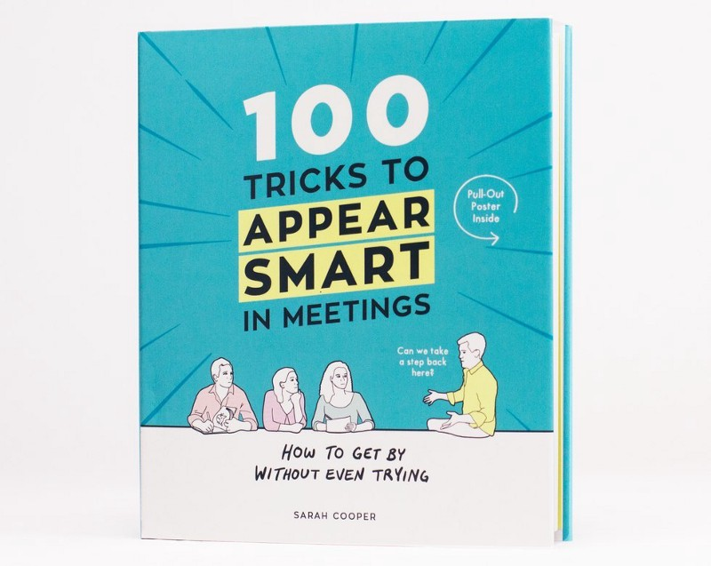

## Introduction

This was another unplanned read! A friend/coworker ordered for our office. I got interested after looking at few pages. Since I had just finished Zero to One and did not have the next book ready, I borrowed it for a quick read.

## The Author

This book is by Sarah Cooper. She is a comedian who was a UX designer at Yahoo! and Google. She had a blog post titled “Tricks to Appear Smart in Meetings” that went viral. The blog post drew so much attention that she decided to turn it into a book. And this is how the book was created.

## The Verdict

It is a fun read, I would not recommend reading it, since most of the tips are not really applicable for a functional business. The book has a lot of pictures and not that much content, so I cannot justify the pricing on it. On the bright side you get a cool poster. If you want a quick giggle, just read a trick and try to match it to a coworker.

## The Summary

Most of tricks are just things that happen in meetings, if anyone is having a discussion. Nothing really stood out from the book. I just hope people don’t take this seriously and they know it is written by a comedian. If anything this should serve as what not to do (in some of the tricks not all). The only thing that is worth sharing is a sentence in the introduction of the book.

> Meetings are one of the few opportunities you have to show your leadership potential, soft skills, and analytical creative thinking brain abilities.
>
> — Pg. VIII
