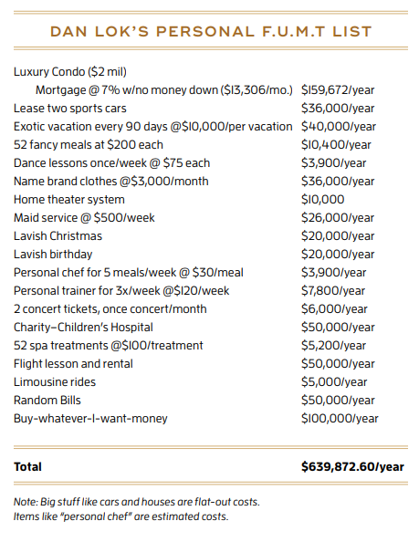
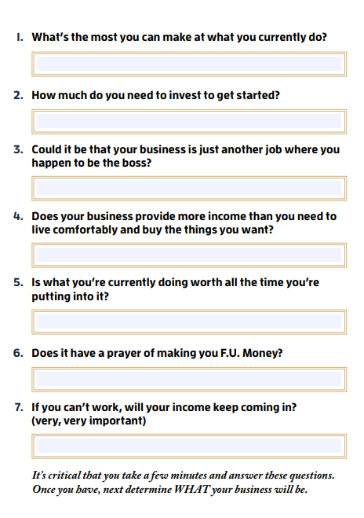

import Gallery from "@site/src/components/Gallery/Gallery.jsx";
import DIG1 from "./dig1.png";
import DIG2 from "./dig2.png";

## Introduction

This was an unplanned read! Although my to-read booklist is full of books to go through, this book ended up being the first book I completed this year. The book was handed to me in both audiobook and eBook forms for [free](https://www.fumoney.com/free-ebook)! Making it extremely easy to load it on my phone and enjoy it.

## The Author

Dan Lok is a successful businessman and entrepreneur, that made his wealth through multiple businesses on the internet. He has published many books and has large social media presence. He was born in Hong Kong then moved to Canada at the age of 14. He offers different courses and trainings for different things. His newest project is the [“High-Ticket Closers”](https://www.fumoneywithjohn.com/now) program.

## The Verdict

The book is interesting, it attempts to change your perspective on money and how to make money. That itself is ok, however beware the author’s intentions of writing this book. Although, he has some good and few great points, he is a salesman. He is selling you his other offerings: books, mentorship programs and training courses.

The book is an easy read. Dan keeps it real, the book is written exactly how he talks. He does not censor his thoughts, which is something that I appreciate in people. The audiobook was a blast to listen to, since it was voiced by him. Additionally, the eBook is full of short words of wisdom “Lokism”, YouTube videos and exercises that make things more interesting than the usual text only books.

I would still recommend this book, especially if you want to change your financial situation but don't know how or where to start. Just don't expect to get a spelled-out answer on how to get rich. The book will give you tips and help you get into the right mindset to get to where you want to be financially. If you don’t want to go through the whole book, you can keep reading to get the highlights and things I got out of this book.

## The Summary

### What is F.U. Money?

F.U. Money is a simple concept, make enough money where you achieve financial freedom. The freedom of not having to answer to anyone you don’t want to. This concept is different from financial independence where you enjoy the lifestyle you want without having to do anything you don’t want to or work. F.U. Money is not as powerful as financial independence. But it sure is close enough for most people.

### What is your magic number?

The first section of the book is dedicated to understanding the concept of F.U. money as well as getting in the right mindset to achieve it. Just like everything else in life, it starts with setting a goal and focusing on achieving it. One must have a dollar amount set in mind and have a plan to get there. The cool thing about this book is the exercises included at the end of each chapter.

Dan wants the reader to set F.U. Money Targets (F.U.M.T.s). These targets are things you can get/do with the money and they will serve as a guide to finding your F.U. Money number. Below is his personal list. I am still working on mine…

----

### The money myths
- **Money Can’t Buy Happiness**: partially agree with this myth. Money can’t make everyone happy, but it can help by getting you the things that make you happy. However, one must be aware of the [Hedonic Treadmill](https://www.investopedia.com/terms/h/hedonic-treadmill.asp).
- **Rich People are Assholes**: Completely agree. I have met quite a few rich people and majority of them were not assholes.
- **You Can Afford to Wait**: Completely agree. This is especially accurate if one wants to retire early. Making money takes time and to make sure we get to enjoy it, we must get to it as soon as possible.

>“The real source of wealth and capital in this new era is not material things. It is the human mind, the human spirit, the human imagination, and our faith in the future.”

> — Steve Forbes, Billionaire Publisher

- **You Have to be Lucky**: Partially agree. Indeed, you don’t need luck to be successful. However, getting lucky does not hurt. Luck can help give you an advantage to shorten the time to hitting your goals.
- **You Have to be a Cheapskate**: Completely agree. Squeezing pennies won’t make you rich, it will just be an inconvenience. Additionally, why is one making money if he/she won’t enjoy it?
- **You Have to Get Rich Slow**: Partially agree. Building wealth takes time however if things are not progressing one should take action.
- **You Have to Work Hard to Make Money**: Neutral. Only working hard will not get you that far. Working smart will get you closer but not that far either. A combination of both will get you to the end of the world.
- **You Have to be Perfectly Ready**: Completely agree. If one waits till they are ready to take action, they will be waiting forever and miss their chance. One can always learn, adapt and evolve as one tackles the challenges that come with seeking wealth.

---

### Mindset shift

- **Conventional Wisdom**: There is a lot of wisdom that we can learn from other people. However, some of it is actually wrong. Take everything with a grain of salt and investigate it for yourself before following it. When someone tells you can’t do something, the response should be, yeah? (think and investigate it), watch me (then do it if you believe in it)!

> “This ‘telephone’ has too many shortcomings to be seriously considered as a means of communication.”

>  — Western Union, Internal Memo, 1876

- **The Most Important Thing You Can Do Today**: Take action that sets you on the path to making your F.U. Money! Lots of people are afraid of taking risks and would rather wait. Bill Gates dropped out of Harvard, one of the most prestigious schools in the US, to pursue the opportunity of building software. If he had NOT taken action, we would have not had Microsoft and all the things built on top of it.
- **You Can Make Money or Excuses, Not Both**: This is my favorite! A lot of people make all sort of excuses, which puts them into the victim mindset. Having that mindset will not get you where you want to be. To start one must learn to NOT make excuses, own up their mistakes and learn from them.
- **Setting and achieving daily goals**: To ensure one is on track, one must break the goal to the achievable measurable smaller goals. That is where setting daily income goals (D.I.G.) comes into play. D.I.G. will not always be measurable, especially when building a brand or investing in things that don't return a dollar amount. One should also have weekly and monthly goals in addition to the daily goals.

<Gallery photos={[
                   { src: DIG1, width: 6, height: 4 },
                   { src: DIG2, width: 2, height: 4 }
                 ]} />

To set the daily income goals, start with yearly goal then calculate how much you need to make an hour. Then take that number multiply it by 3, since you will have unproductive hours.

- **Value your time and focus on the things that will get you where want to be**: Don’t try to do everything! Focus on personal strengths and growing them, rather than trying to be good at everything. To help address the weaknesses leverage others’ strengths.
- **Manage time**: One mistake that many people do (including me) is undervaluing time! Based on the calculation above, if an hour is worth $171 dollars, it makes no sense for me to mow the lawn. Especially, when I can pay someone $20 an hour to take care of it.

>“Rich people value time. Poor people value stuff”

> — Page 197

- **Write down every single activity you do**: Writing everything down, from brushing your teeth, making the bed, to sleeping. This exercise will allow you to identify how much time you spend and where. Evaluate every activity and identify if it is helping to get you to where you need to be or not. If not, it is time to change it. Additionally, this will allow you to prioritize your activities.

----

### The F.U. Money Business

To build a successful business, the person must be focused on the business not the hot product that everyone is talking about. Have a vision and leverage the strengths of others to achieve it. Most importantly the person must not be an opportunity seeker! Opportunity seeker is someone who does not have a strategy and is just looking to make money quickly.

### Ideal business characteristics
1. **Do what you love**: The business must be something that you love so much, that it is the only thing you would do.
1. **Stable, growing and long-term demand**: Competition is great! It means there is demand for what you will offer. The foundation of the business must include strong evidence that the market wants to pay for it, they want to pay for a solution from **YOU** and your solution is brilliant when compared to competition.
1. **Be portable**: The business can be worked on from anywhere, providing the flexibility one desires.
1. **High profit margin**: The business must be profitable and set you up to achieving your goals.
1. **Scalability**: Have the potential to grow fast by adding additional streams of income.
1. **Low cost**: Be able to start the business with thousands of dollars instead of millions.
1. **Little to no staff**: Automating the business so it does not require your presence all the time. Put the right people in the right place. Take action only when needed.
1. **Low overhead**: keep the business lean and mean.
1. **Money coming in while you sleep**: Business should give you the freedom to not be there daily. You should not be exchanging hours for dollars.

> “Fundamentals are everything, while fads come and go. In martial art, I’ve learned that an amateur is someone who knows a thousand moves but practices each move one time. A master is someone who knows only a few moves but practices each move thousands of times. “

>— Page 265

----

### How to make money?
The answer is simple. Knowing and understanding the market is the most important thing. It is more important than the products or services being sold. No matter how great the product or service is, if it does not address the market’s need. To be successful in any market one must fundamentally understand it to dominate it.
