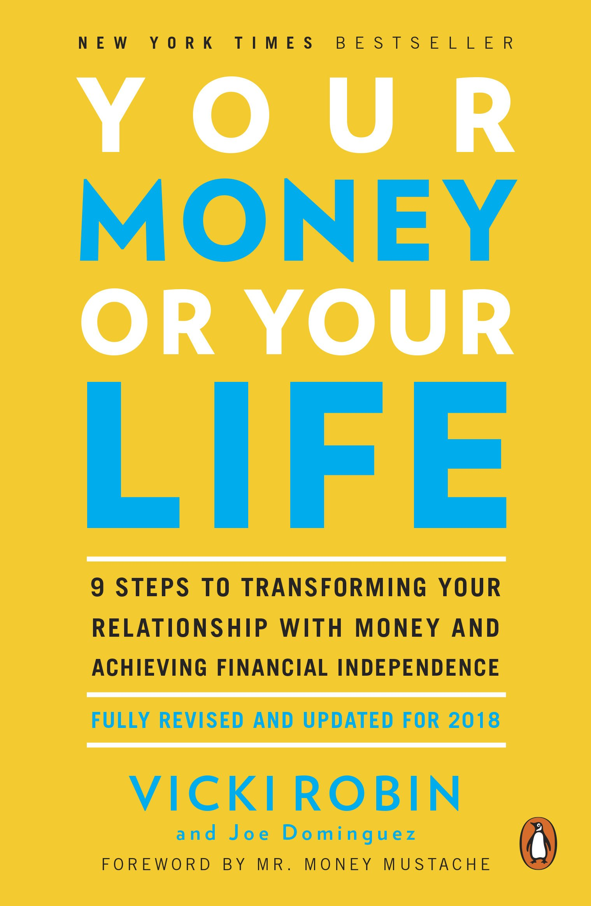

## Introduction

This book was originally published in 1992! Many things have changed in the 25+ years since that book was originally written (including the birth of the Internet, the death of Interest rates, and great changes in consumer products and housing) it still holds. This is especially true if you are reading the revised version by Mr. Money Mustache. The book provides a nine-step program that helps you understand your relationship with money its role in your life and how it is affecting it.

## The Authors

Joe Dominguez grew up in the ghetto, landed a great job in the Wall Street financial sector, saved about $70,000 by age 30 in 1969 ($490k inflation-adjusted to today), and never accepted money for any of his work for the rest of his life. Along the way, he met Vicki Robin, and together they founded an old school grassroots movement called the New Roadmap Foundation – a huge network of volunteer teachers, complete with seminars and even cassette tapes. Without the benefit of the Internet, they educated thousands of people, freeing them from the chains of their spending addictions. Eventually, the efforts coalesced into the book called Your Money or Your Life, which became a big seller and really helped the word start spreading.

Mr. Money Mustache is a thirty-six retiree who now writes about how we can all live a frugal yet life of leisure. He runs a blog and a community to help others achieve early retirement. 

## The Verdict

I borrowed this book from the library! While I was doing my research on becoming better at managing my finances, I was recommended to read this book and in the spirit of the book I was told to borrow it from the library for FREE!

This is for sure a must read and not just a onetime read. The book takes you on a journey of self-discovery in relation to money. The book does not try to sell you on a lifestyle or on how to manage your money. Instead it provides you with step by step discovery process for what you are comfortable with.

## The Summary

If someone thrust a gun in your ribs and said that sentence, what would you do? Most of us would turn over our wallets. The threat works because we value our lives more than we value our money. Or do we? Many of us spend majority of their day working a job "making a dying" because we are killing our health, relationships, sense of joy and wonder. 

Many people seek material possessions which went from fulfilling needs to enhancing comfort to facilitating luxury — and even beyond to excess. A lot of people buy things they don't need or even don't want. These things cost money which requires more work to pay off which means more life sacrifice for something they don't enjoy.

Each person must know what is enough for them. Enough for our survival. Enough comforts. And even enough little ‘luxuries’. We don't need extra things to weigh us down, all the extra things are clutter that take space in our world. 

### The four FIs
#### Financial Intelligence
 Financial Intelligence is the ability to step back from your assumptions and your emotions about money and observe them objectively. Does money really buy happiness? Does everyone really “gotta make a living”? Is money really something to fear or covet, to love or hate? If I sell the majority of my time for money, will I really be secure?
 
 Gaining Financial Intelligence begins with knowing how much money you already have earned, what you have to show for it, how much is coming into your life, and how much is going out. But that isn’t enough. You also need to know what money really is and what you are trading for the money in your life.

#### Financial Integrity
Financial Integrity is achieved by learning the true impact of your earning and spending, both on your immediate family and on the planet. It is knowing what is enough money and material goods to keep you at the peak of fulfillment—and what is just excess and clutter. It is having all aspects of your financial life in alignment with your values. 

#### Financial Independence
Financial Independence encompasses a lot more than having a secure income. It is also independence from crippling financial beliefs, crippling debt, and a crippling inability to manage modern “conveniences.” Financial Independence is anything that frees you from a dependence on money to handle your life.

#### Financial Interdependence
Along the way you realize that the independence we crave is a separation from dead-end routines, jobs, relationships, and ways of thinking—not from one another. Our happiest moments come from love and contribution, and we want more time for what makes life truly meaningful. Our interdependence—doing for one another, receiving from one another, creating with one another—is part of what makes our lives rich. Our interdependence is also a fact of life. We all depend on the services of the natural world. We all depend on shared institutions—from roads to airports to libraries to myriad safety nets to money itself—for a viable life. We float in a sea of interconnectedness. In fact, after achieving Financial Independence, most people (once they get enough rest and indulge some long-standing dreams) actually want to spend their time helping to make the world a better place.

### Step 1: Making Peace with The Past
First, how much have you earned in your life? Find out your total lifetime earnings — the sum total of your gross income, from the first cent you ever earned to your most recent paycheck

#### How:
- Social Security Administration — ‘Request for Statement of Earnings.’
- Copies of Federal or State Tax Returns.
- Paycheck stubs; employers’ records.
#### Why:
- Gives a clear picture of how powerful you are at bringing money into your life.
- Eliminates vagueness or self-delusion in this arena.
- Instills confidence, facilitates goal setting.

Second, what have you got to show for it? Find out your net worth by creating a personal balance sheet of assets and liabilities — everything you own and everything you owe

#### How:
- List and give a current market value to everything you own.
- List everything you owe.
- Deduct your liabilities from your assets to get your net worth.
#### Why:
- You can never know what is enough if you don’t know what you have. You might find there are a lot of material possessions that are not bringing you fulfillment, and you might want to convert them to cash.
- This is a very basic, fundamental practice for any business — and you are a business.

No shame, no blame. In creating your balance sheet, many feelings associated with your material universe may arise: sadness, grief, nostalgia, hope, guilt, shame, embarrassment, anger.

### Step 2: Being in The Present — Tracking Your Life Energy
Money is something we choose to trade our life energy for. Our life energy is our allotment of time here on earth, the hours of precious life available to us. When we go to our jobs, we are trading our life energy for money. In essence, we are businesses trading our life energy for money.

First, how much are you trading your life energy for? Establish the actual cost in time and money required to maintain your job and compute your real hourly wage.

#### How:
- Deduct from your weekly income the costs of getting to and from work; the cost of the clothes you buy to wear at work; the extra cost of at-work meals; the amount spent to relax and wind down after the stress of a work day; job-related illness; and all other expenses associated with maintaining you on the job.
- Add to your work week the hours spent in preparing yourself for work, travel to and from work, the time taken to wind down at home after work, recreation need after work as a means of winding down, shopping to make you feel better since your job feels lousy, and all other hours linked with maintaining your job.
- Divide the new, reduced weekly dollar figure by the new, increased weekly hour figure; this is your real hourly wage.
- Individuals with variable incomes can get creative — take monthly averages, a typical week, whatever works for you.

#### Why:
- This is a very basic, fundamental practice for any business — and you are a business.
- You are in the business of selling the most precious resource in existence — your life energy. You had better know how much you are selling it for.
- The number that results from this step — your real hourly wage — will become a vital ingredient in transforming your relationship with money.

Example:

|Basic job |Hours/Week	|Dollars/Week | Dollars/Hour
|-------|-----|---|---|
(before adjustments)	|40	|440	|11
Adjustments | | |	 	 	 
Commuting	| +7.5	| -50	 
Costuming	|+1.5|	-15	 
Meals	|+5|	-20	 
Relaxing at home	|+5	|-20	 
Escape entertainment	|+5	|-20	 
Vacation	|+5|	-20	 
Job-related illness|	+1|	-15	 
(actual total)	|70|	280	|4

Second, keep track of every cent that comes into or out of your life.

#### How:
- Devise a record-keeping system that works for you (such as a pocket-sized memo book). Record daily expenditures accurately. Record all income. I use [Mint](https://mint.com) and [Personal capital](https://home.personalcapital.com/)

#### Why:
- Because it’s the best way to become conscious of how much money actually comes and goes in your life as opposed to how you think it comes and goes. One of the keys to success in this program (and in life) is a shift in attitude from one of laxity and leeway to one of accuracy, precision and impeccability.

### Step 3: Where Is It All Going? (The Monthly Tabulation)
#### How:
- Every month create a table of all income and all expenses within categories generated by your own unique spending pattern.
- Balance your monthly income and expenses totals.
- Convert ‘dollars’ spent in each category to ‘hours of life energy,’ using your real hourly wage as computed in step 2.
#### Why:
This monthly tabulation will be an accurate portrait of how you are actually living and provide a foundation for the rest of the program.

### Step 4: Three Questions That Will Transform Your Life
#### How: Answer the following questions with total honesty
- Did I receive fulfillment, satisfaction and value in proportion to life energy spent?
- Is this expenditure of life energy in alignment with my values and life purpose?
- How might this expenditure change if I didn’t have to work for a living.
#### Why: 
- These questions will clarify and integrate your earning, your spending, your values, your purpose, your sense of fulfillment and your integrity.
- This will help you discover what is enough for you.

### Step 5: Making Life Energy Visible
#### How:
- Visualize expenses and income using tools (Mint, personal capital), excel or even paper
#### Why:
- It will show you the trend in your financial situation and will give you a sense of progress over time, and the transformation of your relationship with money will be obvious.
- You will see your expense line go down as your fulfillment goes up — the result of ‘instinctive,’ automatic lowering of expenses in those categories you labelled with a minus.
- This Chart will become the picture of your progress toward full financial independence, and you will use it for the rest of the program. It will provide inspiration, stimulus, support and gentle chiding.

### Step 6: Valuing Your Life Energy — Minimizing Spending
Lower monthly expenses by valuing your life energy and increasing your consciousness in spending
#### How:
- Ask the three questions in Step 4 every month.
- Learn to define your true needs (choose quality of live over standard of living)
- Be conscious in your spending.
    - Master the techniques of wise purchasing. Research value, quality and durability.
      - Anticipate your needs and find best deal
      - Buy it for less (comparison shopping, discounted and even used)
      - Meet your needs differently (library instead of buying books)
      - Don't go shopping (impulse buying)
    - Live within your means (avoid interest)
    - Take care of what you have
    - Wear it out
    - Do it yourself
- Smart savings
    - Avoid interest!!
    - Have a place to live
    - Be smart about transportation
    - Take care of your body (avoid medical expenses)
    - Sharing (skills services and items)
    - Switch from phone contracts to pay as you go
#### Why:
- You are spending your most precious commodity — your life energy. You have only a finite amount left.
- ‘Quality of life’ often goes down as ‘standard of living’ goes up.

### Step 7: Valuing Your Life Energy — Maximizing Income
#### How:
Increase income by valuing the life energy invested in your job, exchanging it for the highest pay consistent with your health and integrity
#### Why:
You have only X number of hours left in your life. Determine how you want to spend those remaining hours.

### Step 8: Capital and The Crossover Point
Capital is money that makes more money. It keeps working for you and produces an income as surely as your job produces income. When you put capital in a bank or other interest-bearing instrument it is an investment. An investment is the conversion of capital into some form of wealth other than cash with the expectation of deriving income.
#### How:
- Establish the total monthly expense line your chart.
- Find the long-term interest rate by looking at the interest of the 30-year treasury bonds in the treasury bond table of The Wall Street Journal.
- Establish the monthly investment income line on the chart.
- At some point in the future it will cross over the total monthly expenses line. That is the Crossover Point.
#### Why:
- Identify the crossover point
- At the Crossover Point you will be financially independent. The monthly income from your investment capital will be equal to your actual monthly expenses.
- You will have enough.
- Your options will be free to do what you want.

### Step 9: Managing Your Finances
Invest your capital in such a way as to provide an absolutely safe income, sufficient to meet your basic needs for the rest of your life.

Best Capital investments:
1. must produce income.
1. must be absolutely safe.
1. must be in totally liquid investment. you must be able to convert it into cash at a moment’s notice, to handles emergencies.
1. must not be diminished at the time of investment by unnecessary commissions, or other expenses.
1. the income must be absolutely safe.
1. the income must not fluctuate. You must know exactly what your income will be next month, next year and 20 years from now.
1. the income must be payable to you, in cash, at regular intervals.
1. the income must not be diminished by charges, management fees or redemption fees.
1. The investment must produce this regular, fixed known income without any further involvement or expense on your part. It must not require maintenance, management, geographic presence or attention

#### How:
- Empower yourself to make your own investment decisions by narrowing the focus to the safest non-speculative, long duration fixed income securities, such as:  
  - US treasury bond 
  - Index funds
  - Real estate
  - Local lending
  - Socially responsible investing 
- Cut out high expenses, fees and commissions of middlemen and popularly marketed investment products.
#### Why:
There is more to life than nine-to-five.
