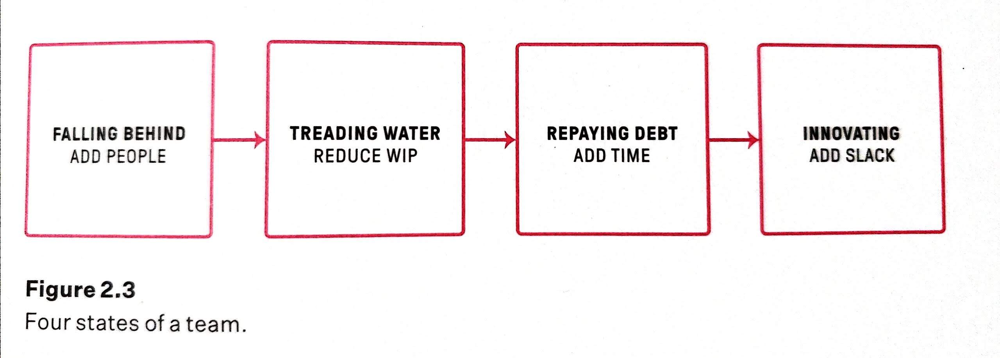
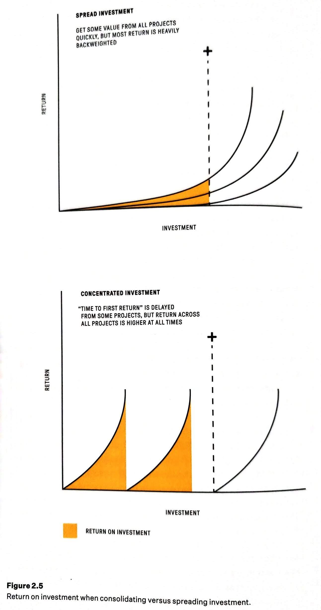
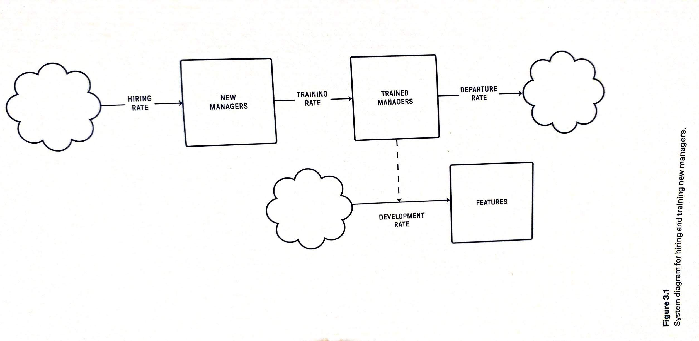
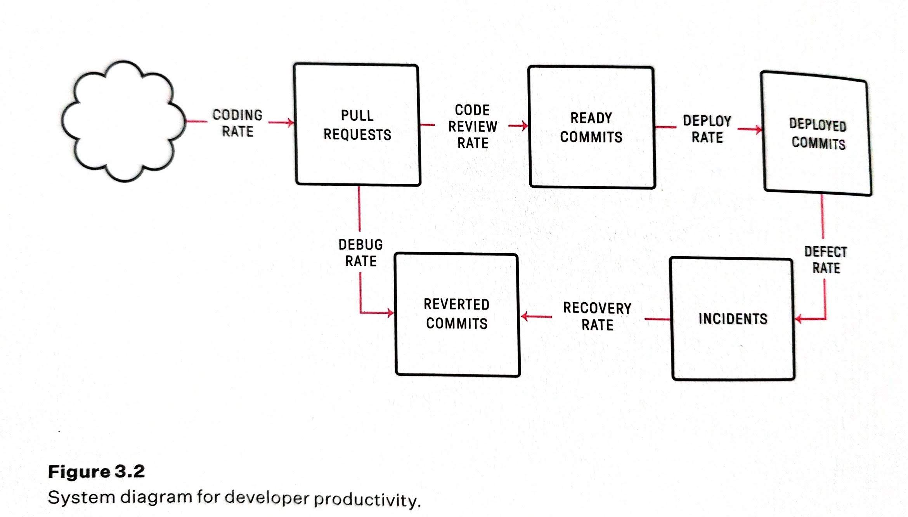
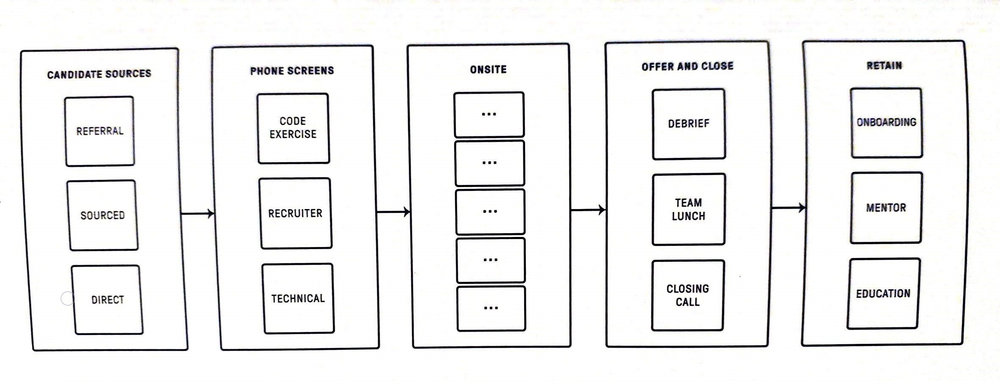

## Introduction
When it comes to engineering management there aren't that many books that tackle this topic. Luckily with the increase of engineering-focused business and the increased demand for software engineers have led to an increase in content geared towards this topic. The thing that makes this book stand out from the rest of the management books is the engineering approach to management problems. It approaches those problems in a very rigorous analytical and metrics-driven way to address concrete and pressing problems faced by organizations. It tackles everything an organization might need from structuring a team or ensuring the equitable distribution of opportunity to fostering an inclusive environment.

## The Author
Will Larson is an engineering leader and software engineer at technology companies of many shapes and sizes. He worked for companies including Digg, Uber, and Stripe. 

## The Verdict
This book has a lot of valuable information that can benefit any engineer who finds themselves in a management role. It is written in a way that is very appealing to technical people/engineers. The information is very dense, as the book delivers valuable information without any extra unnecessary explanations. The book also includes a massive list of references that dive deeper into any topic/concept or idea mentioned in this book.

## The Summary

### Sizing technical teams framework
- Teams should be six-eight in steady state
- To create a new team grow an existing team to eight-ten, then split into two teams of four-five.
- Never create empty teams
- Never have a part time engineer manager supporting more than four individuals
- Never have a full time engineer manager supporting more than eight individuals

### Team States and how to manage each state

### How to manage multiple teams
- Focus on the teams that are in the first stages first (Falling behind/treading water)
- Prioritize one team at a time
- One the team issue has been resolved then move to the next team
- Once all teams at that stage have moved to the next one then tackle the next stage

### Too much slack in a team
Shift scope into the team instead of moving team members out of the team. The team is already gelled together and is having too much slack as a benefit of the team itself. Any changes to the team could affect their output negatively causing the team dynamics to break and potentially fall back multiple stages.

### How to ensure the engineering team does not lose time?
The strategy is to funnel interruptions into an increasingly small area and then automate that area as much as possible.
Ask people to submit tickets, create chatbots that automate filing tickets create a service cookbook, and so on.

Train the team to not answer other forms of interruptions! Create a wiki/document of "who owns X" to prevent the blast questions on who is in charge of a feature/component. Set schedule for meetings to eliminate ad hoc meetings. Have documentation available for everyone to eliminate the majority of the questions.

### Succession plan
- Write down actual roles and responsibilities that you do
- Write down what you do in meetings
- Review calendar for things other than meetings (interviews, networking so on...)
- Look back a year for recurring processes (roadmap planning, performance calibrations, one on ones, headcount decisions)
- Find out who you are supporting and how on the team (collaborations with other teams and what you do for those individuals)
- Audit emails and messages received for questions from people (ensure someone can find/answer these questions)
- Document the things you have in your todo list
- Think through the external relationships you have and who needs to know about those relationships

Once you have defined all of the things you do and the things you need to address, start closing the gaps:
- Write any documentation needed
- Do any quick introductions needed
- Put a plan to close the gap on the things that require skills missing from the current team.

### Spread investment vs Concentrated investment

### Hiring and training management

### Developer velocity measurement focus
- Delivery lead time: the time from the creation of code to its use in production
- Deployment frequency: how often the code is deployed
- Change fail rate: how frequently changes fail
- Time to restore service: the time spent recovering from defects

### Developer productivity

### Product management framework
#### Problem discovery
- Users' pain: what are the problems that your users experience?
- Users' purpose: what motivates your users to engage with your system?
- Benchmark: How do you compare against your competitors in the same and similar industries? Which areas are you weak?
- Analyze your data: What is hidden behind a top-level analysis of your data?
- Competitive advantages: What opportunities you are best positioned to fill?
#### Problem selection
- Surviving: what do you need to do to survive currently?
- Surviving the future: what do you need to do to survive in the future?
- Win the future: what do you need to do to beat your competitors?
- Industry trends: where is the industry headed, and what can you do to take advantage of it?
- Return on investment: is what you are building worth the cost of time and resources?
#### Solution validation
- Write a customer letter: Write the launch announcement letter for your users. Is it exciting, useful, and real?
- Identify prior art: has someone else solved this problem? is there approach good? Can you create a better solution?
- Find reference users: users who are willing to be the first users of the solution. if you can't find any then you should be skeptical of what you are building!
- Prefer experimentation over analysis: focus on being good at cheap validation of experimentation vs building comprehensive solutions based on the analysis.
- Find the path for quickest validations: try to find the cheapest way to validate your solutions
- Justify switching costs: what are the costs for your users to switch to your solution?

### Running good migrations
- De-risk: Write a design document and share it with the teams involved. Iterate on the migration document to address atypical patterns and edge cases. Test it against the next 6-12 months of the roadmap. Test it with the most challenging teams.
- Enable: build self-servicing tooling and documentation to allow any team to run the migration. Build any scripts or tools to felicitate the migration. Allow the teams to run the migration tools to be tested and iterated on.
- Finish: stop the bleeding which is ensuring that everyone is using the new migrated approach for new development. Identify systems and people using an old approach and push them to the new system. Get everyone to be 100 percent rolled out through the organization. Recognize the team effort for a successful migration only when everything is on the new migration.

### There is a structural problem in the organization when you can't
- increase communication
- reduce decision friction
- focus attention
Any other issue can be addressed more directly

### Presenting to leadership
- Communication is company specific: there is no specific format that works for every company.
- Start with the conclusion: especially in written form.
- Frame why the topic matters: since senior people are not as involved in the topic as you might be.
- Everyone loves a narrative: how we got here and where are we going
- Prepare for detours: expect discussions to derail towards unexpected questions.
- Answer directly: don't hide problems
- Deep in the data: You should know the data so you can answer unexpected questions
- Be prepared to discuss details: some seniors like to test people by diving deep into details that make the presenter uncomfortable
- Prepare a lot and practice a little: leadership presentation tend to derail quickly and often so spend most of your time preparing vs practicing
- Make clear ask: ensure the goal of the meeting is clear.
 
### Time management for managers
- Quarterly time retrospectives: review how you are spending time
- Prioritize long term success over short term quality: Sometimes you have to focus on hiring vs doing one on ones just to make sure the team can be successful in the long term
- Finish small, leveraged things: finish the small work that will allow you to leverage that work to create more bandwidth for future work
- Stop doing things: this must be done in a structured way and ensure that it is communicated properly
- Delegate work: whenever working on something ensure you are creating a path for someone else to be able to take over
- Trust the system you build: trust handing off the responsibility to other people. Continuing working on the system can consume all of your time
- Decouple participation from productivity: avoid meetings where your attendance is not valuable for you or your team.
- Hire until you are slightly ahead of growth: hire capable folks and hire them before you get overwhelmed.
- Calendar blocking: block time for management tasks
- Getting administrative support: getting help so you are shielded from the little interruptions

### Encouraging learning communities
- Be a facilitator, not a lecturer: people like to learn from each other instead of being lectured
- Brief presentation, long discussions: five minutes presentation and ten minutes for the discussions (if a group does not gel it will not be awkward)
- Small breakout group: allows people to learn about a topic in a small safe place and be part of the discussion
- Bring learning to the full group: all the groups to cross-pollinate the learning
- Choose topics that people already know about: Ideally the topic is something they do but would like to get better at, such as one on ones, mentorship, coaching, or career development
- Encourage tenured folks to attend: the senior people have the most knowledge that they can share with everyone
- Optional pre-reads: Some people are not comfortable being introduced to a new topic in public.

### Management philosophy
- People over process
- Do the hard thing now
- Your company, your team, yourself
- Think for yourself

### How to distribute opportunities
- Use rubrics: define criteria and evaluate individuals based on the criteria.
- Select project leader: Someone who will be accountable for the project and in charge of ensuring the right people are involved in the project
- Explicit budget: Set a fixed budget for the project and ensure the team follows it. Include team members who can stick to the budget 
- Nudge involvement: People tend to not ask for opportunities so make sure to nudge them by involving them in the process
- Education programs: share what is available with everyone, managers, execs and other teams

### How to make people feel included
- Set up social recurring weekly events: game nights, paper reading
- Employee groups: set up groups based on interests (anime club), backgrounds (middle eastern food club)
- Team off-sites: spend a day learning something new or exploring or just have fun somewhere outside the office
- Coffee chats: Donuts with other employees and get to know them
- Team lunches: have lunches as a team once in a while

### Selecting Project Lead
1. Define: The time commitment, requirements to apply and any other selection criteria.
1. Announce: Through email, all hands, or any method of communication that allows people to apply in private. Allow at least three days for people to apply.
1. Nudge: the people who you think are a good fit but might not apply.
1. Select: based on the criteria defined and reach out to the person to confirm the commitment.
1. Sponsor: find a project leader that has done a similar project to become an adviser for the new leader.
1. Notify: people who did not get selected.
1. Kick off: the project announce the leader, the sponsor and the project.
1. Record: who was selected, who was the sponsor and the project briefing.

### Manager of Managers recruiting notes
- People who can't find upward mobility. They have not managed managers before but are looking for the opportunity.
- Most people with experience managing managers are happy in their roles.
- The demand outpaces supply for this role
- Have a fair way to evaluate candidates from within the company.

### Evaluating a manager of managers hire
- Have he/she been an effective partner to the team they managed and peers
- Can they support the team's operations
- Can they present a compelling vision of the future and state of their team
- Can they identify the necessary steps to transform the present to their vision
- Can they convey complicated topics in both written and verbal communication
- Can they tune the level of detail to their audience
- Can they make others feel heard
- Can they make stakeholders feel confident that their concerns have been addressed

### Eliminate hero culture because they lead to:
- Dissatisfied and burned-out heroes
- You and your heroes alienating everyone else
- The project is not in any better shape than it originally was

### Hiring funnel

### Effective performance review
- Self-review: best to have it explicitly compare and contrast against their job description. 
- Peer-review: conducted by peers. Useful for recognizing mentorship and leadership contributions that can get missed otherwise. Additionally, if structured properly it can identify problems that might be missed by you (note: peers are generally uncomfortable providing negative feedback)
- Upward-review: Ensures the managers' performance includes the individuals they manage (similar to peer-review)
- Manager-review: the individual's direct manager review which is a combination of peer/upward review.

### Managing an organization's metrics
The metrics should cover both the longer-term goals of the team (user adoption, revenue, return users, etc.) and the operational baselines necessary to know if the team is functioning well (on-call loan, incidents, availability, cost, and so on.) For each metric, the dashboard should make three things clear: the current value, the goal value and the trend between them.

### Other interesting statements
All real-world systems have some degree of inherent self-healing properties: an overloaded database will slow down enough that someone fixes it, and an overwhelmed employees will get slow at finishing work until someone finds a way to help.

If your company is designing systems to last one order of magnitude and is doubling every six months, then you'll have to re-implement every system twice every three years. this creates a great deal of risk -- almost every platform team is working on a critical scaling project -- and can also create a great deal of resource contention to finish these concurrent rewrites.

The real productivity kill is not system rewrites but the migrations that follow those rewrites. Poorly designed migrations expand the consequences of this rewrite loop from the individual teams supporting the systems to the entire surrounding organization.

If you ask a manager about their proudest moments, they will probably tell you a story about helping someone grow. If you ask that same manager about their most challenging experience, they will probably talk about a layoff, a reorganization, a shift in company direction, or the time they weathered an economic downturn. In management, change is the catalyst of complexity.

Employees within 60 minutes commute of an office must work from that office.

It is critical the everyone feels as a member of the organization. If you're spending so much energy wondering whom you'll eat lunch with, that's energy you can't spend begin creative. If the idea of going to work gives you anxiety, at some point you're going to decide to stop coming.

Unless your problem is that people aren't trying hard, the "work harder" mantra only breeds hero programmers whose heroic ways make it difficult for  nonheroes to contribute meaningfully. Later, as your new heroes finish martyring themselves on burnout, you are left with bigger problems.

### Additional interesting books discovered from this book references
- Thinking in Systems: A Primer by Donella H. Meadows
- Peopleware: Productive Projects and Teams by Timothy Lister and Tome DeMarco
- The Mythical Man-Month by Frederick Brooks
- Good Strategy/Bad Strategy The Difference and Why it Matters by Richard Rumelt
