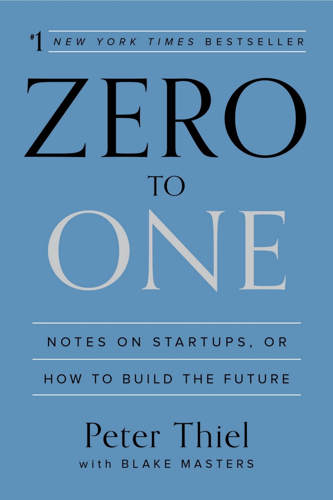

## Introduction

Peter taught a startup course at Stanford in 2012. The goal of the
course was to teach the students to “see beyond the tracks laid down by
academic specialties”. In simple terms, get the students to think outside
the box and come up with truly innovative ideas. Blake Masters was a
student in Peter’s class. He took detailed notes that drew a lot of
attention which led to the collaboration between the two. This book is
the result of the cleaned-up notes from Blake and the brilliance of
Peter.

## The Author

Peter Thiel is a co-founder of PayPal, Palantir Technologies and
Founders Fund. He was the first outside investor in Facebook. He is on
the board of many companies including Facebook. He was a partner for
Y Combinator. He created the Thiel Fellowship. His current net worth is
estimated at 2.5 billion. He crated majority of his fortune through
starting and investing in great businesses.

## The Verdict

I borrowed the book from my friend since I had this book on my to read
list for more than two years. I finally got to it three years too late! If you
are ever thinking of starting a business or are interested in how to build
a successful business this is a must read.

The book is full of great lessons, tips, tricks, information and notes. I
can **NOT** give it justice with my notes. The entire book is full of valuable
content, I had a really hard time trying to not copy the entire book
down.

Additionally, this book has been extremely helpful to take a step back
and compare CourseKey against the content in this book. A lot of what
Thiel mentions in this book applies directly to things we have done, are
doing and will be doing.

## The Summary

### What does zero to one mean?

>Doing what we already know how to do takes the world from 1 to n,
> adding more of something familiar. But every time we create something
> new, we go from 0 to 1.

Think about operating systems for example. Bill Gates created the first
GUI operating system, he created something new, something that did
not exist before. The next Bill Gates will not be building an operating
system. There have been many additions to operating systems by others
(Linux/Mac and so on...) but none of them have been as revolutionary
as the first one.

### The Future of Progress
Progress can be Horizontal or Vertical. Horizontal progress is simple
and easy to imagine. Think of it as copying the things that work with
some improvements. At the macro level it can be summed up as
globalization. On the other hand, vertical progress is more difficult
since it is coming up with new things going from 0 to 1. At the macro
level it is summed up as new innovative technology.

In the future, globalization is not sustainable! This is due to the reality
and constraints of technology. For example, if everyone in the world
lived like the American household, we would deplete all of our planet’s
resources and increase pollution to unsustainable levels. To be able to
maintain globalization we must develop new technology.

Startups are the answer to the problem. Big companies are bureaucratic
hierarchies that move too slow and they avoid risks. On the other hand,
lone geniuses can not create new technology. Startups run on the
principle that you need others to get things done, but you need to be
small enough to get things actually done.

>The first step to thinking clearly is to question what
we think we know about the past.
>
> — Pg.13

### Lessons learned from dot-com crash
1. Make incremental advances: small incremental steps are the best
approach.
1. Stay lean and flexible: Be flexible, adapt for unplanned events and
iterate on things.
1. Improve on the competition: To have a real business, must start
with existing market and customers. Improve on existing products
then introduce the new technology.
1. Focus on product, not sales: Technology is about product
development not distribution. produce should not require
advertising or sales.

---
### Successful businesses

When coming up with a business idea one must answer the business
version of the contrarian question. “What valuable company is nobody
building?” (Pg. 23) Any business can create a lot of value but not be
valuable. Creating value is not enough, it must be valuable and allow
you to capture that value. If you want to create and capture lasting
value, don’t build an undifferentiated commodity business. (Pg. 25)

Running a business is ruthless, and everything is affected by the money.
In business, money is either an important thing or it is everything. (Pg.31)
The easiest way to ensure a business survives is for it to be a
monopoly. Monopoly is the condition of every successful business.
(Pg.34) All happy companies are different: each one earns a monopoly
by solving a unique problem. All failed companies are the same: they
failed to escape competition. (Pg.34)

The value of a business today is determined by the sum of all the money
it will make in the future. (Pg. 44) For a company to be valuable it must
grow and endure, but many entrepreneurs focus only on short-term
growth. (Pg. 47)

### Characteristics of Monopoly

1. Proprietary Technology: The biggest advantage that a business
that can have. Can be achieved by creating something new where
nothing before existed or making a 10x improvement to existing
technology.
1. Network Effects: Extremely powerful and equally difficult to
acquire. The network effect will never happen if the product is not
valuable to the first users when the network is small.
1. Economics of Scale: As the business grows, the costs remain fixed
leading to greater profits.
1. Branding: Every business has a monopoly on its own brand by
definition. Having a brand that is recognizable and big (Apple!)
can be a form of Monopoly.

### How to build a monopoly
1. Start small: Focus on a niche market and monopolize it. Start with
a very small market.
1. Scale up: scale up to adjacent markets.
1. Don’t disrupt: Don’t pick a fight or get distracted in one. Avoid
competition as much as possible. Focus on your own business.
1. The last will be first: Don’t seek to be the first mover, people can
come in after and steal the market share advantage. However,
coming into a market with competitors can allow you to learn from
their mistakes. Business is like chess: you must study the endgame
before everything else (Pg. 58).

>Every company starts in unique circumstances, and
every company starts only once.
>
>— Pg. 60

----

### Having a plan in business
A big reason to why most businesses fail is because they don’t have a
clear vision and not following the money. Coming up with a plan is
difficult, that is why many companies iterate and lay the tracks as they
are going. That may work however iteration without a bold plan won’t
take you from 0 to 1. (Pg. 78–79)

In philosophy, politics, and business, too, arguing over process has
become a way to endlessly defer making concrete plans for a better
future. (Pg. 73–74) As a society, we have become short sighted. We are
more fascinated today by statistical predictions of what the country will
be thinking in a few weeks’ time than by visionary predictions of what
the country will look like 10 or 20 years from now. (Pg. 71) We are no
longer looking for or coming up with any bold ideas.

### What do people do with money in the financial world?

- The founders don’t know what to do with it, so they give it to a
large bank.

- The bankers don’t know what to do with it, so they diversify by
spreading it across a portfolio of institutional investors.

- Institutional investors don’t know what to do with their managed
capital, so they diversify by amassing a portfolio of stocks.

- Companies try to increase their share price by generating free cash
flows. If they do, they issue dividends or buy back shares and the
cycle repeats.

At no point does anyone in the chain knows what to do with money in
the real economy. (Pg. 70–71)

----

### The power law

The power law is similar to the 80/20 rule. Eighty percent of value
comes from twenty percent work you do. This applies to many things
including to the venture capital world. The biggest secret in venture
capital is that the best investment in a successful fund equals or
outperforms the entire rest of the fund combined. (Pg. 86)

Contrary to the common believe diversifying is not the answer.
According to the power law, one thing could have all the impact you
want. You should focus relentlessly on something you’re good at doing,
but before that you must think hard about whether it will be valuable in
the future. (Pg. 91)

### Secrets
Our world is full of secrets: deep sea, physics, space and many other
things. These secrets extend to business as well. Every great business is
built around a secret that’s hidden from the outside. (Pg. 106) In
business, generally what’s most important is rarely obvious. (Pg. 92)
That's why we have to dig deeper and investigate the hidden secrets in
the market that will lead to creating a great business.

>We have given up our sense of wonder at secrets left
 to be discovered

> — Pg. 99

### Why are we not looking for secrets?
1. incrementalism: we are taught that the right way to do things is to
proceed one very small step at a time. If you overachieve and end
up learning something that’s not on the test, you won’t receive
credit for it.
1. risk aversion: The prospect of being lonely and wrong can be
unbearable.
1. complacency: Every fall, the deans at top law schools and business
schools welcome the incoming class with the same implicit
message: “You got into this elite institution. Your worries are over.
You’re set for life.” But that’s probably the kind of thing that’s true
only if you don’t believe it.
1. flatness: if it were possible to discover something new, wouldn’t
someone from the faceless global talent pool of smarter and more
creative people have found it already? (Pg. 97–98)

---

### Business foundation
The most critical time in a business life is its inception. The way a
business starts and how it evolves in the first months will determine
how successful it will be. That also includes the most crucial decision
you will ever make which is whom to start it with. Thiel created a law
based on this idea named the “Thiel’s law”: a startup messed up at its
foundation cannot be fixed (Pg. 107)

There are many foundations for a successful business

#### Alignment
To ensure the business foundation is right everyone in the company
must be aligned. To understand how to keep everyone aligned, first we
must understand how a misalignment happens. To anticipate likely
sources of misalignment in any company, it’s useful to distinguish
between three concepts:

- Ownership: who legally owns a company’s equity?
- Possession: who actually runs the company on a day-to-day basis?
- Control: who formally governs the company’s affairs?

A typical startup allocates ownership among founders, employees, and
investors. The managers and employees who operate the company
enjoy possession. And a board of directors, usually comprising founders
and investors, exercises control. (Pg. 110)

One source of misalignment is when the three groups of people are not
communicating or have different visions and goals.

Another misalignment source is not having the team together full time.
To avoid that, ensure everyone in the company is fully invested. Try to
avoid contract and working remotely as much as possible since this can
lead to misalignment creep. Company employees are either on the bus
or off the bus (Pg. 113)

#### Culture
Another foundation for a business is its culture. Culture is critical for
company’s success and Thiel phrases it nicely.

>Company has no culture; every company is a culture.
>
>— Pg.119

>Why work with a group of people who don’t even like each other? Many
seem to think it’s a sacrifice necessary for making money. Since time is
your most valuable asset, it’s odd to spend it working with people who
don’t envision any long-term future together. If you can’t count durable
relationships among the fruits of your time at work, you haven’t invested
your time well—even in purely financial terms. (Pg. 119–120)

#### Recruiting
Why would someone join your company as its 20th engineer when he
or she could go work at Google for more money and more prestige?
There are two general kinds of good answers: answers about your
mission and answers about your team. Most importantly, don’t fight the
perk war! Anybody who would be more powerfully swayed by free
laundry pickup or pet day care would be a bad addition to your team
(Pg. 121–122).

### Sales
In tech businesses, many good ideas end up failing because they neglect
sales. This is because “nerds” miss that it takes hard work to make sales
look easy (Pg. 128) If you’ve invented something new but you haven’t
invented an effective way to sell it, you have a bad business—no matter
how good the product. (Pg. 130) Superior sales and distribution by
itself can create a monopoly, even with no product differentiation (Pg.
130)

#### Complex sales
Complex sales are selling to organizations where multiple parties are
involved. Politics matters in big deals just as much as technological
ingenuity (Pg. 131) Businesses with complex sales models succeed if
they achieve 50% to 100% year-over-year growth over the course of a
decade. This will seem slow to any entrepreneur dreaming of viral
growth (Pg. 132)

#### Personal sales
The challenge here isn’t about how to make any particular sale, but
how to establish a process by which a sales team of modest size can
move the product to a wide audience (Pg. 132)

Poor sales rather than bad product is the most common cause of failure.
If you can get just one distribution channel to work, you have a great
business. If you try for several but don’t nail one, you’re finished. (Pg.
138)

### Marketing
Selling your company to the media is a necessary part of selling it to
everyone else. (Pg. 138) Any prospective employee worth hiring will do
his own diligence; what he finds or doesn’t find when he googles you
will be critical to the success of your company. (Pg. 139)

Everybody sells. Look around. If you don’t see any salespeople, you’re
the salesperson. (Pg. 139) There’s nothing wrong with a CEO who can
sell, but if he actually looks like a salesman, he’s probably bad at sales
and worse at tech. (Pg. 160)

----

### Man Vs Technology
Tech is complementary for humans. However, many people are afraid
of machines taking over. In reality, better technology in law, medicine,
and education won’t replace professionals; it will allow them to do even
more. (Pg. 148)

Computers can find patterns that elude humans, but they don’t know
how to compare patterns from different sources or how to interpret
complex behaviors. Actionable insights can only come from a human
analyst (or the kind of generalized artificial intelligence that exists only
in science fiction). (Pg. 149)

The most valuable companies in the future won’t ask what problems
can be solved with computers alone. Instead, they’ll ask: how can
computers help humans solve hard problems? (Pg. 150)

As we find new ways to use computers, they won’t just get better at the
kinds of things people already do; they’ll help us to do what was
previously unimaginable. (Pg. 151)

----
### Seven questions
The seven questions that every business must answer: (Pg. 153–154)

1. The Engineering Question: Can you create breakthrough
technology instead of incremental improvements? Any product
built should be 10x better for what the customer currently has
access to.

1. The Timing Question: Is now the right time to start your particular
business? Make sure that you have a realistic plan and good
strategy and you are not jumping into a market too soon.

1. The Monopoly Question: Are you starting with a big share of a
small market? Don’t exaggerate your own uniqueness by carving a
small market out of a bigger market.

1. The People Question: Do you have the right team? The most
important part of business is the team and making sure the right
people are in the right place is crucial.

1. The Distribution Question: Do you have a way to not just create
but deliver your product? As previously mentioned, no matter how
great the product is, if it cannot be sold the business will fail!

1. The Durability Question: Will your market position be defensible
10 and 20 years into the future? Make sure what you are building
will exist in the future.

1. The Secret Question: Have you identified a unique opportunity
that others don’t see? The best problems to work on are often the
ones nobody else even tries to solve (Pg. 166)

----

### Key sentences
- How much of what you know about business is shaped by
mistaken reactions to past mistakes? (Pg. 22)
- The most contrarian thing of all is not to oppose the crowd but to
think for yourself. (Pg. 22)
- Founders only sell when they have no more concrete visions for
the company (Pg. 80)
- You could have 100% of the equity if you fully fund your own
venture, but if it fails you’ll have 100% of nothing. Owning just
0.01% of Google, by contrast, is incredibly valuable (more than
$35 million as of 2014) (Pg. 91–92)
- Kaczynski claimed that in order to be happy, every individual
“needs to have goals whose attainment requires effort, and needs
to succeed in attaining at least some of his goals.” (Pg. 95)
- Less than 1% of new businesses started each year in the U.S.
receive venture funding (Pg. 89)
- The most important task in business—the creation of new value—
cannot be reduced to a formula and applied by professionals (Pg. 188)
