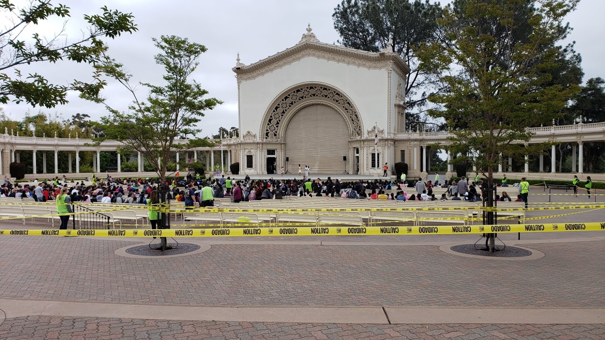
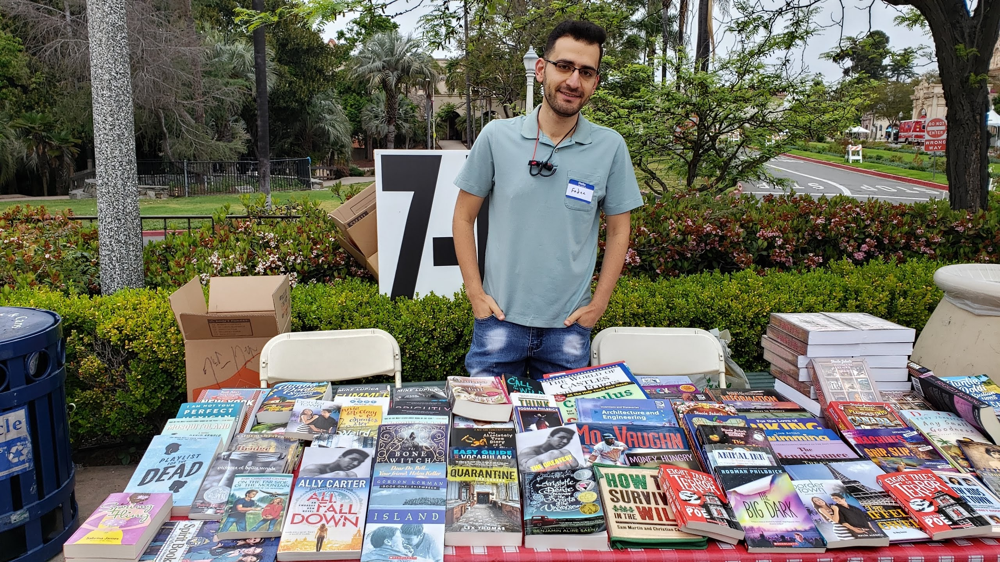
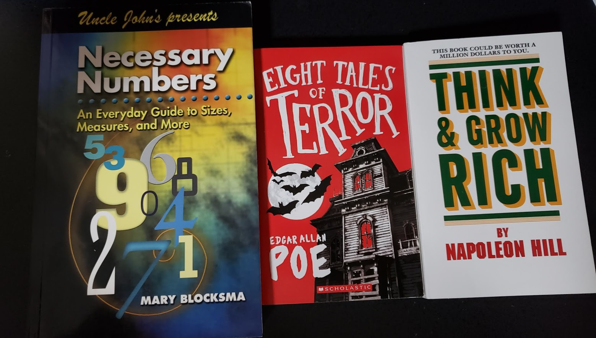

import YouTube from "@site/src/components/YouTube/YouTube.jsx";

Last week I got to volunteer for the children's book party at Balboa Park. I learned about the event through the EOP program at SDSU. 

The event is hosted by the Reading Literacy Learning, a non-profit organization designed to promote literacy among all children in the county of San Diego. Their mission is to plant the seed of literacy in children by providing them with books in hopes that they start their own personal libraries.

Once I found out about it, I knew I had to help. On Saturday, April 27, 2019, the 35th Annual Children's Book Party was held at the Spreckel's Organ Pavilion in Balboa Park! There was some entertainment and free food.

<YouTube videoId="zWZw4wOYGtA" />
<YouTube videoId="Yz3NQS3t0Es" />
<YouTube videoId="-9iad-BuD4M" />

The best part of the event was handing out brand new books for free to children. There were books for everyone K-12, My sister and I were stationed at the table for grades 7-12. We did not get the fun interactive fun, intriguing books where you get to touch and play with things.

We handed out two new books for everyone. That was the best part! Seeing the joy and smiles of young people finding books they love. I added a few books to my to-read list. To top things off we got to take a few new books as well.

