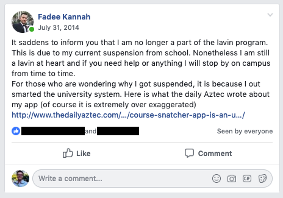

## Introduction

We all have moments that possess a massive rippling effect. Usually those ripples occur from tiny actions, that sometimes we don't even give them a second thought. This effect is similar to the famous butterfly effect. This post is about one of those moments that happened to me.

## Background

To understand the situation, first I need to explain the circumstances surrounding it. In 2012, as a sophomore at San Diego State University (SDSU), I created an application that allowed me to enroll in courses easier. 

Back then course registration was first come first serve in order of seniority except for freshmen who were first (freshmen, seniors, Juniors and finally sophomores). After freshman year, it is pretty much a nightmare trying to get into a popular course! This proved to be a real issue especially since there was no wait list or any system that assisted students in course registration. 

Students had limited options:
- Wait and Retry: keep checking the system until a spot opens up
- Crash: show up on the first day of class without registration and hope the teacher lets you in
- Give Up: take another class
- Black Market: this is where students trade classes for money. Students who have early registration time and don't plan on attending classes, register for courses then sell their spot to other students. Those people would hold the spot until they get paid and they will coordinate with the buyer when they will drop the course so the other student can enroll in it.

Since I didn't like any of these options, I made my own. I created Aztec course snatcher. The app solved my problem and I knew other people could benefit from it as well. Using my entrepreneurial thinking I started selling it. However, not everyone was happy with the app! SDSU's administration decided that I was violating a ton of policies which led to my suspension.

Right before I got suspended from school, I was accepted into the [Lavin Entrepreneur Program](http://lavincenter.sdsu.edu/programs/Lavin-VentureStart/). I attended the orientation for the program during the summer, I was ready and excited to start the following fall semester. However, due to the suspension I was dropped from the program...

## The climax

At that point, I was infuriated at the school. I was enraged! I was not only dropped from the Lavin Entrepreneur Program, but also it set me back a year for my graduation. To top things off, I was taking a summer class and I was set to finish it with an A. However, on the day of the final, I was escorted out of class. I not only lost my credit for the course but also lost $300 in fees after getting a partial refund.

Rage consumed me that day... That day, everything I was working towards was shattered. Additionally, I was "let go" from my job as IT from multiple departments on campus. 

The next day, I calmed down and started reflecting and putting a new plan together. I started fighting back. I Reached out to my professors and got my computer engineering professor to be my advisor/ defense against the school.

Things were starting to look better and was setting things back on track. However, something felt off, something I was neglecting, my entrepreneurship journey. At that time, I was still running HTEV, I was still involved and growing.

However, my curiosity led me back to the Lavin program and I ended up on the Facebook group for my class. I noticed I still had access! I knew from the interview process to get into the program, that there are a lot of brilliant people in it. Thus, I left a message with the expectation of it falling on deaf ears.

<pre>For the curious here is <a href="http://thedailyaztec.com/47880/opinion/course-snatcher-app-is-an-unfair-advantage/">the article</a> mentioned above</pre>

## The outcome

It did not fall on deaf ears! There was an entrepreneur who was looking to recruit technical talent. Luke Sophinos reached out 10-15 mins after I made the post and since then I have been enlisted into CourseKey core team. Luke has even written about this on [medium](https://medium.com/@lukesophinos/recruiting-engineers-for-your-idea-stage-business-as-a-college-student-170c92f4a0e5).

## The butterfly effect

If I had not created the post, Luke and I would have not met. If we didn't meet, I would have not been part of CourseKey and CourseKey might have been a completely different product. If I wasn't in CourseKey I would have not been able to work with brilliant people that help me grow every day. I would have not learned and grown as much as I have. I would have not become who I am now.

I would have been a completely different person. I would have most likely ended up working for a big tech company, Qualcomm or Amazon, as an engineer. I would have not gotten seriously into the startup world. I might have even given up on my personal business.

## Conclusion

Looking at who I am as a person today, a lot can be linked back to CourseKey. I have been shaped and influenced by my interactions with people through CourseKey (coworkers, investors, executives and other businesses) or actions I have taken to help me solve issues at CourseKey (learning things I would have never even bothered to understand). I owe all these experiences to CourseKey and none of them would have happened, if I did not write this post that changed my life.

If interested in how CourseKey and its people have been part of my life. Checkout my [year review](http://mrkannah.com/tags/year-review).
