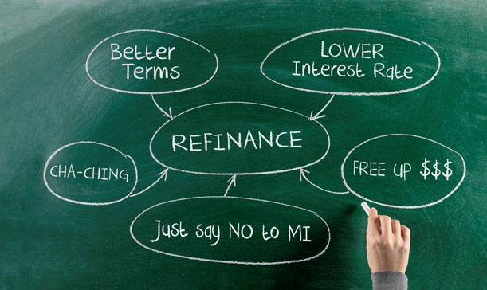
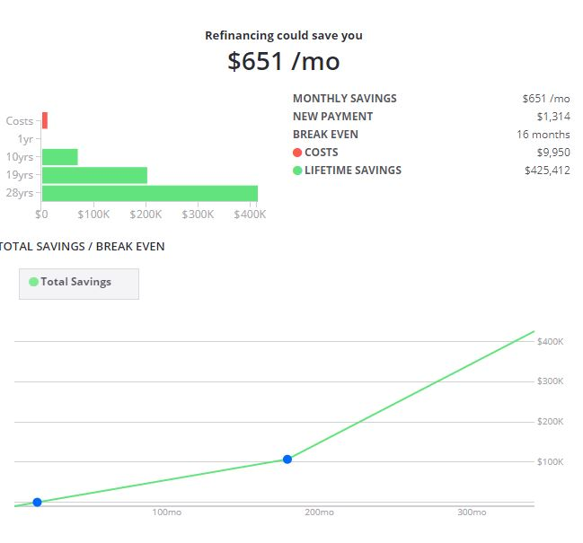

## Why?

Before making any big financial decision one must have a very good understanding of the reasoning behind it. When it comes to refinancing there are many reasons to do it, those reasons can be summed up by the image below.

For me refinancing made perfect sense especially where I am at right now. Since I put done 20% when I first got my mortgage, I did not have to pay for mortgage insurance. That means the refinancing will not help me there. Financially speaking I am stable and thanks to my family's help, I don't have to worry about taking money out of the house equity. This means the only benefit I will get from refinancing is the lower interest rate and better terms.

When it comes to mortgage terms, I had good terms. My mortgage was a conventional 30 years fixed rate, which means I didn't have to worry about changing it from variable rate or change the loan type. The only thing that could benefit me from the mortgage terms is actually the number of years to pay the loan. I could have kept the 30 years term and lower my monthly payment. However, I have been paying extra each month since I had my mortgage, which means even if I reduce the mortgage term to 15 years my monthly payment stays about the same. Having a shorter term means that I get pay it off sooner and save more money.

In the end, my reasoning for refinancing is to reduce the amount of money that I am losing to interest. By changing the terms to 15 years, I effectively save 15 years of interest payments. We cannot forget about the icing on the cake, which is getting a lower interest rate.

## Should I?

Before starting anything how much of a difference will the refinancing do and how will it actually change things? I am not going to claim that I am an expert, or based on all the things that I have read I can predict the exact outcome. However, there are many tools out there that allow you to compare and give you a refinancing report. 

My favorite calculators:
- [Zillow's refinance calculator](https://www.zillow.com/mortgage-calculator/refinance-calculator/): this calculator gives a nice breakdown based on the mortgage terms and rates. Meaning the calculations are based solely on paying the minimum payments each month. 
- [Calculate Stuff refinance calculator](https://www.calculatestuff.com/financial/refinance-calculator): similar to Zillow's calculator, except it compares the remaining amount in your mortgage against the refinanced loan. This gives you a better picture of how the refinancing will affect your current mortgage.
- [Calculate Stuff loan comparison](https://www.calculatestuff.com/financial/loan-comparison-calculator): very helpful when comparing different loan terms especially when it comes to rate and terms.

To use the calculators correctly, I need to get data such as interest rates and expected fees. Luckily, our government has that information for us which helped me get a good understanding of what is a good deal at the time.

For interest rates, I used the [consumer finance](https://www.consumerfinance.gov/owning-a-home/explore-rates/) website to find what is the average interest rate currently and what the best deal I can get. Then there are the closing costs! One misconception is that you can get a mortgage or loan without paying the closing fees. There is no such thing as free lunch, it is just someone else paying for it and in most cases, it is actually you. The fees get rolled up into the loan or the interest rate itself so, in the long run, you will end up paying more. 

Additionally, there are many different closing fees and they differ based on case by case. The common ones are listed [here](https://www.consumerfinance.gov/ask-cfpb/what-fees-or-charges-are-paid-when-closing-on-a-mortgage-and-who-pays-them-en-1845/). The fees change by state, type of loan and many other factors. I explain my fees a little bit further down. However, for my scenario testing, I looked at my original mortgage and used that. Even though, the original loan had lots of fees that no longer apply such as escrow fees, property taxes, HOA and so on. I knew I will be buying some points which will bring it up to about the same amount of fees. The fee amount was $9451.67 for calculation purposes I used $9500.

## The search process
The nice thing about doing a bit of research, you can get all the information you need in one place. The consumer finance website has a nice [toolkit](https://files.consumerfinance.gov/f/documents/cfpb_your-home-loan-toolkit.pdf) that walks you through step by step to getting a home loan.

After all the scenario testing using the calculators, it was clear that the refinancing decision is a good decision and I was ready to pull the trigger. I started looking for lenders! First, I reached out to my original lender with whom I had a great experience. I got no reply and I sort of expected it, since I referred a couple of people to him and they didn't have a good experience. Then I talked to a couple of people who recently got loans recently including my cousin and I didn't like the rates they had.

I then started the hunt online in all the places where you can shop for rates. I tried credit karma, mint, personal capital, nerd wallet and none of them had the rate that I was looking for. Finally, I was on Zillow and tried their [mortgage rate tool](https://www.zillow.com/mortgage-rates/) and that is where I found [AimLoan](https://www.aimloan.com/). After more research, they seemed to be credible and because they are a direct lender, it means I get the best deal possible! Once I found them, I didn't really need to do any more searching especially after going through their application process. The nice thing about AimLoan is I got to see the rates and estimated closing costs before even filling anything. That made me more confident in my choice and began the application process.

## The application process
I really enjoyed my experience with AimLoan, especially their transparency in the whole process and how easy it is to do everything online yet still get calls directly from them when I have any questions. The application was a nice simple online form that you can pause and continue whenever you want. I went through the whole thing within 30mins or so. After that, I got an email from them outlining their entire process.

- Step 1: Apply Online or by Phone. Completed: 11/19/2019
- Step 2: Loan Officer Review. Completed: 11/20/2019

We are pleased to advise you that your loan application has been assigned to the following Loan Officer: Mathew Escobar. Mathew Escobar will review your application and run it through our Automated Underwriting System to obtain an automated approval based on your credit report and the information provided in your application.    
If you have not yet locked in your interest rate, Mathew Escobar will contact you to review pricing options and lock in your rate. 

- Step 3: Initial Processing. Completed: 11/26/2019

Your application will then be assigned to a Loan Processor who will email you a list of required documentation and instructions on how to upload the documents using our secure website portal.  It is important that you submit your documentation as soon as possible to ensure the loan process stays on track and your loan closes on time and within the lock period.
If required, an appraisal will be ordered and the appraiser will contact you to schedule an appointment.  It is important that you schedule the appraisal appointment as soon as possible to ensure the loan process stays on track and your loan closes on time and within the lock period.
From this point forward your Loan Processor will be your main point of contact.

- Step 4: Initial Underwriting. Completed: 12/03/2019

Our Underwriting Team will review your documentation to confirm that you meet program guidelines. Underwriting will prepare a list of any additional documentation required and conditions of approval.

- Step 5: Final Processing. Completed: 12/12/2019

Your Loan Processor will work with you and third party vendors to obtain any additional documentation required.  It is important that you submit your documentation as soon as possible to ensure the loan process stays on track and your loan closes on time and within the lock period.
If required, the appraisal will be received and added to your loan file.
Your Loan Processor will send you a Final Loan Estimate to review and approve.  It is important that you review this document to make sure everything is in order, including the amount of funds required to close.

- Step 6: Final Underwriting. Completed: 12/12/2019

Underwriting Team will review the appraisal and sign off on the earlier underwriting conditions that have now been satisfied.
In rare instances, the underwriter may require additional documentation or conditions based on new information.  It is important that you submit your documentation as soon as possible to ensure the loan process stays on track and your loan closes on time and within the lock period.

- Step 7: Closing Disclosure. Completed: 12/16/2019

Your Loan Processor or our Disclosure Team will send you a Closing Disclosure to review and approve. You must acknowledge receipt of this document in writing or by email response in order to keep your file moving forward.

- Step 8: Doc Drawing. Completed: 12/18/2019

Our Closing Team will communicate with you and your Settlement Agent to coordinate a date and time for you to sign your loan documents (Note, Deed, etc).  The earliest date you can sign by law is the third business day following your written acknowledgment of the Closing Disclosure.
Your loan documents will then be drawn and sent electronically to your Settlement Agent.

- Step 9: Doc Signing. Completed: 12/20/2019

Your Settlement Agent or a Mobile Notary will meet with you to sign and notarize your loan documents.  
When you sign your loan documents (Step 9), you will be provided with a complete copy, including a first payment letter with a payment coupon to use in making your first payment.  Within two to three weeks of closing, you will receive a Loan Servicing Welcome Package with further instructions including how to set up auto pay.

- Step 10: Closing. Completed: 12/23/2019

Your Loan Closer will run a soft credit report to ensure your debt has not increased since the time of your application.  It is important that you do not take on any new or increased debt during the loan process as this could result in you no longer qualifying for the loan.

Your Loan Closer will also verbally verify with your employer your continued state of employment. If at any time during the loan process your employment status changes, it is important that you notify your Loan Processor right away to confirm that you still qualify for the loan.

Your Loan Closer will then initiate a wire transfer to your title company. 

## Application process highlights
After submitting my application and locking my rate, I received a loan estimate and that is when I got to work before continuing the process. I wanted to make sure I am not getting scammed or paying for any fees that don't make sense. Reviewing the estimate and going through [this article from Investopedia](https://www.investopedia.com/articles/mortgages-real-estate/08/mortgage-closing-costs-fees.asp), I became more assured.

I had to submit the following documents online for step 3 (which was extremely easy):
- Driver's license
- Homeowner insurance policy
- HOA statement
- Current Mortgage statement
- Bank statements
- Signed Lock confirmation (rate lock)
- Approval to do a hard credit pull
- Request for Transcript of Tax Return (IRS 4506T)
- Simple privacy forms/ declaration of occupancy (if living in the house or not)

Additionally, given my good credit, I didn't need to get an appraisal even though my house value has gone up by $15K. That saved me the appraisal fee which is ~$500.

My closing process could have been completed a couple of days sooner if it wasn't for the homeowner's insurance policy expiring soon after the closing.

My final docs had a mistake where I could have gotten negative amortization which would have cost me more money. I caught it by just reviewing the documents and comparing them with the original loan terms.

I paid the closing fees when I signed the paperwork on the 18th. I got a cashier's check from the bank and gave it to the notary which came to CourseKey's office for me to sign all the paperwork.

## Total Costs (Closing Disclosure)
### A. Origination Charges: $5,457.05
These are the fees that go to the lender, ie the person processing the loan for you. Usually, this is around $1000 for a good lender. I also purchased a couple of points to get the best rate possible. The way it breaks down for me is:
- Lender Fee: $995
- Points: $4,462.05

### B. Services You Cannot Shop for: $904.50
- Appraisal Fee: $478 (Waived)
- Credit Report: $40
- Flood Certification: $5.50
- Tax Service: $64
- Title - Closing Fee: $450
- Title - Lender's Title Insurance: $345

### C. Services You Can Shop for: $0
- Originally, I could have chosen the title company to do the closing and the title insurance. However, since I was extremely busy, I decided to pay a bit extra for the convenience. I also got the notary to come to me for the signing which was nice.

### D. Total Loan Costs (A+B+C) $6,361.55

### E. Taxes and Other Government Fees: 140
- Recording fees and other taxes: 140

### F. Prepaids: $121.41
- Prepaid interest ($13.49 per day for 9 days @2.5%): $121.41

### Total: $6,622.96 (Original estimate: $8,249 w/ payoff amount of $197,856)

## Final costs
My new loan is for $197,000. All costs add up to $‭201,964.71 ($6,622.96 (closing costs) + $195,341.75 (old loan payoff amount)) which means I have to pay the difference as my closing fees which is $4,964.71.

The real cost of the refinance is the following closing costs + the difference of the new and old loans + the old loan payoff fees: $6,622.96 + $2,492.86 + $834.61 = $9,950.43

I got a refund of $148.97 from the original lender which brings the total costs down to $‭9,801.46‬

