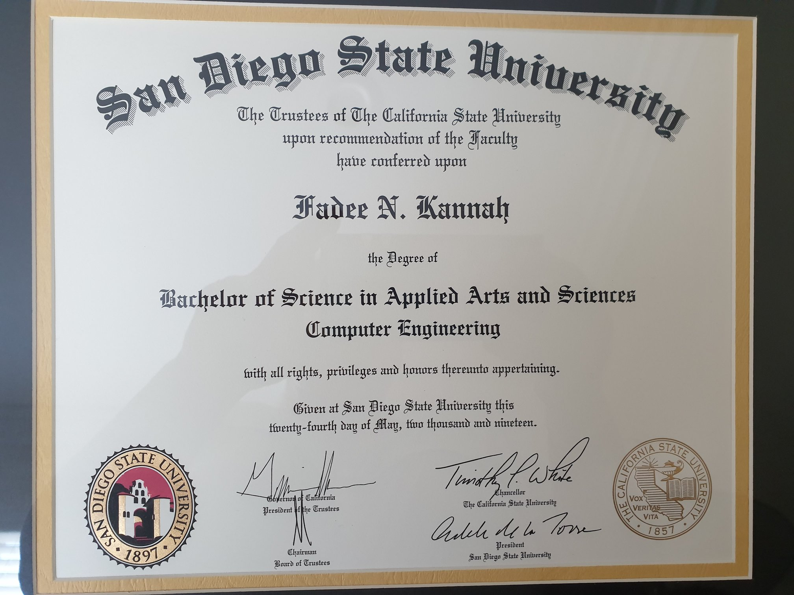
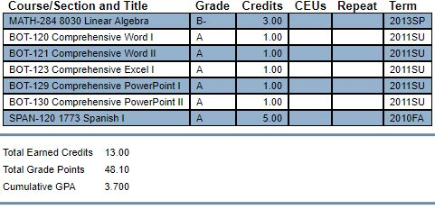
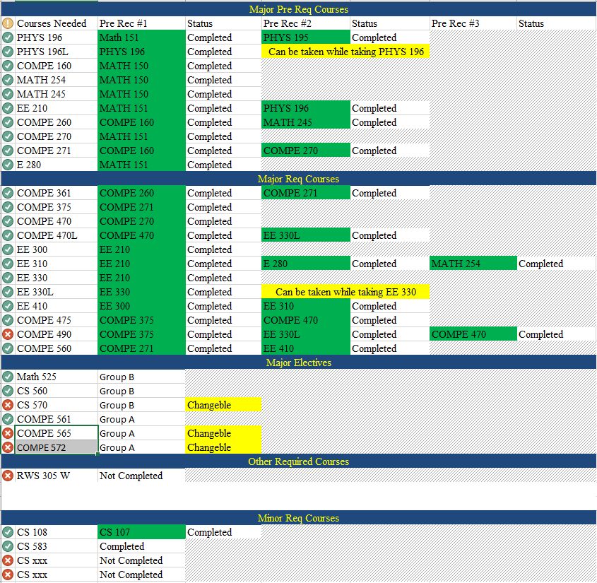
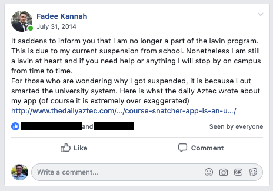
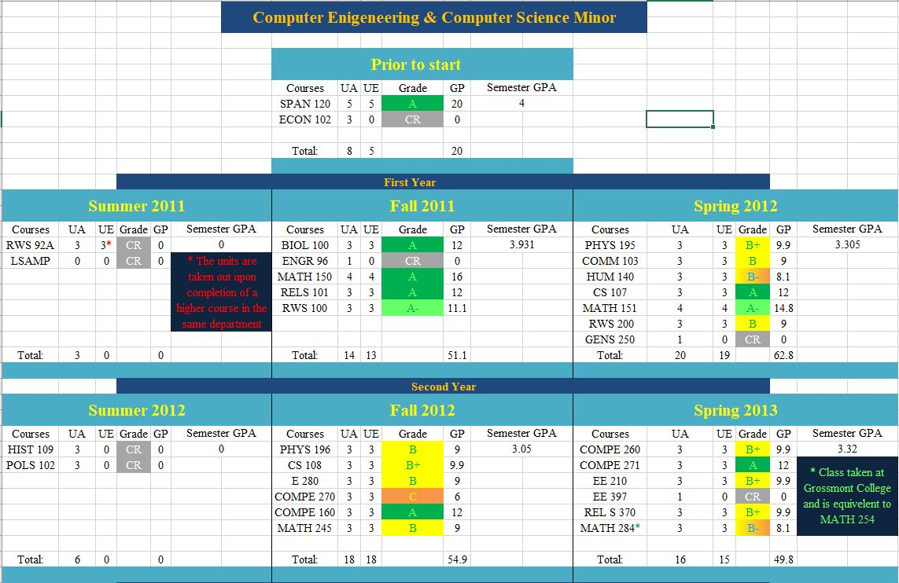
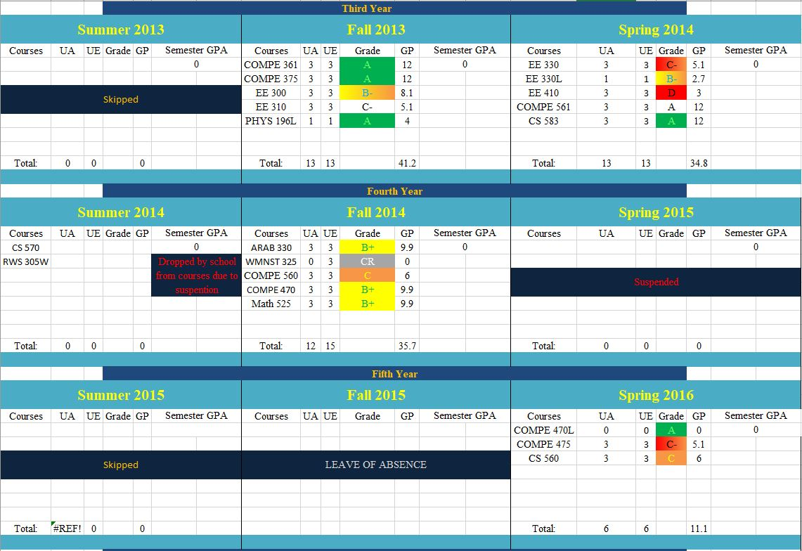
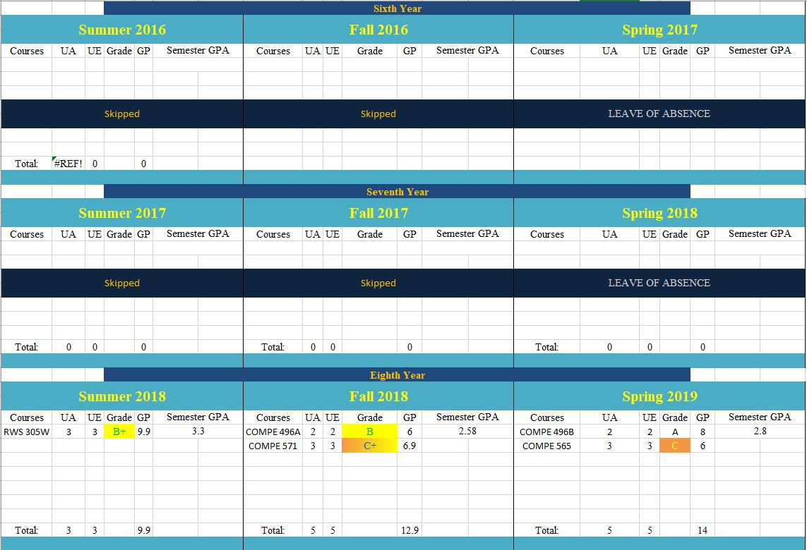
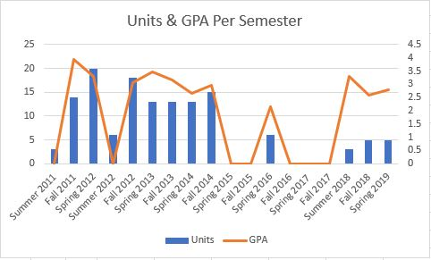
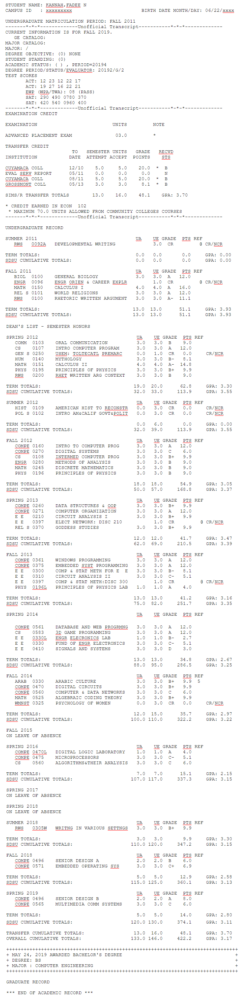

## Semester by semester

### Fall 2010

It all started while, I was in high school. I learned that I would not be able to graduate unless I meet the two years of foreign language. Speaking two other languages natively apparently does not meet the requirement. Since I was cramming four years of high school in two and a half it was not possible to squeeze two years of language classes in.

The only solution was to take night classes at community college. I ended up taking Spanish I which counts as two years of high school language. The best part was I got to double count it for my college requirements as well.

### Spring 2011

My last semester in high school, I finally got the chance to take an AP class. I took AP Economics which allowed me to take the AP test. I ended up passing the AP test and earning credits for another class for the university before even starting.

Additionally, I finished the last part of the business office technology shared program between my high school and Grossmont college. This gave me credits for 5 college courses, however none of them applied to my major.

Finally, the college application, I decided to apply to Educational Opportunity Program (EOP). While I was still finishing my high school senior year, I received another email to apply for the Mathematics, Engineering, Science Achievement (MESA) program.

Both programs offered a lot of services and subprograms that helped me with not just school but also grow personally. Both programs had summer sub-programs that I decided to enroll in!

### Summer 2011

EOP offered the [summer bridge](http://studentaffairs.sdsu.edu/EOP/Modern/BEST.html) an intensive preparation program to help students transition to the university lifestyle by developing the necessary skills. MESA offered the [Louis Stokes Alliance for Minority Participation program (LSAMP)](https://casa.sdsu.edu/freshmen/) which offered many benefits such as preparing for calculus, give scholarships, book loans and many other benefits.

That summer was very intense! It was not only a transitional five week of intensive courses but also because I was still learning how to communicate with people. At that time, I had only been in the USA for two and a half years. Additionally, I barely used my English, I spent majority of my time in high school using Arabic or Chaldean just because I did not have the need to use English.

As I was doing my work and minding my own business, the summer bridge mentors noticed something about me, that I did not know was a strength I had till years later. They selected me to be a mentor in the new program Promoting University Learning and Leadership (PULL). I got to mentor a student from high school and have him shadow me for a week.

### Fall 2011 & Spring 2012

That summer set my momentum for the year, I started the fall semester running. I started with 13 units (got a bit worried due to the intensity of the summer programs). However, the following semester, I enrolled in 20 units while continuing to be involved in the EOP, MESA (MEP: Maximizing engineering potential) and LSAMP programs. I also got to participate in the [19th MESA Olympics & Robotics competition](http://alliance.sdccmesa.com/archives/2595).

### Summer 2012

After a year of data and experience in the university, I set my plans to graduate within four and a half years with not only my major but also a computer science minor. I mapped out every single class.

Since I was used to taking summer classes in high school, I planned on not skipping a single summer semester in the university either.

### Fall 2012 & Spring 2013

For this academic year I slowed down. I took a little bit less units (18 in fall, 16 in spring). This was due to me starting work as an IT for the EOP office and getting involved in student organizations. I joined IEEE, became president for CASU (Chaldean American Student Union), helped start MechaTronics. I also enrolled in the [pre-Marc program](http://www.sci.sdsu.edu/marc/pre-marc/overview/). I also teamed up with awesome people to win the [20th MESA Olympics & Robotics Competition](http://alliance.sdccmesa.com/archives/4170)

### Summer 2013

I took a break... However, I continued working on my growth and learning. I started working for the education department at San Diego State University as well. I worked on side projects and improving my skills. I focused on programming as much as possible and I built a few simple apps for fun. Because of my late course registration date, I created a script that helped me enroll in classes. The script later became the Aztec Course Snatcher.

### Fall 2013 & Spring 2014

Helped start SDSDS (San Diego Software Development) which was no longer a thing the following semester. I founded and became the president of HTEV (HiTech EdVentures) with the help of my instructor. I continued to grow my skills and became more entrepreneurial by turning my script into a complete desktop application and started selling it to other students.

I also became an unofficial teacher/lab assistant for the intro to programming course. That led me to getting started with private tutoring which was how made some extra cash.

### Summer 2014

I enrolled in two classes. However, since I created and sold Aztec Course Snatcher, I got awarded by getting suspended and getting dropped from my summer classes on the last day of class. That caused me to lose all my work during the summer as well as $100.

At the same time, I got accepted into the Lavin entrepreneurship center. I attended the orientation but because of the suspension I was dropped from the program as well. That led to me to writing [the post that changed everything](../fbPost).

### Fall 2014 & Spring 2015

I fought back hard!!! I changed the suspension from two years to a single semester and because of my persistence I even managed to move the suspension from the fall to the spring.

Although I was taking 15 units during the fall and was still heavily involved in EOP, MESA, HTEV, IEEE, I decided to help Luke start CourseKey when he reached out during the Fall.

Additionally, I attended the MESA Leadership conference, where I got leadership training. I also got recognized by senator Mark Wyland as well as San Diego State University.

Funny thing, although I was suspended during the spring I was still on campus every single day. I crashed classes to learn, still continued to be involved in my programs and student organizations but most importantly I started focusing on CourseKey.

I also did research with a faculty on campus. I processed Bluetooth signal from new EKG sensors and graphed the data in a Windows universal app.

### Summer 2015

Because I was focusing on CourseKey I decided to skip the summer and drop my minor.

### Fall 2015 & Spring 2016

I applied for a leave of absence for the fall. However, I still wanted finish school. I tested the water by taking three classes and working on CourseKey. That didn't go as smoothly as I liked! School ended up being more of a distraction and pain.

### Summer 2016 - Spring 2018

Because of the spring 2016 semester I decided to shelf school for a while till I can ensure it won't interfere with CourseKey. However, since CourseKey is a startup, we never have enough resources or bandwidth for me to take care finishing school.

Since I had used up all of my leave of absence, the school informed me that I would have to retake all my major courses if I don't finish soon. This is due to a policy where the accreditation no longer applies since the curriculum has most likely changed.

### Summer 2018

I decided to try finishing the school by taking a single class. It turned out to be a piece of cake. The demand of a startup was nothing compared to a writing class. I ended up getting a B+ with minimal effort and focus on the course.

### Fall 2018 & Spring 2019

The last two semesters. I took the senior design course which is broken down to two parts one in each semester. I was lucky to be partnered up with an awesome group that assigned me building an app.

I had the app 85% done by the end of the first semester and 98% over winter break. The other classes during both semesters where challenging graduate level engineering courses. However, with the skills and knowledge I have accumulated over the years, I managed to walk into the finals with the need to only get 15% to get a passing grade.

## TL; DR

After a long eight year journey, I have finally reached my goal of becoming a computer engineer. In the process, I faced many challenges and hurdles that I almost gave up on my goal. However, everything that happened led to me to who I am today. 

## The journey based on data

### Grades breakdown

Grade | Count
-------|-------
CR | 8
A | 13
A- | 2
B+ | 9
B | 6
B- | 3
C+ | 1
C | 4
C- | 3
D | 1

#### GPA

 Type | GPA
-----|------
Transfer | 3.7
SDSU | 3.11
Overall | 3.17

### Semesters breakdown

Type | Count
-----|------
Attended | 14
Leave of absence | 3
Skipped | 2
Suspended | 1
Dropped | 1
Summer Attended | 4
Summer Skipped | 4 

### Graduation ceremonies attended
- MESA Graduation
- EOP Graduation
- College of Engineering
- Knights of Columbus Mar Toma Council Graduation

### Was mentioned in the school news
This is just a few links that I could find. (I should have documented them as I found out about them) 
- [Leaders in STEM](http://newscenter.sdsu.edu/sdsu_newscenter/news_story.aspx?sid=75337)
- [Unlocking New Possibilities](http://universe.sdsu.edu/sdsu_newscenter/news_story.aspx?sid=75670)
- [MESA Students Create Student Engagement Platform](http://mep.sdsu.edu/engineering/mep/default.aspx?display=updates)
- [Course snatcher app is an unfair advantage](http://thedailyaztec.com/47880/opinion/course-snatcher-app-is-an-unfair-advantage/)
- [How To Keep Calm During SDSU Registration](https://www.theodysseyonline.com/how-keep-calm-during-sdsu-registration) (cannot find the original article on the daily aztec)
- [Course Key boosts campus interactivity](http://thedailyaztec.com/66941/news/course-key-boosts-campus-interactivity/)

### Data created
Throughout my journey, I kept a folder with all my courses work. This folder grew in size over the years, now that I have graduated it is 28.36 GB. It includes notes, projects, books, lectures, homework assignments and everything related to my education. 

### Ways I got money (college related)
This list excludes CourseKey related
- Financial Aid
- LSAMP Scholarship
- Working IT for EOP
- Working IT for Education Department 
- National Science Foundation Stipend
- MESA scholarship
- EOP scholarship
- Build MESA website
- Private tutoring
- HTEV projects
- Unofficial TA
- Aztec Course Snatcher
- Side projects for other students

### Tuition
I managed to avoid college dept by working and paying for it. I was fortunate enough to have financial aid cover most of college fees. I ended up having to pay $8,328 out of pocket total.

#### SDSU Transcript

