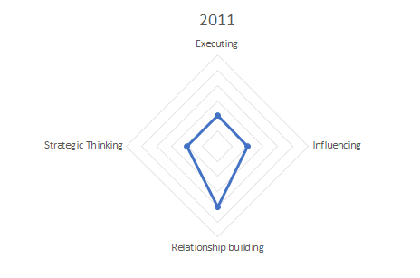
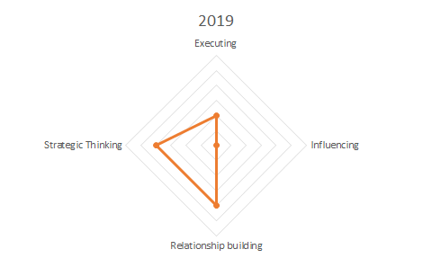

## Introduction

What are my strengths? That is a question that I had when I started at San Diego State University. I observed a lot of talented people and everyone seemed to have many strengths. I knew I had my own strengths as well but was just not aware of them and how they work together. These strengths are what makes me who I am.

In the fall of 2011, through the MESA program, I found out about the [strengths quest](https://www.strengthsquest.com). This allowed me to find out what my top five strengths were at the time. I recently was wondering if those strengths have changed, especially since it has been eight years and it is the end of my university career. I retook the assessment, and there are few interesting findings that I learned. Just by looking at the differences in my top strengths I can see the growth and character changes I have gone through.

## Strengths Assessment Results

Rank | 2011 | Domain | 2019 | Domain
|---|---|----|---|----|
1 | Restorative | Executing | Relator | Relationship building
2 | Includer | Relationship building | Learner | Strategic Thinking
3 | Activator | Influencing | Analytical | Strategic Thinking
4 | Relator | Relationship building | Includer | Relationship building
5 | Learner | Strategic Thinking | Achiever | Executing

In one of [my previous posts](../../Talks/MesaLeadership/strengthsFinder), I have the generic descriptions for each strength and domain.

## Personalized summary of all my strengths
### 2011

#### 1. Restorative

Means I am good at dealing with problems and figuring out what is wrong and resolving it. I like to reach some conclusions about what I need to upgrade, make better, or perfect before I expend any time, money, energy, or resources. I try to be fair. Because of my other strengths, I usually am more upbeat about life when I can determine why I failed to reach a goal or a standard of excellence. Once I identify my errors, lack of knowledge, or need to practice certain skills, I am apt to devise a plan to improve my performance. Driven by my talents and goals, I sometimes become a bit frustrated with people who have few clear goals. Perhaps these individuals remind me that ill-defined objectives seldom are realized. 

Since a young age, I always enjoyed solving problems and handling things that others did not want to do. This included dealing with issues and figuring out what went wrong. When I came to the US, I set goals for myself to achieve. I started working on them as soon as I could. Here are a few goals that I set back then:
- ✔ Graduate high school with my class/peers: Had to do it in 2.5 years instead of 4, To learn more see my [educational journey](/about?section=Education)
- ✔ Become a CTO by 40: Became the CTO for CourseKey at 22
- ✔ Buy a house by 2020: Bought it in 2018
- ⚒ Graduate university: Work in progress since my other goals moved up in priority (target: May 2019)

#### 2. Includer

Means I accept others, I am aware of those who feel left out, and I make effort to include them. I may not do a great job at showing my effort, but I do enjoy including people. In conversations, I move in and out of thought-provoking conversations with grace. I enjoy delving into certain topics and explore the frontiers of particular ideas. I am happier if I meet more people who share the need to talk about theories and concepts rather than be concerned with gossip or practical matters. Instinctively, I derive satisfaction from partnering with specific people. I usually find many qualities to appreciate in most of the people I meet. I accept individuals just as they are. Sometimes I move beyond tolerating people to enjoying their company.

Since I was young, I realized that everyone knows something that I don't. This is why I enjoy involving others in either conversations or activities. My favorite part is when those conversations turn into thought provoking topics. These conversations always lead to me learning something new that in some cases changes my perspective/view on the topic or just expands my knowledge. Additionally, I dislike it when anyone feels excluded, that is why I try to include everyone.

#### 3. Activator

It means that I want to get things done, rather than simply talk about them. I turn ideas into actions. As soon as I have made up my mind, I am eager to get started. People who interfere with making progress irritate me. Because of my strengths, I try to generate enthusiasm, so people become as eager as I am to transform an idea into something tangible. I am energized by opportunities and possibilities. By nature, I am the human spark plug of the team. That is, I inspire and energize people to dedicate themselves to a task. Instinctively, I like to make my own choices. Once I have settled on a goal, I am eager to reach it. I issue direct orders when the need arises.

This strength peaked for me when I was running HiTech EdVentures (HTEV). I got to work with multiple teams of students and got them to run and build things. Since middle school, I always ended up being the one in charge when it came to group projects without even intending to. I just try to organize things and put a plan together to turn the ideas into action.

#### 4. Relator

Relator means that I enjoy and have great satisfaction working hard with a group of friends to achieve a goal. Additionally, I have many friends who come to me for guidance, suggestions or recommendations. Topics might include situations in their personal or professional lives. By nature, I identify with people who share their ambitions, hopes, or intentions with me. Because of my strengths, I feel most fulfilled when I am busy and simply performing tasks towards my goals. When I have nothing to do, typically I end up finding something to do. Sitting around and wasting time does not suit me at all. Driven by my talents, I consistently measure up to my high expectations when working, studying, or playing. I naturally gravitate to tasks where facts, events, processes, or ideas are methodically outlined.

Because of my other strengths, this strength developed. From being an includer to be being a Learner, I collect and analyze lots of information. Because of this people can feel related to when conversing with me. I am good at listening and help come up with solutions and advice for people who ask for one. I remember many situations back in high school where people would ask me which classes to take, what to do so they can graduate and even which university/college to attend after.

#### 5. Learner

This is a strength that doesn't really need an explanation. I have a great desire to learn and want to continuously improve. The process of learning excites me. I aim to expand my knowledge and challenge my thinking about certain things. Instinctively, I appreciate opportunities to acquire knowledge, gain skills, or experience new things. I refuse to let my mind grow dull by being complacent (self-satisfied). Sometimes I am frustrated until I figure out why things happened the way they did. By nature, I have extra energy to work hard when I am acquiring information to broaden my knowledge base. e

Since I can remember, I have always been curious and interested in learning. I would go as far as I could to learn how things worked. For example, I always opened up any gaming console that I got, and I managed to even break my PlayStation2. When I got my PC, I managed to fry the motherboard the next day and corrupt windows within three days. I always enjoyed pushing myself to learn. I enrolled in difficult and demanding classes - honors and Advanced Placement (AP). I did so even though the teachers and counselors were against it. That was understandable given I had only been in the US for a year and my English was still very limited. I just have an itch, more like a need to “prove myself to myself” every now and then.

### 2019

#### 1. Relator

My relator strength has evolved. I make people feel worthwhile and appreciated by inviting them to share some of their aims for the future. When I know a bit more about a person, I tend to begin nurturing a meaningful relationship. Because of my strengths, I use sound reasoning to identify the basic components of a complicated situation, process, event, or decision. I describe certain types of intricate things in ways that people can easily understand. Occasionally I direct their attention to specific points. I avoid overwhelming particular individuals with every fact or detail I know. I occasionally assist my teammates by reducing the difficult-to-understand programs, rules, processes, concepts, formulas, or policies to their bare essentials. I still identify with people who share their ambitions, hopes, or intentions with me. 

#### 2. Learner

My learner strength has also evolved! Instinctively, I aspire to hold the topmost position in an organization. This lofty goal motivates me to broaden my knowledge base, enhance skills I already possess, or acquire new ones. When opportunities to advance my career present themselves, I am determined to be the best prepared and most knowledgeable for the opportunity. I welcome the chance to vie with certain people for important positions. I thirst for new ideas and knowledge. Sometimes I dive into my reading with abandon. Other times I lose myself in a book or a project. I want to absorb as much information as I can. I endorse the importance of acquiring additional knowledge and gaining new skills. I regard education as an ongoing activity. I show my teammates how one action or a single comment caused something unexpected to occur. Experience might be one of my best teachers. This partially explains why I do not automatically orchestrate an event, plan a schedule, or allocate resources the same way I did the last time.

#### 3.Analytical

Being analytical means that I search for reasons and causes. I have the ability to think about all of the factors that might affect a situation. I reason through what needs to be done and how to do it. My methodical approach produces precise outcomes. I prefer assignments that demand attention to detail. I am a process thinker. I search for the reasons something went wrong. Occasionally, I sort through facts, look for missing pieces, or study a sequence of steps. If I fall short of a goal, I investigate until I know precisely what prevented me from being successful. I feel inclined to double check my work. I need to understand how one idea or fact links to whatever precedes or follows it. I may be perceived by my teammates as a businesslike individual.

Through my university journey, I became more analytical or as my political science teacher calls it "bullshit detector". Understanding why things happen a certain way is critical to being successful, from why I missed a question on the midterm to why my relationship with people did not workout. Working on CourseKey has made me even more analytical! This is due to the fact that I have to ensure everything we build is up to our standard. 

#### 4. Includer

 My includer strength has moved down. I feel affection for certain individuals whom others label unlikeable, annoying, or disagreeable. I derive much joy from teaming with people to accomplish things. I view work, study, and play as opportunities to socialize and be productive. This explains why I need to interact with others on a regular basis. People energize me. I refuse to inflict emotional pain on others by making them feel unwelcome. I welcome the company of numerous people. However, there are some individuals with whom I choose to spend less time.
 
 #### 5. Achiever
 
 Achiever means that I take immense satisfaction in being busy and productive. I prefer to spend time with individuals who are trustworthy. I avoid people whose words or deeds indicate they value honesty less than I do. I handle tension well. Stress causes me to concentrate my physical and mental energy on the right priority. Periodic deadlines motivate me to be more efficient and effective. It’s very likely that I do more than just try to live up to my commitments. I continue working until I deliver on a promise. This enhances my reputation for being trustworthy, reliable, or dependable. I generate in my friends some of my passion for moving ideas from the talking stage to the action stage. My dedication to projects rallies individuals to work alongside me. I occasionally toil for hours to produce topnotch results. Being the best at something is important to me. I have little tolerance for mediocrity, especially about the things that matter to me.
 
-----

## Strengths Analysis

Focusing on strength domains, the first thing is the top 5 strengths domain distribution. I no longer have the Influencing domain as one of my top five. Instead, I have added another strength in the Strategic Thinking domain. This is the result of the people that I am surrounded with and the position that I am in. I no longer need to influence people, I work with self-motivated people as well as other leaders who can do the influencing better than I ever could. This is why I have shifted my focus and strength to strategic thinking. 

My current top strength is relator which falls under Relationship Building. This shift is due to me realizing the importance of personal relationship with other people. The most critical thing that I have learned over the last couple years, is that no one can do everything alone. I had to be able to work efficiently and professionally with my coworkers. The better I am at that, the quicker and better the outcome will be. Additionally, being the glue connecting different parts of the organization has forced me to be better. My goal is to become the mythical 100x developer/team member.

Executing strength moved down. This was a bit surprising for me at first. I have been executing and delivering on way more things than I have ever had before. Upon further reflection, I realized that the way I execute things have shifted. Before, I used to jump into a problem head first and try to solve it once I think I have enough information. Now, I am more methodical in my approach. I ensure I not only understand the problem but also, I have analyzed it, mapped out everything related to it, and I have included the right people! To do so, my other strengths had to take a higher priority.

Learner strength has moved up! This has been critical strength to my success and this is why I have been honing it. Either through the university or at CourseKey, I always have new things to learn! The more that I learn, the more I realize how much I don't know. This is why being a learner is my second strength. Working with others and being able to share and collaborate, has not only allowed me to focus my learning but also leverage others knowledge.

Finally, includer has moved down. I always want to make sure I include people as much as possible. However, working at CourseKey, I have realized that it might not be the best way to get things done. Sometimes it is better to report back to the team members instead of requiring everyone to attend a meeting. In other situations, getting consensus proved challenging. To solve for these issues, I have modified my strength. Now, I still include people but only if they really need to be there. 
