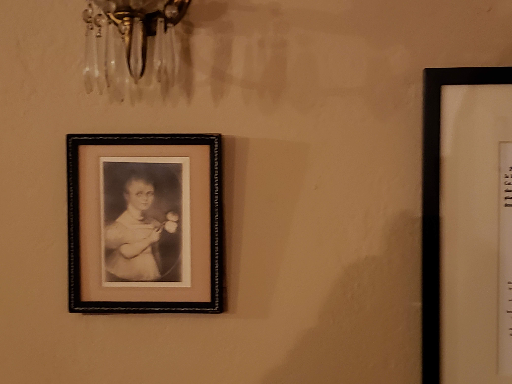

import YouTube from "@site/src/components/YouTube/YouTube.jsx";
import image from "./images/ezgif.com-optimize.gif";

## Background Information

This was our second time attending the conference! In 2018, we attended the conference for a single day. We flew in and back on the last day of the conference. Back then it was just three of us, me, Luan and Irving. Because we went on the last day, we didn't get to attend many of the talks that we were interested in.

While we were at the conference, we participated in a private research for one of the big three cloud providers.

<YouTube videoId="GPiUXzPBsRA" />

<pre>Disclaimer: this was a year ago and towards the end of the day when we were exhausted and running on little sleep.</pre>

This year, we took majority of the development team at CourseKey and got to enjoy the conference for two days!

## Trip Summary

The fun started early morning the day of. This was the first time I ordered an Uber early morning from my new house. That was when I learned the down side of living on the outskirts of the city. It would take longer for the Uber to get to my place than it would take me to drive to the airport (no traffic that is).

I decided to just drive and park in the airport. On my way there, traffic was terrible!! Which delayed me way longer than I planned for. By the time I got to the airport, I had 20 minutes before boarding started. 

This was when I started getting texts from my team asking me where I was. Usually, I am always early, so it was unexpected. Additionally, I had everyone's Bart(train) tickets, Airbnb info and the itinerary for the whole event.

When I got to the security checkpoint, things were ugly. Chaos everywhere! The lines were full and the TSA agents were extending the lines on the other side and they mixed the precheck and regular lines adding to the chaos and confusion. At this time, I started to panic and planning on how I will send all the info for the team since it seemed like I will be missing the flight.

Luckily, I got through the TSA, and **RAN** to the gate which was still open!! I literally got on the plane in the last 3 minutes.

Once we arrived at San Francisco airport, we took the Bart to Oakland convention center. We met up with Irving, then we spread out!! We attended a bunch of talks and keynotes. Soon after the hunger hit, which meant it was time to grab some food!


Since we were in China town we went for Chinese. After the food we went back to convention for more talks and enjoy the exhibit hall.


After the exhibit hall closed and all the talks were done, we went hunting for the after parties. Sadly, due to the underwhelming events, we ended up wandering around till we found a good spot.


We took over a table, enjoyed dinner and playing some games! We played Fluxx and super fight. After spending couple hours playing games, it was time to head to our Airbnb.

Our Airbnb was unique. It was an older building with a lot of rooms. It felt like a movie set piece, mainly for a horror movie!! I enjoyed the stay there 😊



The next day as we were heading to the conference, we ran into farmers market. We explored it for a bit and most of the team went for coffee and the rest went to the convention center for the conference.

The rest of the day was similar to the first day. More talks, more time in the exhibit hall, more fun, Chinese lunch.


The conference started to wrap up, some of the booths were gone, everyone was drained and ready to take a nap. However, that's not how CourseKey works. 


We had a fun bug show up in production! The dev team took over a table, patched the bug, QA'ed and released the fix within 30 minutes. In the meantime, our PM upgraded our JIRA system!! 

After the quick work session, the exhibit was closing down. The exhibitors packed their tables and people disappeared from the convention center.

As we were heading out, we noticed a flyer for an after-party nearby. Since our flight was later in the day, we decided to crash the party.

The party was hosted by Kik to promote their Kin team/technology. It was fun chatting with their team and learning about more about the technology. Additionally, the free food and drinks were a plus!!

After the party, we left to the airport taking the Bart again. The ride felt much longer, which could have been caused by the exhaustion finally catching up to me.


In the airport, things were more relaxed. Once we were past security, we got to relax a bit. We ended up playing some more Fluxx for a bit before onboarding. With that we wrapped our trip to developer week.

### Fun Fact

Fadi managed to get third place against all the other attendees for the number of booths visited and scanned!

 

## Talks & Keynotes

We attended many talks/keynotes. I documented the highlights and important information from the talks that stood out for me. You can read the recap for each one here:

- [Make Your Existing Application Serverless with React, Graphql and Cloudflare Workers](./make-your-existing-application-serverless-with-react-graphql-and-cloudflare-workers)
- [Strengthening the Tribe - Developers Enabling Developers](./strengthening-the-tribe-developers-enabling-developers)
- [A Decade of Stack Overflow - Building a Place for Anyone Who Codes](./a-decade-of-stack-overflow-building-a-place-for-anyone-who-codes)
- [Eventbrite’s 13-Year Technical Evolution](./eventbrites-13-year-technical-evolution)
- [Enabling Business Agility Through Evolutionary Architecture](./enabling-business-agility-through-evolutionary-architecture)
- [Blitzscaling Your API - Lessons Learned After Building over 400 Integrations](./blitzscaling-your-api-lessons-learned-after-building-over-400-integrations)

## The Exhibit Hall

The exhibit hall was great! It was the perfect opportunity to learn about new technologies, platforms and tools that we can utilize. Additionally, it was a great opportunity to connect with the teams that we use their products.


First, we ran into GitKraken, our git GUI tool. After talking and sharing how happy we were with the tool, we managed to get a discount code that helped pay for a year subscription for one user!! As a startup, saving any bit of money is always a nice plus.

Another company we ran into was Atlassian. We use BitBucket and Jira. Luckily for us both teams had representatives there. I literally spend at least three hours in their booth. We discussed features, limitations and even bugs in their software and they got escalated on the spot. As a team, between me and our PM we gave Atlassian enough feedback that they recruited our PM to provide user feedback for them.

There was a total of 90 Exhibitors all around the hall. The full list can be found [here](https://developerweek2019.sched.com/directory/exhibitors). My favorite exhibitors we met was GitKraken followed by the CodeStream. However, Atlassian's team was awesome and they treated everyone in the exhibit hall to free beer and food!!
 
## Conference Recap

This conference was ton of fun and I was glad that I could take more of the team this year. We got some discounts and an upgrade to our Jira software. Additionally, we got to learn, play and "party". 

### Resources

Here are a few links worth sharing that popped up during the conference.

#### Dev resources / communities
- [dev.to](https://dev.to/)
- [DZone](https://dzone.com)
- [Microsoft Dev Collective](https://developer.microsoft.com/en-us/collective)

#### Great API documentation example
- [Trulioo](https://developer.trulioo.com/)

```mdx-code-block
import DocCardList from '@theme/DocCardList';

<DocCardList />
```
