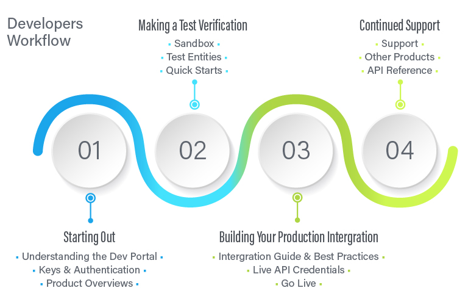

## Introduction

This talk was hosted during the Developer Week 2019 conference. I attended this talk to learn about building APIs for integrations. This is important since in today's world data is being shared between many services. 

## Presenters
This talk was presented by two product managers (Shivin Bakshi and Conor Delahunty) from Trulioo. Shivin has been involved in championing integration of 40+ data sources, release management of SDKs, and managing Trulioo’s document verification technology. Conor is responsible for the development of Trulioo’s developer hub and expanding their developer ecosystem as well as integrating APIs from across the world.


## Summary
When building APIs field names are extremely important. The filed names should match business logic not internal system names.

**Example**
Using `name` as a data field name in the API is bad, because it can be a user's name or business's name and so on... Instead use nested data as user and business and in it define the name field.

```xml
<data>
    <user>
        <name>Test</name>
    </user>
    <business>
        <name>company</name>
    </business>
</data>
```

Another good practice is to research competitive APIs. This will allow you to learn what to expect and what to account for when building the APIs. 

Building APIs is just building another product for a customer. The APIs are the product and the customer is the developer. To ensure the APIs build are the successful focus on the costumer, which is the developers.

### Developers Workflow

1. Starting out
   - Understanding the dev portal: Help the developers understand where all the resources available to them are and how to access them. Ensure the documentation is available and easily accessible.
   - Keys & Authentication: Provide the developers with access and credentials to access the apis.
   - Product overview: Ensure the developers understand what they are integrating and know the business logic they are planning to integrate.
1. Making a Test Verification
   - Sandbox: Provide a testing/staging environment for the developer to test the integration without affecting production data.
   - Test Entities: Provide the developer with testing data.
   - Quick Starts: Offer guides for the developer to implement simple integration with the system
1. Building Your Production Integration
   - Integration & Best Practices: Ensure the developer is following the best practices to solve the use case. Guide them through the process to ensure no mistakes are made during the integration.
   - Live API Credentials: Provide production credentials so the integration can go live.
   - Go Live: Help the developers go live if needed and monitor things to ensure everything works as planned.
1. Continued Support: Ensure developers are aware of updates and changes and have access to all the documentation as well as access to monitoring data.

### Developer focused documentation
- All documentation should be available online
  - Use swagger for documentation and swagger-diff for managing updates and different api versions
- Make it interactive: allow the developers to test in the documentation directly.


### API Design
- Flexible design: Apis should be designed so they are flexible and extendable
- Api should be for both human and machines: Should be easy for human to read and easy for machines to process.
- Support the customers: It should always be clear to the customer what the API is and what it does. 
