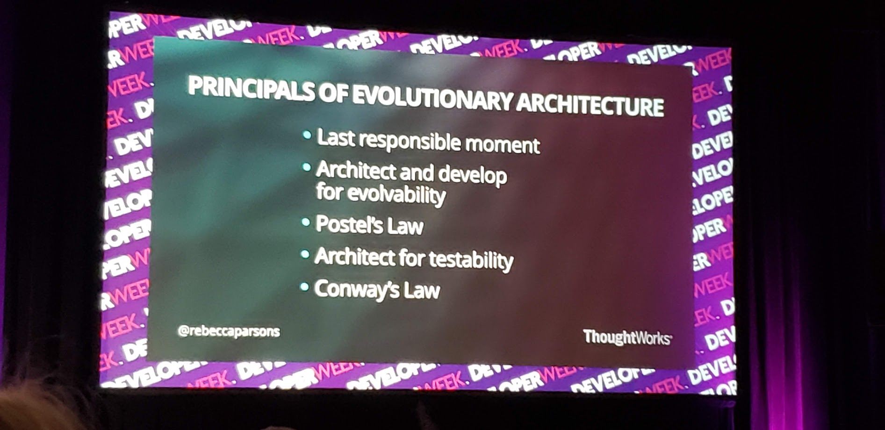

## Introduction

This talk was hosted during the Developer Week 2019 conference. I attended this talk to have better understanding on how to approach enterprise software architecture. 
  
## Presenter
Dr. Rebecca Parsons is ThoughtWorks’ Chief Technology Officer. Her technical experience includes leading the creation of large-scale distributed object applications and the integration of disparate systems. She also was awarded the 2018 Technical Leadership Abie Award from AnitaB.org, as part of the Grace Hopper Celebration, for her ongoing and impactful commitment to increasing the representation of women in technology.

Before coming to ThoughtWorks, Dr. Parsons worked as an assistant professor of computer science at the University of Central Florida where she taught courses in compilers, program optimization, distributed computation, programming languages, theory of computation, machine learning and computational biology.

[@rebeccaparsons](https://twitter.com/rebeccaparsons)

## Summary

### Software development process
The best approach to develop software and run a business is to follow this virtuous cycle and repeat:
- Testable hypothesis
- Continuous and experimental design
- Fast, reliable delivery
- Measure and analyze the results

As an industry we have gotten better at handling requirement changes, but we have not been able to handle architecture changes. We should plan for the quick infrastructure and ecosystem changes. This is where Evolutionary architecture comes in.

### Evolutionary architecture
Evolutionary architecture is guided incremental change across multiple dimensions. Architecture focus changes and the best architecture changes over time. That is why a business should design it to be evolutionary.

Evolvability is becoming a first-class citizen in today's world. Especially how quickly software is evolving and changing.

To build an evolutionary architecture we must:
- Decide on what to focus on 
- Decide the fitness functions to measure the architecture
- Evaluate how close to achieving the desired result/outcomes

### Fitness function
Fitness functions are designed to have objective, quantifiable results. By using the fitness functions, it creates a consistent enforcement mechanism. Finally, by having a list of fitness functions allows developers to easily design and deploy.

The fitness functions can be one of or a combination of:
- manual vs automated
- atomic vs holistic
- static vs dynamic
- triggered vs continuous
- temporal
- domain-specific

### Trade-offs
When designing an architecture there is always a tradeoff that needs to be made. For example, if we prioritize security AND performance the tradeoff is, we cannot maximize either of them. When it comes to software architecture, we have many many possibilities and trade-offs to make.

### Principals of Evolutionary Architecture

- **Last responsible moment**: Hold off on making a decision as much as possible. To ensure we have a lot more information to make the best decision possible.
- **Architect and develop for evolvability**: Mainly how easy it is to understand the code and how close is the software/code to the business logic.
- **Poarel's law**: This relates to how systems talk to each other. The architecture should be conservative with what exposes but be as generous as possible for what it accepts. Only make changes when required. Be very cautious what you send.
- **Architect for testability**: Thinking of testing first will steer someone away from bad architecture.
- **Conway's law**: Any system built in and across organizations reflects the business communication. If people don't talk the systems will not talk!

### Techniques for Designing Evolutionary Architecture
- Database refactoring: Migration of data always hard
- Choreography: automate systems so they can run without relying on a single point of failure
- Contract testing: Get requirements from the client and use the tests as the prove point for all the tests. Ignore each other until the tests fail.
- Continuous delivery: should not be done if cannot manage it or have the discipline for it

### Architecture styles
- Big ball of mud
- Structured monolith
- Layered monolith
- Micro-kernel
- Micro-services

### Steps to move towards an Evolutionary Architecture
- define architecture fitness function
- start from the furthest thing you are on (the area you are the weakest at)
- improve on it
- focus on what matters
- monitor, adapt and repeat

Monitoring is critical so you can ensure things don't get worse and the investment put in will not have to happen again.

