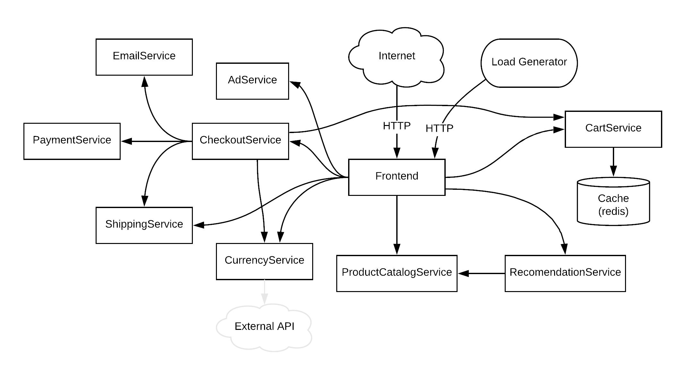

## Introduction

This talk was hosted during the Developer Week 2019 conference. I attended this because I was curious about the topic. 
  
## Presenter
Sevki Hasirci is a Systems Engineer at Cloudflare, working on developer tools, his day to day responsibilities are making developers more productive.

## Summary
This talk was a technical demo of the service worker feature in cloudflare. All examples can be found here:
- [Workers React Example](https://github.com/cloudflare/workers-react-example)
- [Workers React PWA Example](https://github.com/cloudflare/workers-react-pwa-example)
- [GraphQL running on Cloudflare Workers](https://github.com/cloudflare/workers-graphql-gateway-example)
- [Microservices Demo Graph](https://github.com/GoogleCloudplatform/microservices-demo)

One extremely important thing that many people seem to forget in business is that you need to make money when starting a business. Microservices doesn't make you money. If you have no customers, it does not matter if your system is scalable!

