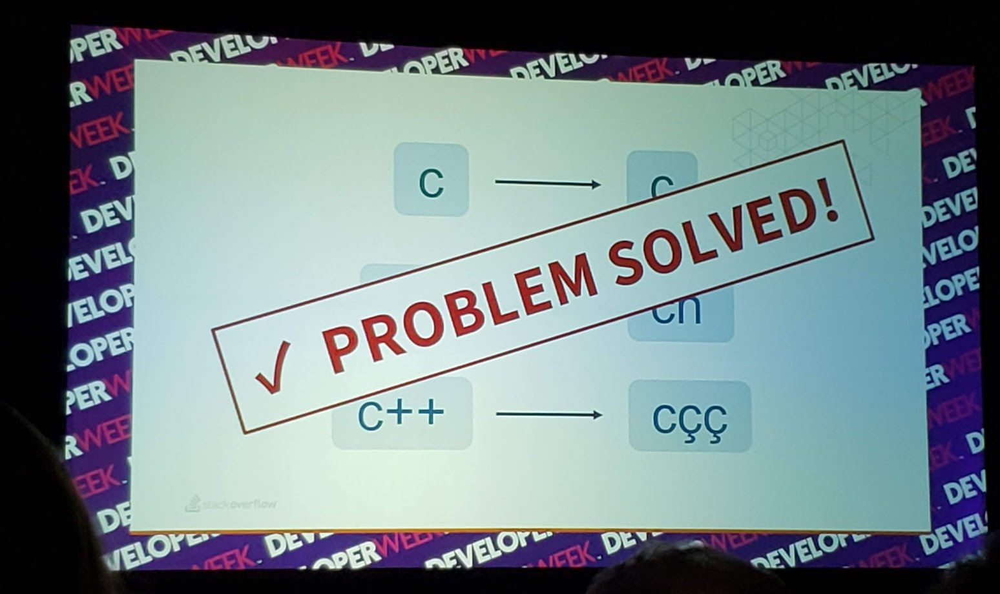
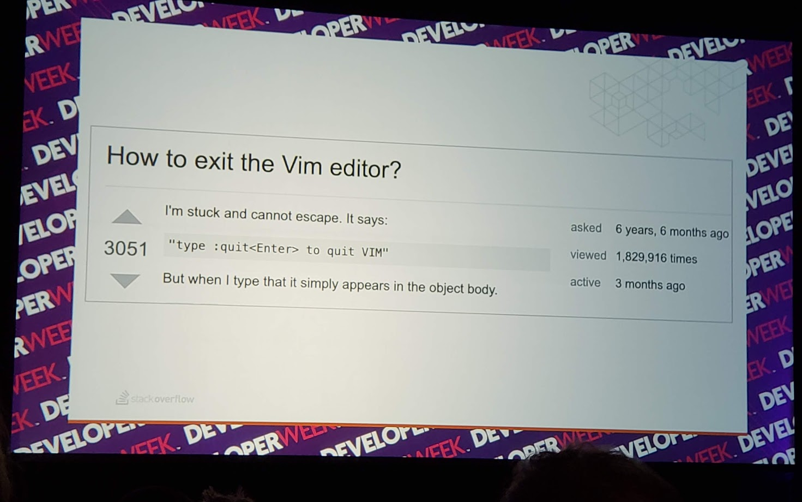

## Introduction

This talk was hosted during the Developer Week 2019 conference. I attended this talk to learn about how the company grew and changed within a decade. 
  
## Presenter
David Fullerton is President and Chief Technology Officer of Stack Overflow. He's responsible for managing the Executive Team and driving the overall company strategy of serving everyone who codes, everywhere. David joined Stack Overflow in 2010 as a Development Team Lead before assuming the role of Vice President of Engineering in 2012. David has been President and CTO since 2018.

## Summary
### Stackoverflow's Mission
Help everyone who codes learn and share their knowledge

### Journey
Originally stackoverflow started with 9 webservers and couple databases. To ensure stackoverflow could get to market quickly they hacked few things together. Instead of implementing a complex tagging system they took advantage of full text index searching in the database. 

The hack worked until they had to implement tagging for special characters like C, C#, C++ (the index engine treated all of them as "C"). The team used another hack to solve the issue, which was to use unused characters from other languages to substitute the special characters.

That worked, but just for a while. Once the team had to implement localization and needed the "unused characters", they had to rebuild the tagging system. However, since now the team has more resources and knowledge, they are able to rebuild the tagging system better than ever. 

### Moral of the story
Using hacks is not bad. It gave stackoverflow a lot of benefits! It allowed stackoverflow to deliver a better product faster. It gave them insight into the requirements of the system that they would have missed if they started with a complex system. The users were delighted and never affected by the hack.

However, some hacks can be damaging and should be avoided! If a hack affects the user, it should be avoided as much as possible. On the other side, if the hack is only code based and does not affect the user directly then it is OK to use.  

stack exchange

### Who is Stackoverflow built for?
Stackoverflow is for professional programmers 

### The most popular question in Stackoverflow

