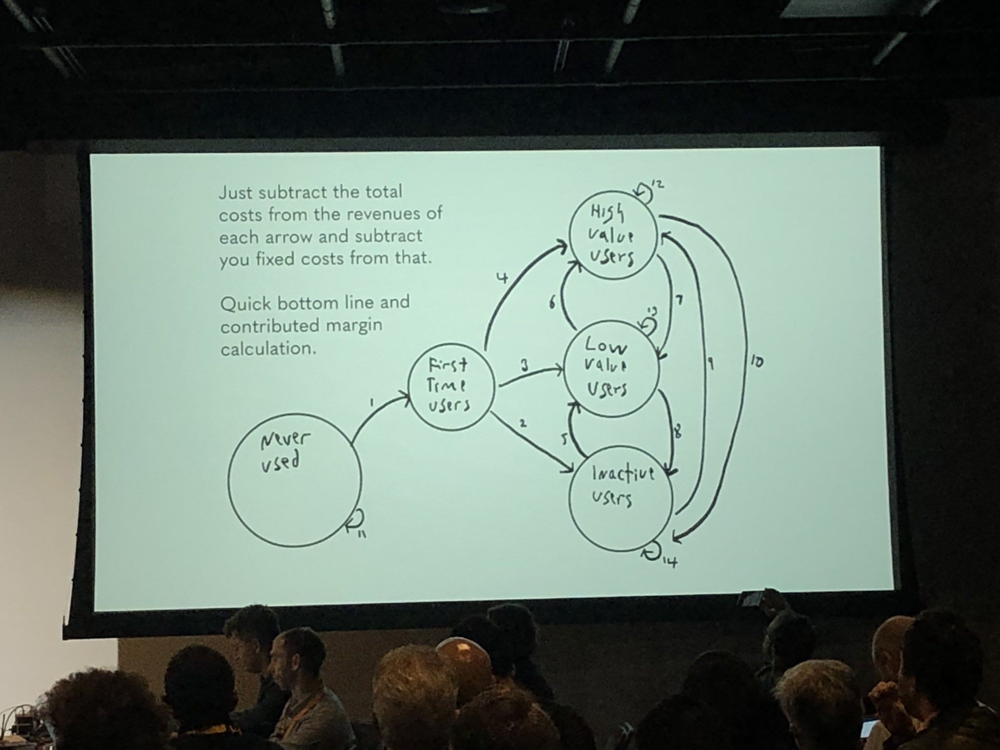

This fall Luke and I got to attend the Launch Scale conference. The conference is geared towards founders and helping early stage startups and small businesses scale. The conference had great speakers, it included successful entrepreneur, incredible founders, world class venture capitalists and many other famous figures from silicon valley.

## Key Highlights (favorite talks)

### The State Machine that Answers All Startup Growth Questions
Phil Libin, Co-founder of All Turtles and previously Co-founder & CEO of Evernote, presented a state simple state machine that can answer all of a startups questions. This resonated with me because state machines are one of the first and most powerful tools that I learned about in computer engineering. The great thing about state machines is you can follow the change of states and it can tell you a lot of information with a simple drawing.

Each number represents a state change in the lifecycle of a customer for a business. Knowing what causes each number (transition) is critical for the success of the business. Additionally understanding what are the numbers behind each transition will help understand the business better (ex. # of new users -> first vs churn (first time users -> inactive users))

> “How do you know when to raise money or start a company?" 
> 
> "The answer is when you can’t NOT do it anymore. That’s when you know.” -Phil

### Rocks, Pebbles, and Pixie Dust: A Recipe for Scaling Roadmap
Donna Boyer, VP of Product of Stitch Fix and previously director of product of Airbnb. She provided information on to how build a roadmap that makes users happy. Should always start with the vision and work backwards by breaking it to different version and defining what each version has. Additionally, she used the analogy of rocks, pebbles and sand for time managment with a twist for building product roadmap.

Instead of using an excel sheet and relying on weighted scales for each feature request a better approach is to follow the analogy. The rocks are the big feature that is required to reach the vision of the business. The pebbles are the supporting functionality needed to support the rock features and the businesses. The pixie dust is the delightful small features that might never have a high ranking if used with a ranking system. 

> "There is never one right path. You have to pick the path that is right for YOU." -Donna

### Scale Talk: Product Market Fit
Rahul Vohra, Founder & CEO of Superhuman, developed a framework that makes product/market fit more actionable. His framework utilizes a four-step process that measures and optimizes the market fit. What better way to learn about those steps other than from the [source](https://firstround.com/review/how-superhuman-built-an-engine-to-find-product-market-fit/).

> "What is the best way to measure product-market fit?
>
> Simply ask your users this: How would you feel if you could no longer use the product?" -Rahul

  
### Creating & Scaling a Viral Evangelism Loop
Roland Lightenberg, Co-Founder and SVP Growth & Innovation at Housecall Pro, shared how to turn users into champions and evangelists for the business. 

> "You want to create things that leverage your users' curiosity. Because with curiosity, comes virality." -Roland

I have written more detailed recap of this talk [here](./viral)
