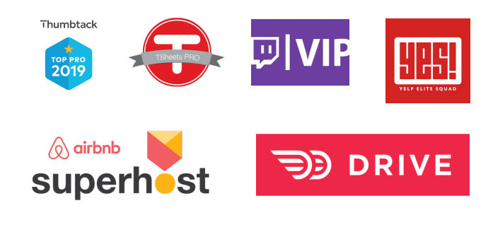

## Introduction

I got to listen to this talk during the Launch Scale 2019 conference. This talk one of the most interesting talks for me. It focuses on developing the network effect and maximizing the reach of the product. 

## Presenter
The talk is presented by Roland Ligtenberg, the Co-founder & Senior Vice President of growth at Housecall Pro. He was part of the founding team at Qualcomm Labs as a product and business development manager where he launched Gimbal software.

## Summary
Customers can be segmented into different groups. If we look at the return per customer we can segment them to the following groups:
- Normal customer: the customer who just purchases the product
- Loyal customer: the customer who purchases the product and some add ons
- Evangelist: Which is the customer that not only purchases the product and its add ons but also brings more customers that can be in any segment creating a network effect and 10x the value for the business

### How to acquire evangelist for the business?
This is where the viral evangelism loop comes in. The loop can be broken into four steps:

1. Define
1. Value
1. Recognize
1. Share

### 1. Define
This is defining the evangelism program. It has two components the written and the visual.
#### Written component
First, it must have a title. The title is the name of the program and the shorter it is the better.
Then it must have a clear definition for who this is for (ideal evangelist profile), what they will need to do and why they do it.

> A Superpro is a home service professional committed to servicing their customers with excellence in addition to providing them with a modern, transparent, and online experience from the moment they schedule a job to serving them for years to come.

#### Visual component
The visual component is extremely important as it speaks to our psychology.

> “A soldier will fight long and hard for a bit of colored ribbon.” 
>
> Napoleon Bonaparte

Additionally, it makes the evangelists instantly recognizable. Giving them more exposure and helping trigger the network effect.

### 2. Value
The way to create value for the evangelists is by defining the benefits and requirements to be part of the program.

#### Benefits
Exclusivity can be a great benefit to offer the program members. Especially when it is earned not bought. It will encourage FOMO (fear of missing out) and generates status for the members.

The exclusivity can be offered via making the members:
- Alpha/beta testers (get access to the newest features before others)
- Have a directory recognizing the members and linking back to their websites
- Exclusive communities (FB/Slack)
- Media content specific to them (newsletters)
- Discounts

Another benefit can be priority. Giving the evangelists more priority in the product.
- Get better placement in the application
- Quicker customer service
- Feedback is prioritized higher and weighted more heavily

#### Requirements
How does someone a user get to become a member of the program? By satisfying clear and simple requirements. To select the requirements, they must be objective, not subjective. They also should be challenging but not unobtainable. They should be hard enough that less than the top quartile of customers can qualify.

The higher the difficulty and the higher the effort needed to meet the requirements, the more value you get to extract from an evangelist. Also, you must uphold the rules at all costs. There should be no exceptions or special treatments! Once the system is compromised noone will be interested in being a part of it.

### 3. Recognize
It is important to recognize the evangelists and that should be done in both offline and online environments.

For the offline environment, holding meetups, special events, conferences, and tradeshows will encourage the customers to be more involved in the program and help it grow. They will also be more engaged and feel a greater sense of belonging in the program/business.

In an online, recognition can be achieved by putting a spotlight on the members in the business online communities (FB/Slack/Forums). Having a dedicated section of the website for them. Including them in case studies published to all customers. Having dedicated spotlight in a newsletter. 

### 4. Share
Allowing the members to share the program with others in both environments offline and online. To achieve that:
- Creating assets: This allows the member to brag about their membership. Ex: certificates, stickers, patches, digital badges, FB/Instagram content 
- Leveraging curiosity: By having those assets on display other people get curious and that increases the virality effect.
- Engaging: with content generated by the members of the community and encouraging them to share and create more content.
- Save: saving the content generated as a resource to be used to amplify and reuse in other campaigns for the product
