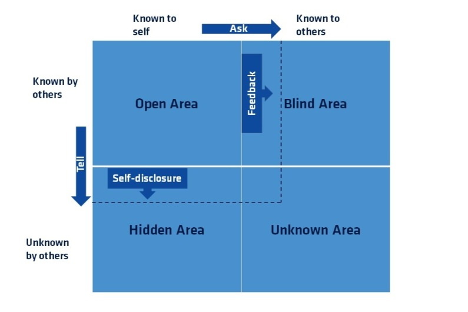

## Presenters

Dr. Vanderslice is an assistant professor at California Baptist University Jabs School of Business. Gaynell teaches management, organizational behavior, leadership & change management, managerial ethics, and business communications at the undergraduate and graduate level and has conducted workshops on leadership and communications best practices. Gaynell has 25+ years of management experience in the technology and service industry. In 2006 she pioneered a leadership and knowledge-sharing program that engaged employees and fostered shared leadership, enhanced managerial relationships, empower employees, improved job performance, and promoted professional development. Gaynell is also a public speaker and a leadership workshop facilitator. She holds a Ph.D. in Leadership from Alliant International University (AIU) in San Diego and a Certificate of Leadership from Claremont Graduate School.

Yolanda Tanner is the Space and Naval Warfare (SPAWAR) Deputy STEM Federal Action Officer. Yolanda has over 35 years of Department of Defense experience spanning military, defense industry, and civil service. Her technical background is in radio frequency systems, routing and switching and tactical networking. Over the past ten years, she has developed continuity of operations plan, created the Naval Information Warfare Center Pacific (Formerly SPAWAR SSC Pacific) STEM postsecondary outreach program and has facilitated educational partnerships with major universities, such as San Diego State University. She holds a B.S. in Computer Information Systems/Management, a Masters in Education with a graduate certificate in College Advising from UCSD and completing doctoral studies in Education with a concentration in higher education and research emphasis in STEM. Additionally, she serves as the Vice Chair of the MESA Industry Advisory Board and recognized as the 2018 MESA SDSU Industry Representative of the Year.


## Summary

This was a workshop that discusses an important topic that gets overlooked most of the time. Emotional intelligence is crucial in our lives, especially in the workspace where lots of emotions clash.

Emotional Intelligence: One's ability to manage oneself and interact positively with others. Connect and be empathetic with others.

### The Brain
Our brain can be split into two different types: the emotional brain and the logical brain
- The Limbic System: the fight or flight system, this is the first place where information gets processed. This is the part of the brain that reacts without thinking (the emotional).
- Frontal Lobe: The self-control, logic processing (the rational brain). Information must pass through the Limbic System first.

### Foundations of Emotional Intelligence
1. Self-awareness: Everything starts with understanding the ourselves and being more aware of who we are.
1. Self-management: Managing ourselves so we can become who we truly are.
1. Relationship Management: Manage our relationships with others.
1. Social awareness: Observe and become aware of everyone else's emotions.

### Self-awareness
To become aware of who we are we first must identify core values and understand them ([Values list](https://jamesclear.com/core-values)). Those core values should be prioritized to really understand one's self. When values clash, we tend to defend our values and get angry. Therefore, we need to be self-aware and to do that. It all starts with understanding our emotions.

```Markup
The last time I was (emotion), I ____________ (What was the situation that caused)
I responded by ____________ (how did I respond to the situation)
I responded that way because ____________ (why did I react that way)
In the future I can ____________ (reflect on how to address the same situation in the future)
```

Self-awareness is not limited to a person. It can apply to an entire team. Once everyone's values are defined come up with team values that the whole team agrees on! This is how the team gets the opportunity for success.

### Getting past the sensitive line
Ask "why" five times! Keep digging deeper and deeper to understand the situation and its causes.

### Johari's Windows
Is a technique that helps people better understand their relationship with themselves and others.


### Highlights

People don't care about what you know, until they know you care! 

Humor helps connect people.

See yourself from the lens of others.

When it comes to the workspace, there are always things that are have to do (job, roles and responsibilities). There are the additional things on top of the basic roles and responsibilities (Emotional, personal connections and other soft skills). 
