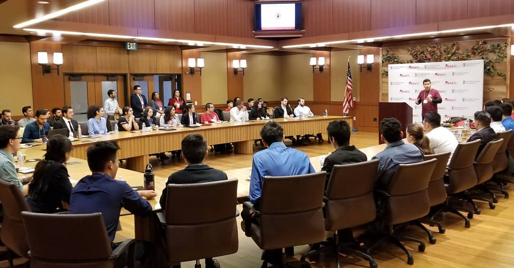
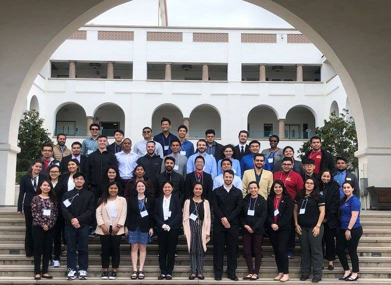
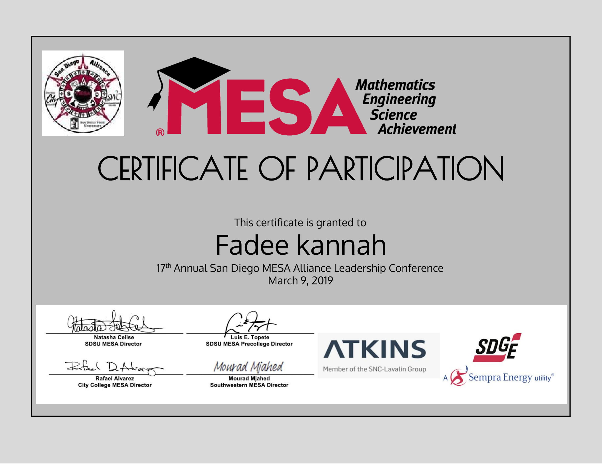

## Background Information
This is an annual conference held yearly by the MESA program. It is focused on honing the leadership skills for the students in the MESA program. I originally attended this conference back in 2014. I got to attend many helpful workshops and talks that helped me improve and grow. Additionally, I got recognized by San Diego State University as a [leader in STEM](http://newscenter.sdsu.edu/sdsu_newscenter/news_story.aspx?sid=75337) as well as by Mark Wyland, the republican senator for California.

When I was presented with the opportunity to be on the wait list for this year's conference, I jumped on it. I got lucky and a spot opened up for me to attend! However, this year's conference was different. It was only one day instead of spanning an entire weekend. The conference was on March 9th, at SDSU instead of some hotel (cannot recall where exactly, it was 5 years ago).

## The Agenda
### Check-In & Network
I was there early like I usually do. I got to meet and network with few people prior to the event start. I also got to catch up with the program coordinators for a bit.

### Welcome and Overview
This was a quick overview of the event presented by Natasha Celise (SDSU MESA Program Director).

### [Strengths Finder](./strengthsFinder)
This was a presentation that explains the strengths quest assessment, what it means and how it applies to us. 

### [STEM CAREER PANEL: Outside the Box](./OutsideTheBox)
This was a presentation covering the career opportunities available to STEM majors.

### Lunch
We got to enjoy a sponsored lunch and some more networking where I got to catch up with my friend.

### [Emotional Intelligence](./emotionalIntelligence)
This was a mini workshop/ presentation that covered the importance of emotional intelligence in the workspace as well as in life in general.

### Improving your resume & interview skills
This talk/workshop got canceled due to the presenter not being able to attend the conference.

### Group Photo

### [Social Media & Your brand](./socialMediaAndBrand)
This talk was focused on utilizing social media for career opportunities and how it affects our careers. This talk was the inspiration for me to write [The post that changed everything](../../Personal/fbPost).

### [Breakout EDU](https://www.breakoutedu.com/)
This was a fun team exercise similar to an escape room. We got a briefcase that was locked and a Wikipedia article that had the clue to unlocking the box. This is where we learned that we over complicate things for no reason. We spent too much time trying to decipher lots of clues when the answer was literally in front of us. inside the briefcase there was a box that had 3 unique locks with another set of clues.
 
## Conference Recap 
The conference was what I expected. Although it was geared towards people who are just starting their careers, I was still able to learn a few new things from it. I would definitely recommend it to students who the opportunity to attend. 

