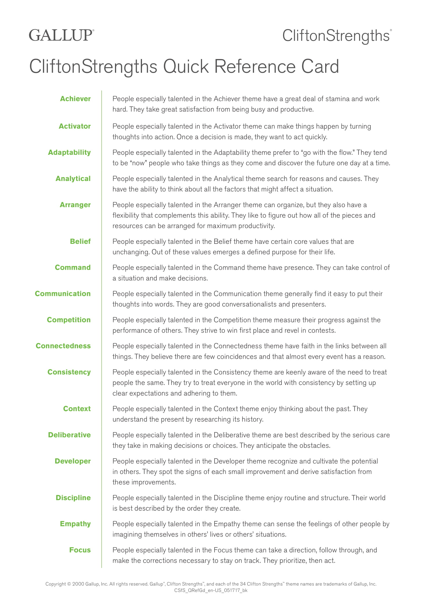
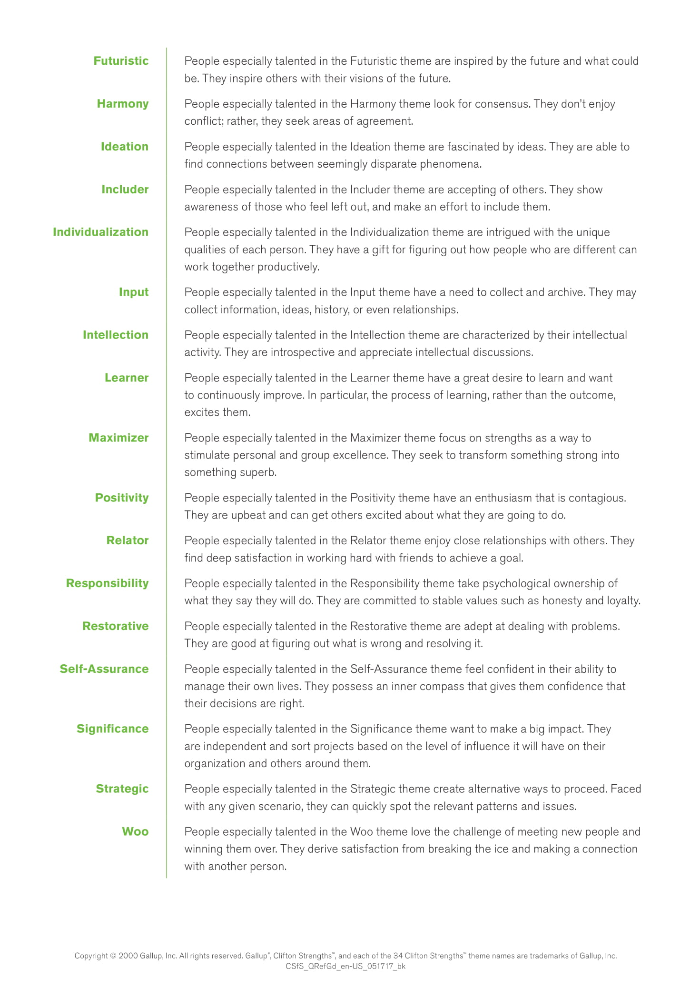
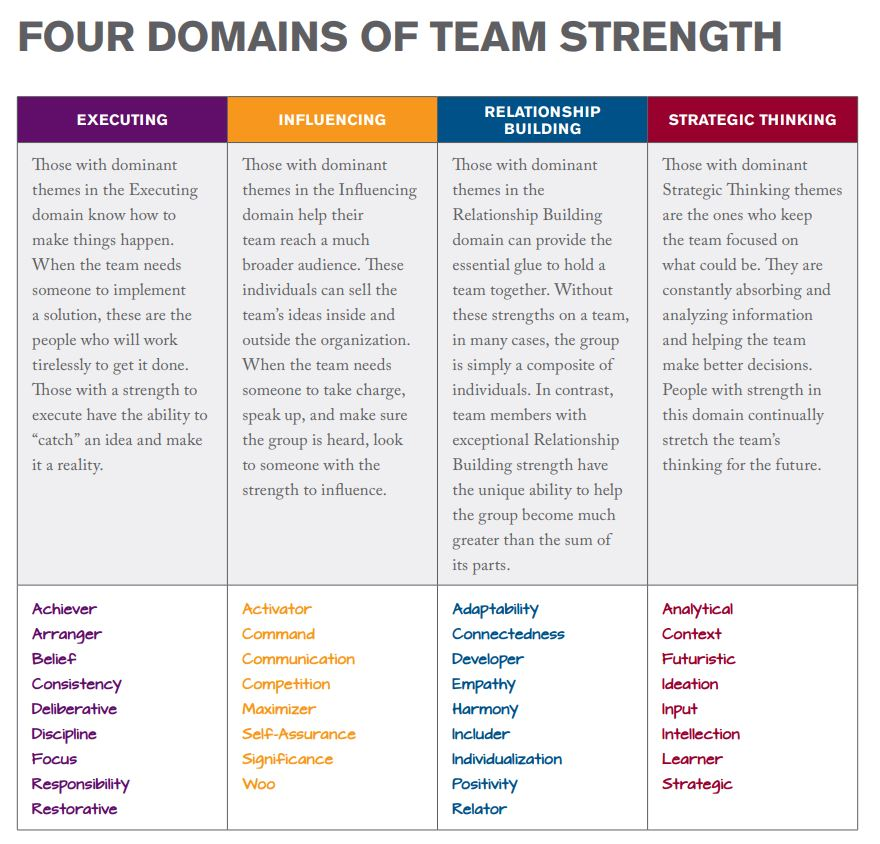

## Presenter

Rafael Alvarez is the MESA program director at San Diego City College.

## Summary

This is a talk explaining how the [Gallup Strengths Quest](https://www.strengthsquest.com) works and how it relates to the real-world. All MESA students have the opportunity to take the assessment to identify their strengths. This assessment focuses on assessing the person on 34 different strengths and ranking them. 

The following are all the different strengths:

All these strengths fit into different domains

Once a person takes the assessment, then have access to the **strengths insights report**. This report is unique and is relative to the other top strengths instead of just the generic explanations provided above. 

Additionally, one should focus on the top strengths to maximize outcomes. The top strengths are the what we are experts at, we use them without thinking as they are part of who we are. 
