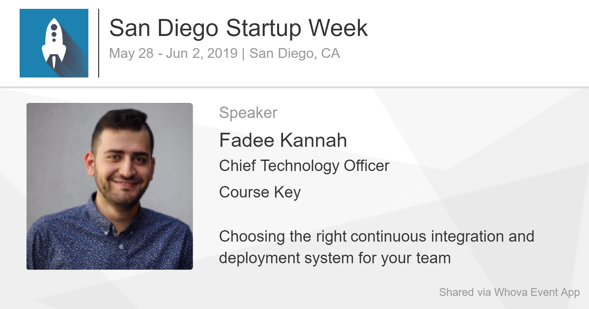

import presentation from "./SDSW19Presentation.pdf"

In 2016 I attended San Diego Start Up week for the first time. At the time, I got free tickets since CourseKey was a part of the EvoNexus Incubator. Since then I have always wanted to speak in it. The conference is geared to help the local startups and grow the startup community in San Diego.

I wanted to help other entrepreneurs learn more about the technical side of things. Being part of two incubators and pseudo involved in the San Diego startups world, I noticed few things. First thing I noticed, there are few technical people involved in community. Second thing, the business founders don’t really have the technical knowledge necessary to ensure the success of their business.

For the last couple years, I have always missed the deadline! However, since Luke (CourseKey’s CEO) has been speaking in the conference for a while, I made sure to pester him to let me know when the application time is around the corner.

My talk got accepted and I was extremely excited to participate. Additionally, for speaking in the conference I got a free ticket for the full conference. Sadly, due to upcoming deadlines and work demands, I was not able to participate and explore the conference. I literally walked into the stage did my presentation and left right away.

My talk was titled "Choosing the right CI/CD system for your team". The talk is focused on informing people about the development process and the idea of using continuous integration and delivery. It covers the different ways of implementing the CI system and the journey that CourseKey went through to get to the current CI system.

## [The Presentation](https://whova.com/embedded/session/sdsw_201905/629000/)

<object data={presentation} type="application/pdf" width="100%" height="800px" />
