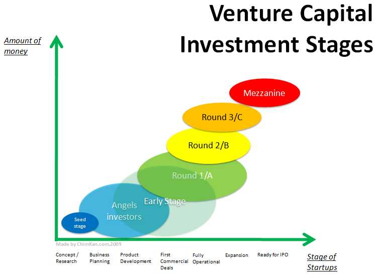

Getting money from investors is difficult! To make it a bit easier one must look at the investors' perspective and understand what they are seeking from their investment. Additionally, fundraising at the right time of the business life cycle always helps. Each stage of the company requires a different kind of an investor as they will be seeking different things out of the business.

Disclaimer: this is my personal generalization of investing rounds, take everything you are about to read with a grain of salt. Additionally, this does not take into account the effects of COVID-19 on the economy and the venture capitalist world.  

## Pre-seed/seed Investors
Those investors are mostly investing in the people running the company. The business idea is still important, however, the ability of the founders to execute and turn the idea into a viable business is more important. Those investors take on the majority of the risk especially with new entrepreneurs who have not yet proven their ability to execute.

### Series A Investors
Those investors require that the founders have managed to operate the business successfully and have found the product market fit and are ready to scale. This will show that the founders understand their market and with the additional capital they can capture it more effectively.

### Series B Investors
Those investors are looking for growth in adjacent markets. As you capture more of the original market you started in, you are likely to run into different markets that with some adjustments to your product/business you can start capturing.

### Series C Investors
Those investors look for the unit economics. Basically, they are looking at the numbers for revenue and costs for generating that revenue and if economics of scale will generate a satisfying ROI (return on investment).

### Series D and on Investors
For those investors, it is all about the financials. They will base their evaluation on the net present value of future cash streams.

For more in depth and more realistic look at what it needed for fundraising, I highly recommend reading the [SaaS Funding Napkin](https://www.dropbox.com/s/etmgz1vbxuys1yw/SaaSNapkin2019.pdf)
