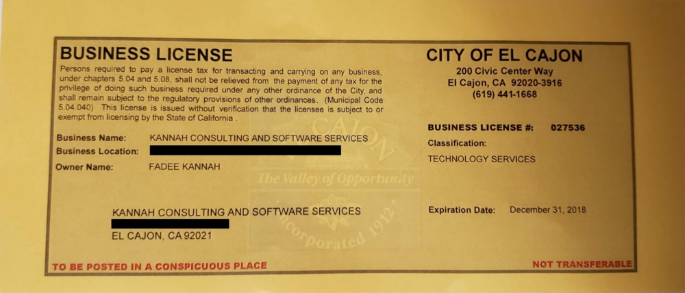
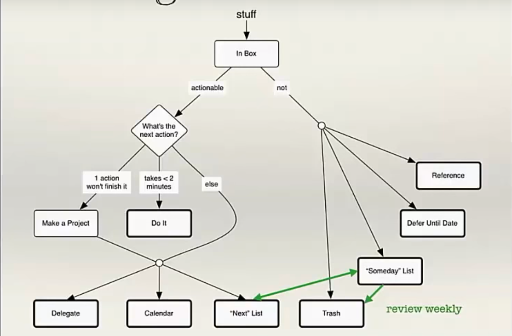
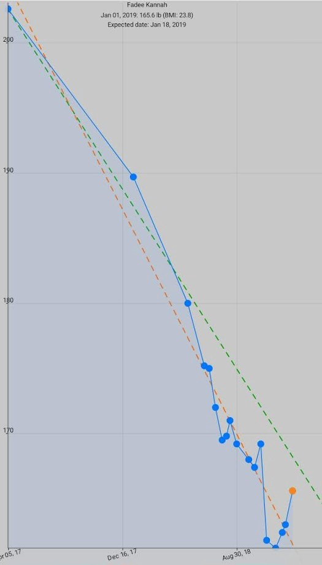
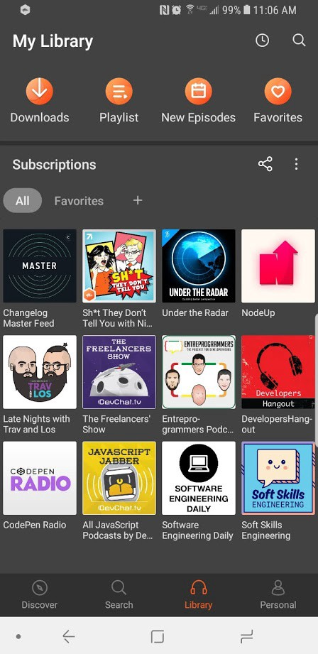
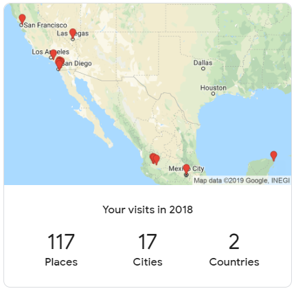

import YouTube from "@site/src/components/YouTube/YouTube.jsx";
import Gallery from "@site/src/components/Gallery/Gallery.jsx";
import home1 from "./images/home1.jpeg";
import home2 from "./images/home2.jpg";
import remodel1 from "./images/remodel1.jpeg";
import remodel2 from "./images/remodel2.jpeg";
import remodel3 from "./images/remodel3.jpeg";
import remodel4 from "./images/remodel4.jpeg";
import warming1 from "./images/warming1.jpeg";
import warming2 from "./images/warming2.jpeg";
import warming3 from "./images/warming3.jpeg";
import warming4 from "./images/warming4.jpeg";
import engagement1 from "./images/engagement1.jpeg";
import engagement2 from "./images/engagement2.jpeg";
import sdsu from "./images/sdsu.jpeg";
import flight1 from "./images/flight1.jpeg";
import flight2 from "./images/flight2.jpeg";
import hotel1 from "./images/hotel1.jpeg";
import hotel2 from "./images/hotel2.jpeg";
import tulum1 from "./images/tulum1.jpeg";
import tulum2 from "./images/tulum2.jpeg";
import tulum3 from "./images/tulum3.jpeg";
import tulum4 from "./images/tulum4.jpeg";
import tulum5 from "./images/tulum5.jpeg";
import tulum6 from "./images/tulum6.jpeg";
import coba1 from "./images/coba1.jpeg";
import coba2 from "./images/coba2.jpeg";
import coba3 from "./images/coba3.jpeg";
import coba4 from "./images/coba4.jpeg";
import coba5 from "./images/coba5.jpeg";
import coba6 from "./images/coba6.jpeg";
import coba7 from "./images/coba7.jpeg";
import cenote1 from "./images/cenote1.jpeg";
import cenote2 from "./images/cenote2.jpeg";
import playa1 from "./images/playa1.jpeg";
import playa2 from "./images/playa2.jpeg";
import playa3 from "./images/playa3.jpeg";
import food1 from "./images/food1.jpeg";
import food2 from "./images/food2.jpeg";
import food3 from "./images/food3.jpeg";
import food4 from "./images/food4.jpeg";
import food5 from "./images/food5.jpeg";
import food6 from "./images/food6.jpeg";
import club1 from "./images/club1.jpg";
import club2 from "./images/club2.jpg";
import g1 from "./images/g1.jpeg";
import g2 from "./images/g2.jpeg";
import g3 from "./images/g3.jpeg";
import g4 from "./images/g4.jpeg";
import g5 from "./images/g5.jpeg";
import g6 from "./images/g6.jpeg";
import t1 from "./images/t1.jpeg";
import t2 from "./images/t2.jpeg";
import t3 from "./images/t3.jpeg";
import t4 from "./images/t4.jpeg";
import t5 from "./images/t5.jpeg";
import t6 from "./images/t6.jpeg";
import t7 from "./images/t7.jpeg";
import t8 from "./images/t8.jpeg";
import t9 from "./images/t9.jpeg";
import zoo1 from "./images/zoo1.jpg";
import zoo2 from "./images/zoo2.jpg";
import zoo3 from "./images/zoo3.jpg";
import zoo4 from "./images/zoo4.jpg";
import cruise1 from "./images/cruise1.jpg";
import cruise2 from "./images/cruise2.jpg";
import cruise3 from "./images/cruise3.jpg";
import cruise4 from "./images/cruise4.jpg";
import cruise5 from "./images/cruise5.jpg";
import cruise6 from "./images/cruise6.jpg";
import cruise7 from "./images/cruise7.jpg";
import cruise8 from "./images/cruise8.jpg";
import cruise9 from "./images/cruise9.jpg";
import cruise10 from "./images/cruise10.jpg";
import cruise11 from "./images/cruise11.jpg";
import cruise12 from "./images/cruise12.jpg";
import cruise13 from "./images/cruise13.jpg";
import cruise14 from "./images/cruise14.jpg";
import cruise15 from "./images/cruise15.jpg";
import cruise16 from "./images/cruise16.jpg";
import cruise17 from "./images/cruise17.jpg";
import cruise18 from "./images/cruise18.jpg";
import cruise19 from "./images/cruise19.jpg";
import cruise20 from "./images/cruise20.jpg";
import team1 from "./images/team1.jpeg";
import team2 from "./images/team2.jpeg";
import team3 from "./images/team3.jpeg";
import team4 from "./images/team4.jpeg";
import balboa1 from "./images/balboa1.jpeg";
import balboa2 from "./images/balboa2.jpeg";
import sea1 from "./images/sea1.jpg";
import sea2 from "./images/sea2.jpg";
import sea3 from "./images/sea3.jpg";
import sea4 from "./images/sea4.jpg";
import sea5 from "./images/sea5.jpg";
import sea6 from "./images/sea6.jpg";
import sea7 from "./images/sea7.jpg";
import sea8 from "./images/sea8.jpg";
import sea9 from "./images/sea9.jpg";
import sea10 from "./images/sea10.jpg";
import sea11 from "./images/sea11.jpg";
import sea12 from "./images/sea12.jpg";
import sea13 from "./images/sea13.jpg";
import sea14 from "./images/sea14.jpg";
import sea15 from "./images/sea15.jpg";
import sea16 from "./images/sea16.jpg";
import park1 from "./images/park1.jpg";
import park2 from "./images/park2.jpg";
import park3 from "./images/park3.jpg";
import park4 from "./images/park4.jpg";
import park5 from "./images/park5.jpg";
import park6 from "./images/park6.jpg";
import park7 from "./images/park7.jpg";
import park8 from "./images/park8.jpg";
import park9 from "./images/park9.jpg";
import park10 from "./images/park10.jpg";
import park11 from "./images/park11.jpg";
import park12 from "./images/park12.jpg";
import park13 from "./images/park13.jpg";
import park14 from "./images/park14.jpg";
import park15 from "./images/park15.jpg";
import park16 from "./images/park16.jpg";
import park17 from "./images/park17.png";
import park18 from "./images/park18.jpg";
import park19 from "./images/park19.jpg";
import park20 from "./images/park20.jpg";
import park21 from "./images/park21.jpg";
import park22 from "./images/park22.jpg";
import park23 from "./images/park23.jpg";
import park24 from "./images/park24.jpg";
import park25 from "./images/park25.jpg";
import park26 from "./images/park26.jpg";
import party1 from "./images/party1.jpeg";
import party2 from "./images/party2.jpeg";
import party3 from "./images/party3.jpeg";
import party4 from "./images/party4.jpeg";
import party5 from "./images/party5.jpeg";
import party6 from "./images/party6.jpeg";
import party7 from "./images/party7.jpeg";
import party8 from "./images/party8.jpeg";
import party9 from "./images/party9.jpeg";
import party10 from "./images/party10.jpeg";
import party11 from "./images/party11.jpeg";
import party12 from "./images/party12.jpeg";
import party13 from "./images/party13.jpeg";
import party14 from "./images/party14.jpeg";
import party15 from "./images/party15.jpeg";
import party16 from "./images/party16.jpeg";
import party17 from "./images/party17.jpeg";
import party18 from "./images/party18.jpeg";
import party19 from "./images/party19.jpeg";
import friends from "./images/friends.jpeg";
import back1 from "./images/back1.jpeg";
import back2 from "./images/back2.jpeg";
import back3 from "./images/back3.jpeg";
import back4 from "./images/back4.jpeg";
import back5 from "./images/back5.jpeg";
import back6 from "./images/back6.jpeg";

Before jumping into 2019, I took a step back and did some self-reflection. As I took a deeper look into last year, I realized that 2018 has been one busy year. I ended up writing this because of how much has happened this year. As I was doing so, I realized I could just share it with everyone.

Before jumping into lessons learned and challenges from this year, I would like to first walk you through the big highlights of this year. The easiest way I could do that is if we turned this year into a movie.

If this year was a movie, it would be the equivalent of marvel’s infinity war. Just like the movie, this year had many stories clash together, other stories concluded, and a few new ones have started. In few words, this year has been busy, challenging, full of changes, old things, new things, lots of fun, lots of work, smiles, tears and it ended with a snap!

The year started with a house hunt. A hunt that had the whole family searching and hunting until my sister spotted our dream house! Once we set target, the process of closing started! The process was painful, and we would have not gotten the house if it wasn’t for the help of my uncle and cousin!

<Gallery photos={[
                   { src: home1 },
                   { src: home2 }
                 ]} />

## The First Battles

Once we got the house key another battle started. The remodeling… This battle lasted a few months. There were many upgrades needed, painting, installing tiles, installing lights, ceiling fans, upgrading the kitchen, installing synthetic grass and much more. However, by the end of all the upgrades I got to celebrate the house with my CourseKey family and friends!

<Gallery photos={[
   { src: remodel1 },
   { src: remodel2 },
   { src: remodel3 },
   { src: remodel4 },
 ]} />

<pre>Backyard work</pre>

<Gallery photos={[
   { src: warming1 },
   { src: warming2 },
 ]} />

<pre>CourseKey’s house warming</pre>

<YouTube videoId="SPcXeYsF_Tc" />

<pre>Unforgettable night</pre>

<Gallery photos={[
   { src: warming3 },
   { src: warming4 },
 ]} />

<pre>Friends’ house warming</pre>

Since the house purchase and the remodeling took a few months (4.5 months). I did not sit idly, I was engaged with few other things. For starters, I got to celebrate two of my cousins’ engagement in January!

<Gallery photos={[
   { src: engagement1 },
   { src: engagement2 },
 ]} />

<YouTube videoId="VFg77xA9hdE" />

Couple days after the partying, I attended the developer week conference in Oakland! There I had a blast with my friends and coworkers. I got to play Settlers of Catan for the first time and I won! However, that might have been because I threatened Luan (CourseKey’s Android summa cum laude) that I would fire him 😝

My personal consulting business got some love! For starters, I upgraded the website. It is still work in progress and in need for a lot of improvements. Nonetheless it is still better than the previous version, which was nothing! My old website was taken down because I forgot to log in 😅. Additionally, I finally got my business license! Now, I am officially certified to do business in the city of El Cajon.

## The Summer Heat

Once summer arrived, it brought its heat and fun. I went back to school, after taking four years break from SDSU to focus on CourseKey. I started with an online class then two classes during the fall. With that completed, I only have two classes left and I will officially graduate next year!

As we all know summer is the fun season! This year I decided to travel and explore with great and fun people. My first summer trip was my cousin’s bachelor party in Cancun! The trip cannot be summed in words!

I knew the trip would be great from the very start. On the way to Cancun we got a cheap upgrade to first class (for the first time ever!). We stayed at Riu Palace Las Americas (adult only) resort. Since I am on the “See food diet” as you may already know, we did the all-inclusive food and drinks!

<Gallery photos={[
   { src: flight1 },
   { src: flight2 },
   { src: hotel1 },
   { src: hotel2 },
 ]} />

Although the hotel was great and offered many onsite entertainment and activities, we were not just going eat, drink, and enjoy the beach all day long. We went on a couple of excursions while we were in the area.

<YouTube videoId="Nui-tIvkt0Y" />

First stop was Tulum ruins. Tulum was amazing for many reasons! I was fascinated by how it was built and learning the history behind it. I got to see the temple of Ah Muzen Cab (One of my favorites ADCs in SMITE) and learn more about him.

<Gallery columns={3} photos={[
   { src: tulum1 },
   { src: tulum2 },
   { src: tulum3 },
   { src: tulum4 },
   { src: tulum5 },
   { src: tulum6 },
 ]} />

Next stop was Cobá the Mayan city, where I got to explore the ruins in a jungle. The most exciting part of this stop was climbing the Nohoch Mul Pyramid. Sadly, the pyramid was not in a great shape… most steps were broken, and some had big pieces missing. However, that did not stop me from wanting to climb it!

<Gallery columns={3} photos={[
   { src: coba1 },
   { src: coba2 },
   { src: coba3 },
 ]} />

The climb was one of the scariest things I have done in a long time. What seemed like a simple climb was definitely not! The problem was not the broken steps or the height to speak of really. The issue was how many people were going up and down. Some of those people could not breath and looked like they could pass out any minute. When I reached the top the humidity and altitude hit me hard, I started having a bit of a hard time breathing and my glasses were fogging up nonstop. Finally, it starting to rain which did not help, going down was at the very least more than I asked for. However, the view from the top alone was worth the trouble.

<Gallery columns={3} photos={[
   { src: coba4 },
   { src: coba5 },
   { src: coba6 },
   { src: coba7 },
 ]} />

Following that we made a stop at a small cenote. I went for a swim, it was refreshing and cold. The swim felt great, however floating was a challenge since it was fresh water. The water was extremely clear, you can see the fish swimming below you.

<Gallery photos={[
   { src: cenote1 },
   { src: cenote2 },
 ]} />

<YouTube videoId="4ZKMwNfT49M" />

To wrap a busy day, we stopped at Playa del Carmen for the sun set and exploring a touristy part of Cancun. But wait something is missing… where is the party? Well… we did not go there to party really. We went there to enjoy a relaxing time and explore. For me I got to enjoy lots of food, drinks, sun and excursions. I got to try lots of awesome food and drinks. The main highlight would be the pina colada, miami vice and cannot forget the all you can eat, especially the churros!

<Gallery columns={3} photos={[
   { src: playa1 },
   { src: playa2 },
   { src: playa3 },
   { src: food1 },
   { src: food2 },
   { src: food3 },
   { src: food4 },
   { src: food5 },
   { src: food6 },
 ]} />

Finally, before wrapping up the Cancun trip, we did stop at a club. You can’t really expect us to go to Cancun and not at least party once. The club was fun and had pretty good music.

<Gallery photos={[
   { src: club1 },
   { src: club2 },
 ]} />

<YouTube videoId="UxeRs0BRNZk" />

<YouTube videoId="zE6dJJCqS0k" />

Summer was not over and neither was its fun. Four days after coming back from Cancun, I was back in Mexico. This time was for business! I went to CourseKey’s Guadalajara headquarters. We met up with Chad’s (Alejandro) family, our QA engineer, and we got to spend friday working together.

<Gallery photos={[
   { src: g1 },
   { src: g2 },
]} />

Who are we kidding at this point? It is the weekend, we are in Guadalajara it was time to have a drink or two. We made lots of great memories together! Pancho (Ron) was a celebrity at the bar, everyone playing drinking games, and many many more fun memories.

<Gallery photos={[
   { src: g3 },
   { src: g4 },
   { src: g5 },
   { src: g6 },
]} />

Since we were in Guadalajara, we had to make a stop at Tequila town. We had a blast there and not just from drinking ridiculous amount of tequila. Downtown was great with all the shops and street food stands. We even enjoyed a tour inside Tequila Tres Mujeres.

<Gallery columns={1} photos={[
   { src: t1 },
]} />

<Gallery columns={3} photos={[
   { src: t2 },
   { src: t3 },
   { src: t4 },
]} />

<Gallery columns={3} photos={[
   { src: t5 },
   { src: t6 },
   { src: t7 },
]} />

<Gallery columns={2} photos={[
{ src: t8 },
{ src: t9 },
]} />

<YouTube videoId="RLXtF5wfmm4" />

You would think I have had a busy enough summer by now, well sorry to disappoint. I ended up on a four days cruise with the family to Ensenada and on the way stopped at Santa Ana Zoo.

<Gallery photos={[
   { src: zoo1 },
   { src: zoo2 },
   { src: zoo3 },
   { src: zoo4 },
]} />

As expected, the cruise was a blast. The main highlight for me was the unlimited ice cream (and all the other food of course)! I attended paintings auction and got to learn about the history of some of the artists as well as the way they protect their work against counterfeiting. Plus, I got to enjoy some shows aboard the cruise.

<Gallery photos={[
   { src: cruise1 },
   { src: cruise2 },
   { src: cruise3 },
   { src: cruise4 },
   { src: cruise5 },
   { src: cruise6 },
   { src: cruise7 },
   { src: cruise8 },
   { src: cruise9 },
   { src: cruise10 },
]} />

<Gallery columns={3} photos={[
   { src: cruise11 },
   { src: cruise12 },
   { src: cruise13 },
   { src: cruise14 },
   { src: cruise15 },
   { src: cruise16 },
]} />

<Gallery columns={1} photos={[
   { src: cruise17 },
   { src: cruise18 },
]} />

<Gallery photos={[
   { src: cruise19 },
   { src: cruise20 },
]} />

## The Fall wrap up

As fall started to settle in, many things were changing and shifting around. One notable shift was the office relocation and with that comes the new office warming party!

<Gallery photos={[
   { src: team1 },
   { src: team2 },
]} />

The party was a great excuse for me to do some networking and spend time with friends. I got to meet old and new friends as well as have a drink or two with them.

As the year was coming to an end, we celebrated one last hurrah! The Christmas party! Although this party didn’t actually involve too much partying, in my opinion it was one of the most memorable. Mainly due to the great time that everyone was having and all the fun honest late-night conversations.

<Gallery photos={[
   { src: team3 },
   { src: team4 },
]} />

After the party, things were settling down. As the dust was clearing and the year ending everything seemed quiet. Looking around, many people (close friends and acquaintances) were no longer there. Some old faces and new alike were beside me. With that I took a deep breath and reevaluated things as I prepare for 2019.

----

## Other notable moments of the year

### Exploring different cultures

In March, me and my sisters decided to attend the Korean cultural night since we enjoy K-pop, Korean dramas, and of course Korean food. The event included many singing, dancing, cultural music, Korean martial arts history, martial arts demonstrations and many more things.

<YouTube videoId="UCnzmk3Q6SY" />

<YouTube videoId="3OibfLte0fA" />

<YouTube videoId="jnSfrzWnid4" />

On St Patrick’s day, my family and I got to enjoy the house of Ireland celebration in Balboa Park. We got to ride bikes (Ofos) around the park, enjoy the scenery, learn about Irish culture and see some great dancing.

<Gallery photos={[
   { src: balboa1 },
   { src: balboa2 },
]} />

<YouTube videoId="lSzYyPrMjx8" />

<YouTube videoId="fqeB6hc7MeM" />

<YouTube videoId="3V0X2wwjy_E" />

### Enjoying the water & sun

This year my family and I purchased the yearly pass for SeaWorld. Since we had the pass, we went there so many times that no one knows the exact number. I have been on every single ride except for the electrical eel and the Sky Tower. I have seen all the different shows including the seasonal ones (summer, Halloween and Christmas). I have explored every corner reachable.

<Gallery photos={[
   { src: sea1 },
   { src: sea2 },
   { src: sea3 },
   { src: sea4 },
   { src: sea5 },
   { src: sea6 },
   { src: sea7 },
   { src: sea8 },
   { src: sea9 },
   { src: sea10 },
]} />

<Gallery columns={3} photos={[
   { src: sea11 },
   { src: sea12 },
   { src: sea13 },
   { src: sea14 },
   { src: sea15 },
   { src: sea16 },
]} />

You cannot live in San Diego and not go to the beach during the summer. The best beach trips are those with the family and friends. Additionally, we have lots of great parks where you can still enjoy the sun, weather and without the crowd of people.

<Gallery photos={[
   { src: park1 },
   { src: park2 },
   { src: park3 },
   { src: park4 },
   { src: park5 },
   { src: park6 },
   { src: park7 },
   { src: park8 },
   { src: park9 },
   { src: park10 },
   { src: park11 },
   { src: park12 },
   { src: park13 },
   { src: park14 },
   { src: park15 },
   { src: park16 },
]} />

<Gallery columns={3} photos={[
   { src: park17 },
   { src: park18 },
   { src: park19 },
   { src: park20 },
   { src: park21 },
   { src: park22 },
]} />

<Gallery photos={[
   { src: park23 },
   { src: park24 },
   { src: park25 },
   { src: park26 },
]} />

### Optimizing my workflows

Sometime around middle of the year I changed how I handle my tasks. I was always stressing about when I will get things done and what I have left todo. I had many places where I kept track of what I needed done, including my head (the worst place possible). I started using trello and following a process that I learned about from an opensource project maintainer’s youtube video. The new process has been a life saver.

### Partying with awesome people

As part of our culture and tradition, before two people get married, we do what is known as Henna. Don’t ask me about it and what it means because I know nothing about it. However, that did not stop me from enjoying it and have a blast of a time! Not only I got to spend time with my family and relatives but also have so many laughs. I got to do a beer tasting competition and I am happy to report I guessed every single one wrong. Of course, we cannot forget about the actual wedding. It was a great wedding as well. It was extra special for me since it was my first time being groomsman.

<Gallery columns={3} photos={[
   { src: party1 },
   { src: party2 },
   { src: party3 },
   { src: party4 },
   { src: party5 },
   { src: party6 },
]} />

<Gallery columns={1} photos={[
   { src: party7 },
]} />

<Gallery columns={3} photos={[
   { src: party8 },
   { src: party9 },
   { src: party10 },
   { src: party11 },
   { src: party12 },
   { src: party13 },
   { src: party14 },
   { src: party15 },
   { src: party16 },
]} />

Before Omar and Jamie went on their trip around the world, we had one last hurrah together. It was after our office happy hour, we ended up back at our office then we went to Omar’s and Jamie’s friend house for Karaoke and barbecue. It was not only a great time and fun company but also my first time doing karaoke.

<Gallery columns={3} photos={[
   { src: party17 },
   { src: party18 },
   { src: party19 },
]} />

<YouTube videoId="eKOKwS7E31Q" />

### Eating great food

When it comes to having good food, I will not miss a chance. When my cousin invited me to a Brazilian steakhouse I could not refuse. I have been to Rei do Gado and Fogo de Chão here in San Diego. However, both fail when compared to Mr. Pampas in Tijuana! It had more variety of meats that were great, and they actually served them. Unlike the places here in San Diego where you must ask them for specific meats. The “salad bar” had so much variety from sea food all the way to fancy and traditional dessert. Sadly, I was so busy enjoying the food and the company, that I forgot to take pictures 😔

### Giving back

I have always had passion for assisting students. As the CTO at CourseKey, I get to do so daily, but not as directly as I’m used to. In 2015, I participated in the SDHacks hackathon. The experience of the hackathon was unforgettable! It was my first hackathon, and I got the chance to work with a great team of friends to create something truly interesting. When I was contacted to be the judge for SDHacks 2018, I agreed instantly! My experience in 2015 as a participant was so memorable that the opportunity to participate again as a judge was a no-brainer. And while hackathon judging is great, I still wanted to be more involved. After speaking with the organizers, I became a 2018 mentor as well. For the full story read my blog post on CourseKey’s blog.

<Gallery photos={[
   { src: back1 },
   { src: back2 },
]} />

That was not the only time that I helped students. In collaboration with SDSU’s MESA program, I hosted a shadow day at CourseKey. I took in nine science, math and engineering students from San Diego State University, San Diego City College, Southwestern College and showed them what it means to be an engineer at CourseKey. I presented to them as if they were new hires. They got to learn about us, how we do things and why we do them. For the full story, see the CourseKey blog (post is not up yet).

<Gallery photos={[
   { src: back3 },
   { src: back4 },
]} />

<pre>CourseKey team with interns and shadow day participants</pre>

### Loving work

This year’s trip to Las Vegas, was interesting. I went there to visit a campus implementing CourseKey in all their programs. It was great and intense! I was there for a day, I arrived at night and in the morning was in meetings till four then flew back. Although, it was for business and for a single day, I enjoyed it a lot. I got to meet up with smart people and discuss plans to have CourseKey used by everyone on campus. As a side note, I took the best sunset picture during this trip.

<Gallery photos={[
   { src: back5 },
   { src: back6 },
]} />

## What is it that I’m grateful for in 2018?

I am grateful for the people I have in my life and the support I got from them. Be it my immediate family, CourseKey family, relatives or friends, without them I don’t think I would have been able to have such a great year. I am grateful for being surrounded by amazing people every day. People that challenge and push me to be better. People that I can learn from and help me grow. Being surrounded by the right people has been the main reason that this entire year was possible.

I am also grateful for all the challenges and failures that I had to face this year! There was no shortage of challenges this year! Starting with the house purchase and the escrow/closing process to winter blues at the end of the year. Many other challenges were sprinkled in through the year such as work, school and health. Without those challenges and failures, I don’t think I would have been able to grow and learn the way that I have.

Finally, I am grateful for all the pains of 2017. Simply put it was not a great year! From family issues, work complications, relationship ending, health issues to bunch of other problems. Every single bad thing that happened that year ended up being a catalyst for the successes and improvements for this year.

## Where did I fail?

There were many things that I failed at this year! At work, I failed on delivering some of my promises to my team. I failed at being a good leader on multiple occasions. At home, I failed at handling many situations and interactions with the family. Financially, I failed to hit my savings goal and underestimated my property taxes. Personally, I neglected some dear friends and relationships. Although, this year had ton of failures, I am thankful for them. Each failure has been a chance for me to learn and become a better person.

## What were my most meaningful moments?

The most impactful moment this year would be the period after the Christmas party till the end of the year. After the Christmas party, I got into a bit of a sad mood as I started reflecting on this year. Part of my sadness was caused by the reflection on how I spent my time this year. It made me realize how I gave my time to the wrong people. Which in turn made me neglect the people that truly matter to me.

The summer was not all sunshine and rainbows. There were a lot of challenges and stressful moments. There was no shortage of things keeping me up most nights (school, work to personal affairs). The most challenging thing during the summer was the loss of three of my friends and coworkers. They decided to move on from CourseKey to do other great things. We are all still friends, however what hurts the most is not having them around on a daily basis.

<Gallery columns={1} photos={[
   { src: friends },
]} />

## What were my 2018 goals?

### Buy a house

I will not settle down until I complete a goal that I have written especially if I have a deadline attached to it. I always wanted to have a family house and because of 2017, the house purchase moved up in priority. By the end of the first quarter of the year, we were already moved in.

### Be healthy

Another goal I set for myself for 2018, was to get in shape and focus on my health. In 2017, I was in a bad shape. I was overweight, had back pain, had bad posture, severe vitamin D deficiency and few other things that I can’t even remember. I am happy to say, I hit my weight target four months early. I set my target based only on monitoring my food intake and no change to my lifestyle (no exercise, no limiting certain foods, just doing the same thing I do and enjoying my “see food diet”). I no longer have back pain or vitamin D deficiency and I fixed my posture.

<pre>Ignore the massive upward tick at the end, it’s the holidays time with the family</pre>

### Go back to school

Education and continuous learning are a major part of my life. Although I am learning at an insane rate compared to when I was attending San Diego State University, I still want to finish my degree! I am practically done, everything I had remaining could have been completed in a single semester if I focused solely on school. However, since I am prioritizing CourseKey over school, I am doing the bare minimum to get me there, without losing all the work I had done in the last seven years for school.

### Read a book each month

Since my education does not come from school, I decided to focus on reading books. My original goal was to read a book a month. Although, I did not meet this goal, I still have learned a lot this year. My education ended up coming from many sources other than books. I have started listening to podcasts, I subscribed to many newsletters, I am following a few technical blogs and I explore github periodically. In May, I modified my goal since it makes more sense for me and for what I do. I still plan to read books just not as aggressive as other sources of knowledge.

### Travel to new cities

Another goal I had was to have fun and travel. I for sure did accomplish that. I did not only get to travel by myself (Las Vegas, on a business trip), but also with friends (Oakland, Guadalajara, Tequila), relatives (Cancun, Tijuana) and family (Ensenada, Santa Ana).

## As I look to next year, what will I be focusing on?

There are many things that I will be focusing on next year as a result of this year. I still have a lot of room for growth, learning and improvements to do. I will continue to focus on my education, learning and health. I also have many new goals that I plan to accomplish next year. However, I will not share those goals here and to understand why watch this.

<YouTube videoId="avWaapXdHgM" />

As I am writing this, I am noticing how this year have changed me in many different aspects. I have a greater appreciation for my resilience in dealing with the changes and challenges. I, for sure, have a better perspective on how the people I surround myself with, have influenced my life and experiences this year. 2018 was just another year with its ups and downs and I am excited to see what 2019 has in store for me.
