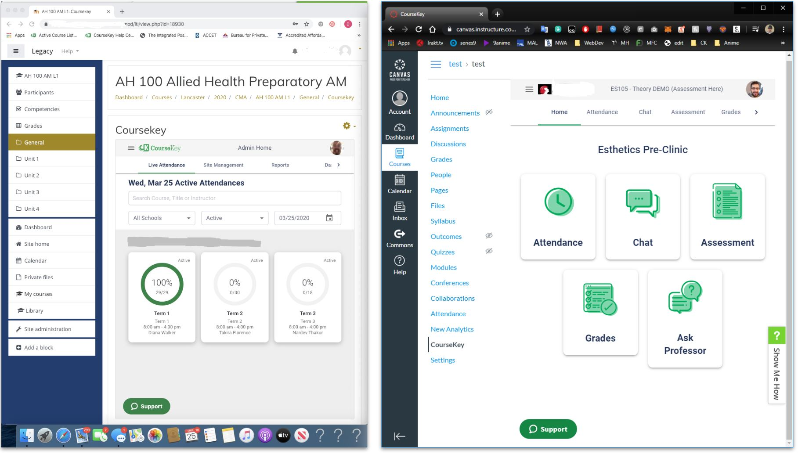
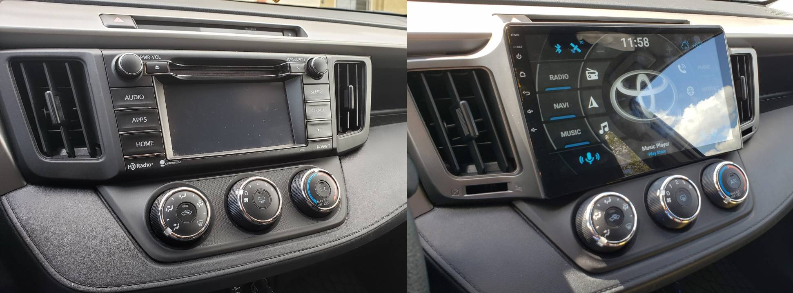
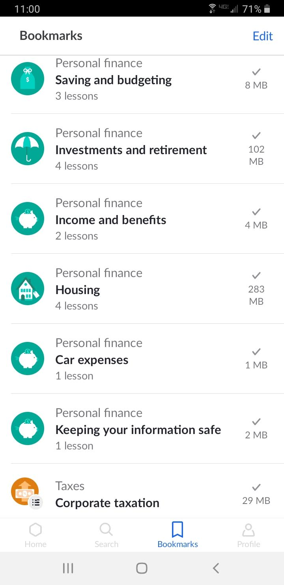
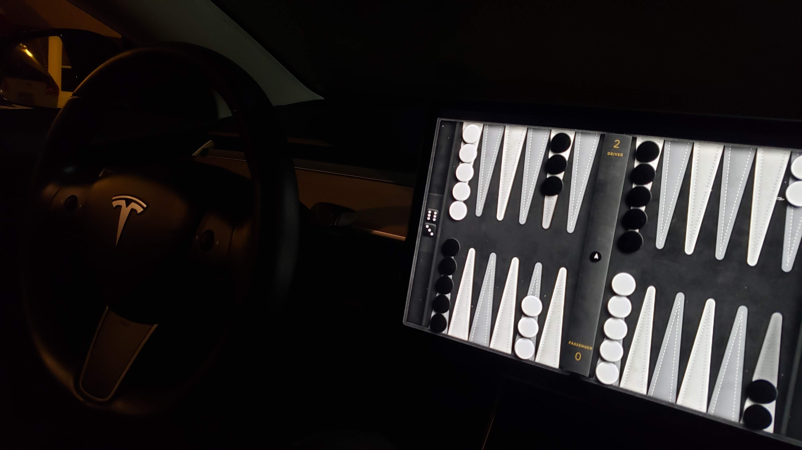
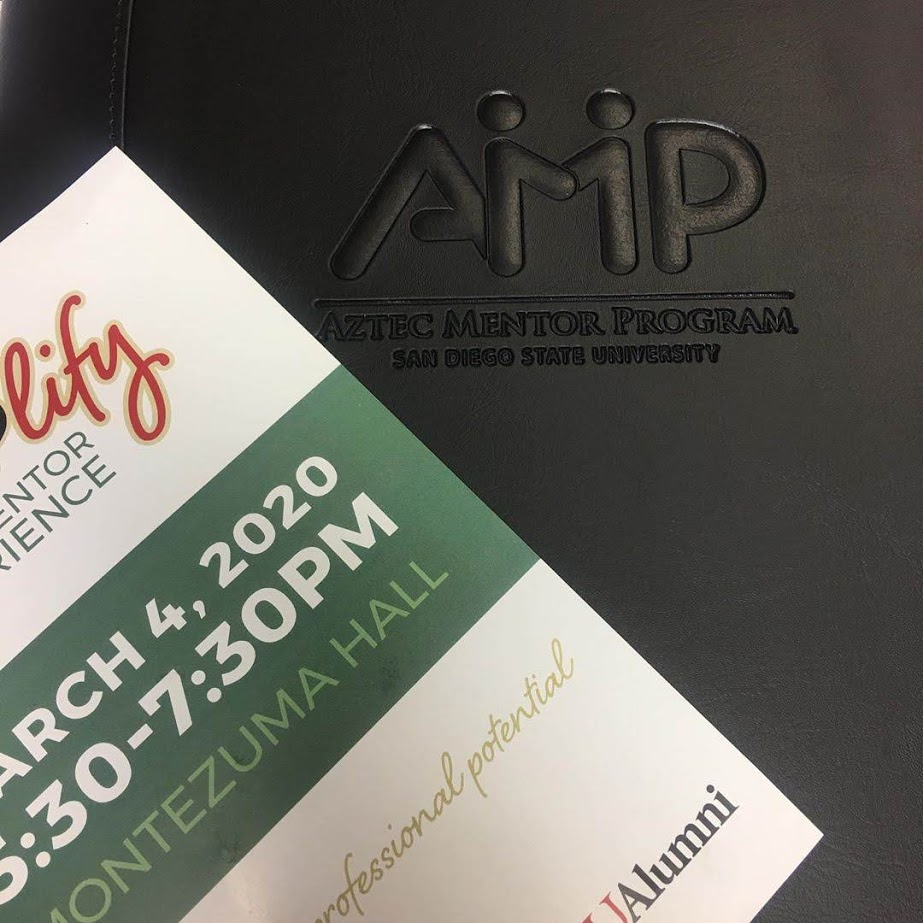
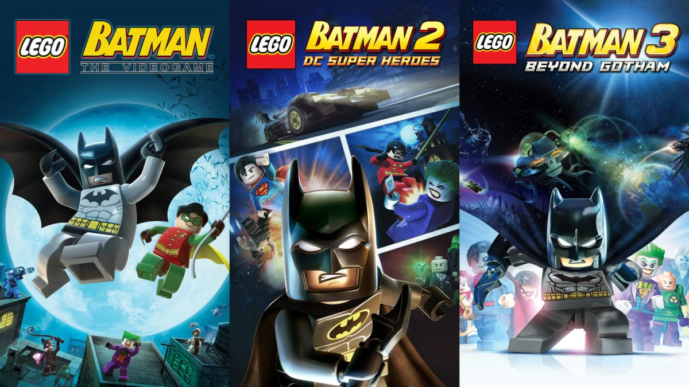
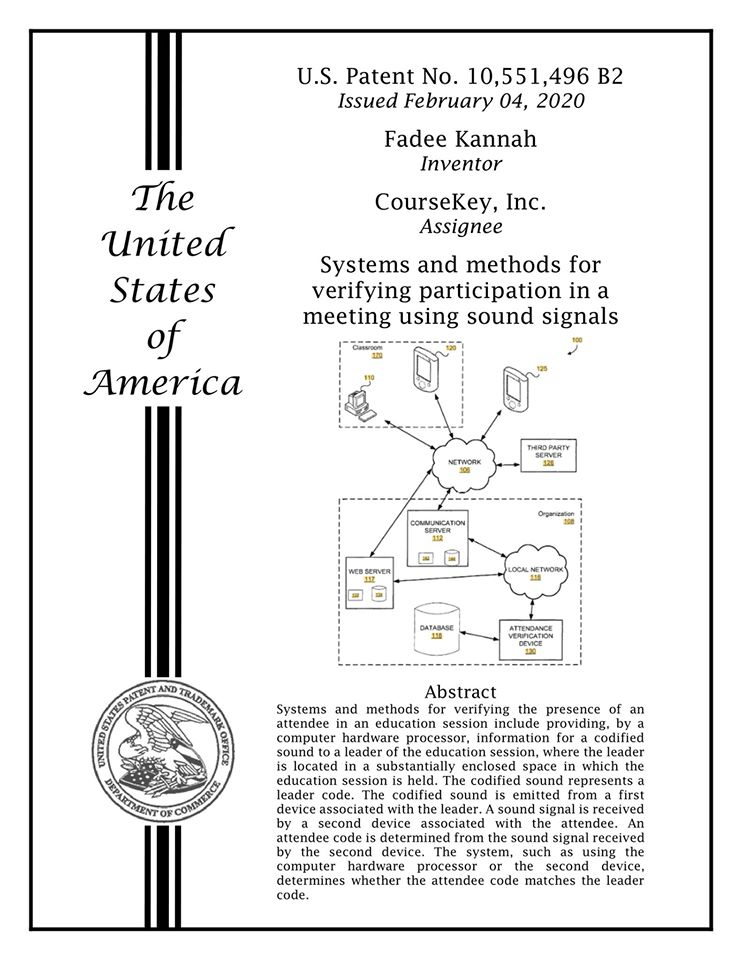
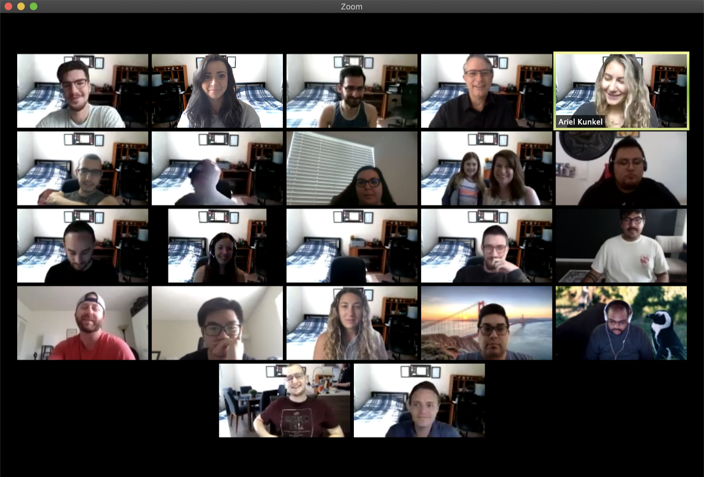
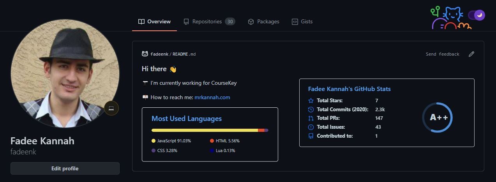
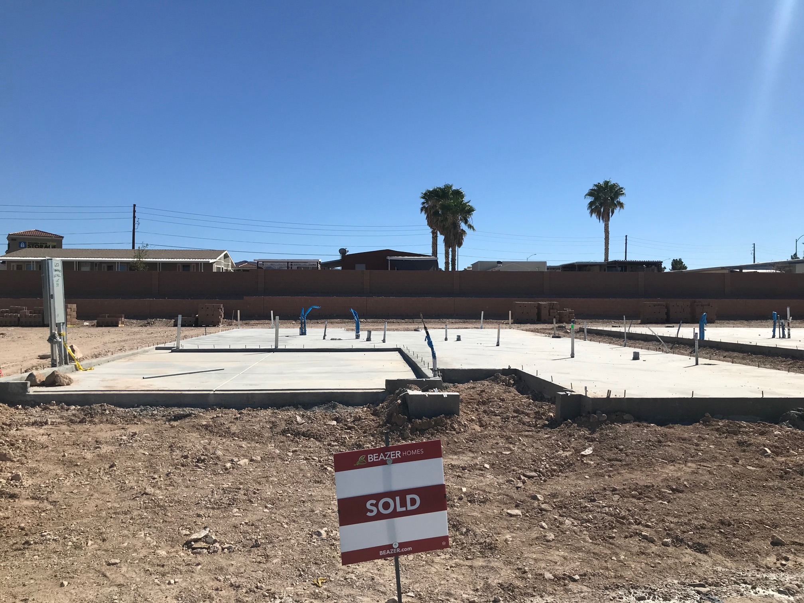

import YouTube from "@site/src/components/YouTube/YouTube.jsx";
import Gallery from "@site/src/components/Gallery/Gallery.jsx";
import feb1 from './images/feb1.jpg'
import feb2 from './images/feb2.jpg'
import feb3 from './images/feb3.jpg'
import feb4 from './images/feb4.jpg'
import feb5 from './images/feb5.jpg'
import feb6 from './images/feb6.jpg'
import feb7 from './images/feb7.jpg'
import tree from './images/tree.jpg'
import paint1 from './images/paint1.jpg'
import paint2 from './images/paint2.jpg'
import squirrel1 from './images/squirrel1.jpg'
import squirrel2 from './images/squirrel2.jpg'
import squirrel3 from './images/squirrel3.jpg'
import squirrel4 from './images/squirrel4.jpg'
import grad20201 from './images/grad1.jpg'
import grad20202 from './images/grad2.jpg'
import grad20203 from './images/grad3.jpg'
import grad20204 from './images/grad4.jpg'
import ckparty20200 from './images/ckparty2020.jpg'
import ckparty20201 from './images/ckparty20201.jpg'
import ckparty20202 from './images/ckparty20202.jpg'
import ckparty20203 from './images/ckparty20203.jpg'
import ckparty20204 from './images/ckparty20204.jpg'
import ckparty20205 from './images/ckparty20205.jpg'
import photoshoot1 from './images/photoshoot1.jpg'
import photoshoot2 from './images/photoshoot2.jpg'
import photoshoot3 from './images/photoshoot3.jpg'
import photoshoot4 from './images/photoshoot4.jpg'
import photoshoot5 from './images/photoshoot5.jpg'
import photoshoot6 from './images/photoshoot6.jpg'
import build1 from './images/build1.jpg'
import build2 from './images/build2.jpg'
import build3 from './images/build3.jpg'
import build4 from './images/build4.jpg'
import build5 from './images/build5.jpg'
import build6 from './images/build6.jpg'
import build7 from './images/build7.jpg'
import build8 from './images/build8.jpg'
import inv1 from './images/Net2020.png'
import inv2 from './images/NetBreakdown2020.png'
import year1 from './images/yearInPixels.png'
import year2 from './images/moodbreakdown.png'
import vegas20201 from './images/vegas20201.jpg'
import vegas20202 from './images/vegas20202.jpg'
import vegas20203 from './images/vegas20203.jpg'
import vegas20204 from './images/vegas20204.jpg'
import vegas20205 from './images/vegas20205.jpg'
import homeOptions1 from './images/homeOptions1.jpg'
import homeOptions2 from './images/homeOptions2.jpg'
import christmas20201 from './images/christmas20201.jpg'
import christmas20202 from './images/christmas20202.jpg'
import christmas20203 from './images/christmas20203.jpg'
import christmas20204 from './images/christmas20204.jpg'
import christmas20205 from './images/christmas20205.jpg'
import christmas20206 from './images/christmas20206.jpg'
import christmas20207 from './images/christmas20207.jpg'

## Introduction

Although this year was challenging and kind of sucked. It was still a good year for me. The year literally started with me getting sick on the first day, but I didn't let that ruin the year for me. Once I rested and recovered, I was ready to make it a great year. At least as good as possible while being stuck at home for the majority of it.

I started with big plans to get more involved in the community and spending more time with friends. Some people were saying I was finally out of my cave! That did not last long though thanks to COVID! Even during a lockdown, I was still committed to expanding my network and social circles.

To keep busy my family and I took on a few house projects when the weather was nice. And when it wasn't we were watching different TV shows and movies. To stay sane I worked on a few side projects. The biggest project is most likely the move out of California to Nevada since it is bleeding into next year.

Things at CourseKey were a wild ride this year! When the year started, it finally felt like things could slow down a bit. However, that feeling was eliminated as quickly as it appeared. As COVID cases began to rise, we transitioned to work from home. We adapted to it quickly by updating our roadmap and building what our market needed as schools transitions to being online.

That allowed us to grow rapidly. As the company grew, my team grew as well. It more than tripled in size from seven to thirteen to twenty-two people. On the way, I lost a few engineers from my team because of people reaching out to them and making them offers that we could not compete with at the time. This year I lost people to a previous employer, Intuit, and PayPal. On the bright side, we hired great people and we were awarded our second patent!

This year was a leveling up and a growth year for me. I got to level up in many different areas. At work, I leveled up my hiring, technical, communication, organization, delegation, and management skills. On a personal level, I have a better understanding/definition of what I want in many different aspects of my life. Mainly in spirituality, romance (dating), living environment, growth/learning, and career. Even with all of that, I still had many moments throughout the year that I could only represent with this video. 

<YouTube videoId="ZLB-JTUpk2U" />
 

### Goals achieved this year
####  Major Life goals
- **Earn a second patent**: Early this year, we got granted our second patent! With this, I am officially a two-time inventor recognized by the United States Patent and Trademark Office. Both patents can be found [here](https://patents.google.com/?inventor=Fadee+Kannah).
#### Yearly Goals
- **Transfer my investments from Traditional IRA (investment retirement account) into a Roth IRA**: I opened my account with an "adviser" who opened the wrong account type for me at the time causing me to lose on some tax benefits. During the COVID-19 chaos, I opened a new Roth IRA and did a [Backdoor Roth transfer](https://www.nerdwallet.com/blog/investing/backdoor-roth-ira-high-income-how-to-guide/). The main reason that I did this is so I get better tax benefits from my retirement accounts. I did some math and I figured it will be better for me to pay taxes now and let my money grow tax-free for the next 30+ years. Additionally, since the market was down, I used that to my advantage by leveraging [loss harvesting](https://www.investopedia.com/articles/taxes/08/tax-loss-harvesting.asp).
- **Rebalance my investment assets**: After the transfer of my investments, I made some changes to my portfolio and allocated my money differently from the initial time I invested. The new breakdown can be seen in the money section below. This way I won't have to worry about where to invest my money, everything is set up and automated.
- **Get more involved in the community**: I joined CETA (Chaldeans in Engineering and Technology Association) and became a mentor for other members of the organization. Additionally, I also become an official technical advisor for [ZIP Launchpad incubator](https://ziplaunchpad.sdsu.edu/resources/domain-expert-office-hours) to help advise students starting their software businesses. I have also joined my church's youth group. I also joined the San Diego Engineering leadership roundtable group. I have also started working with the [REC Innovation Lab](https://sdmiramar.edu/programs/entrepreneurship/rec).
- **Move to Nevada**: Since mid-March CourseKey had transitioned to working remotely. The more COVID dragged on, the more remote the business became. By May, we closed down our San Diego office, and we started hiring people from all over the US as well as in Mexico. At that point, CourseKey was the only reason I was still in California. The weather is nice, but the sunshine tax is too much for me, especially since I enjoy the dryer weather more. I am not a big ocean person either so that is kind of irrelevant for me. Finally, when the fires hit and had the valley fires nearby, I just couldn't convince myself staying in California makes sense for me.

##### Why Nevada?
1. Close enough to California where I can drive down to see my parents if needed.
1. Lower cost of living and better quality of life.
1. No income taxes! This is a nice plus because just by moving I am effectively giving myself a raise.
1. Better schools, community, and services when compared to El Cajon.
1. Friendlier for small businesses when it comes to taxes, fees, and laws in general.
1. I can work from anywhere, especially since my team is distributed across multiple timezones.
1. Weather similar to Iraq's weather, warm dry, and you get actual seasons.

### Personal Side Projects
- **Bigger Reward**: a fun side project that was being built to help my friend's business. However, once COVID hit that was no longer needed. It just became a base project for testing fun ideas and concepts. For example, I set up a local in-browser database using [Dexie.js](https://dexie.org/) for local use and made it sync with the firebase database. Another concept was using Twilio API to send messages and manage conversations using the same number and firebase. As well as a bunch of frontend experiments with UI/UX and flexbox.
- **LTI Integration**: Since we started CourseKey, I knew about Learning Tools Interoperability (LTI), which is a standard of communication for education systems. I had worked on it, on and off in the past during my free time. However, due to COVID, I decided to at least get a simple CourseKey embed integration done. That allowed us to embed our app inside different learning management systems (LMS) such as canvas, blackboard, moodle, and so on...

- **Smart car entertainment system**: My parents bought a new car because our old one broke down. That meant we are due for a car rotation, which got me the 2016 Rav4. The car is nice however it didn't have an easy way to mount my phone for navigation. So, instead of investing in a different phone holder, I just replaced the whole car entertainment system with one that can have navigation built-in!

- **[Khan Academy](https://www.khanacademy.org/)**: While being locked down due to COVID, I finally could start catching up on my learning a bit. So I went through a few courses at Khan Academy. Here is a list of all the courses that I completed.

- **Music clean up**: this project is the longest project I have been working on. It was originally started about 12 years ago back when I was still in Iraq! I would love to say it is done, but this will continue to be a work in progress as my music library continues to grow. I listened to more than 3000 songs and organized it all.
- **Retirement project**: This project started as a fun project but ended up being a tough realization. I did some reading and started putting together a simple plan. Then things got a bit complicated as I needed to account for inflation and other variables. Luckily, there are great tools already available online! [This calculator](https://smartasset.com/retirement/retirement-calculator) is amazing! It helps you calculate and figure out the savings amount you need to retire and how much money you will have according to data entered. Knowing those numbers is the main part of putting a plan together, the rest is just tweaking the variables till you have realistic values and making sure you try to meet those numbers.
- **Password manager migration**: Although I enjoyed using [Buttercup](https://buttercup.pw/) the load times on mobile were getting extremely annoying. So I migrated to [BitWarden](https://bitwarden.com/). Even though, bitwarden has an import for buttercup it didn't work the way that I expected. This is because I had a few custom fields and I wanted those fields to be mapped correctly. So I have created a [custom script](https://gist.github.com/fadeenk/9a87afd7718ba9e0af730700b115ca8c) to do a clean import.
- **[Grow on Air With Google](https://growonair.withgoogle.com)**: This is a series of videos where google basically sells its products to businesses. However, there were a few useful videos/topics. I found a shortcut where you don't have to signup for each one, instead just watch it on their [youtube channel](https://www.youtube.com/c/GrowwithGoogle/videos).
- **Buying a new construction home**: With the move to Nevada, comes finding a place to move into. Since my family is moving in with me, I wanted to ensure that my family likes the new place. After looking at a few different places nothing matched what we were looking for. While exploring we found a new construction that had the perfect floorplan for us at the perfect location. Buying a home is a tough process, buying one in the build process is even harder! When getting a new home there are way more decisions that need to be and the process will take way longer than expected.
- **[flexbox zombies](https://mastery.games/flexboxzombies)**: This was a fun way to learn flexbox. Flexbox is the newest way to handle aligning things on the web and making them responsive on different devices. I got most of it done but I struggled with the shrink/grow and basis functionality which I couldn't find any use for in my applications.
- **RaspberryPi server**: After finding my forgotten RaspberryPi, I decided to do something with it other than have it collect dust. The first thing, I did was updating to the latest [Raspberry Pi OS (Lite)](https://www.raspberrypi.org/software/operating-systems/#raspberry-pi-os-32-bit) and set it up as a headless server. Once that was set up the fun starts! I set up [home assistant](https://www.home-assistant.io/) which allows me to control everything that is remotely smart. Then I set up [PiHole](https://pi-hole.net/) which is a DNS sinkhole, it allows me to block ads, tracking, and shady websites on all devices in the network. This means no more ads on any mobile app or my smart TV.
- **Calendar/ appointment scheduling prototype**: a quick prototype for my friend's business using [react-big-calendar](https://github.com/jquense/react-big-calendar).

### Reading Materials this year
- [An Elegant Puzzle: Systems of Engineering Management](https://www.amazon.com/Elegant-Puzzle-Systems-Engineering-Management-ebook/dp/B07QYCHJ7V) [📓 My summary](./an-elegant-puzzle-systems-of-engineering-management)
- [Preparing for retirement](https://www.bogleheads.org/wiki/Preparing_for_retirement)
- Comics
  - [Sweet Home](https://manhwatop.com/manga/sweet-home): It was so good that Netflix adapted it into an [original series](https://www.netflix.com/title/81061734)
  - [Toaster Dude](https://www.webtoons.com/en/comedy/toaster-dude/list?title_no=1983&page=1): Great short funny comic that did not overstay its welcome
  - [Lore Olympus](https://www.webtoons.com/en/romance/lore-olympus/list?title_no=1320): It is great and I would highly recommend it, especially if you enjoy mythology. However, given how long it is and how limited my free time is I had to sacrifice it and put it on hold.

### Podcasts
#### Added
- [My First Million](https://castbox.fm/channel/My-First-Million-id2180580)  Backstories & strategies behind millionaires' success
- [Gaming Ride Home](https://castbox.fm/channel/Gaming-Ride-Home-id2638311) Latest video game news
- [Command Line Heros](https://castbox.fm/channel/Command-Line-Heroes-id1105224) True stories about everything that shaped and revolutionized the technology world
- [The Dream](https://castbox.fm/channel/The-Dream-id2096806) Deep dives into pyramid schemes and wellness products
- [Mixergy](https://castbox.fm/channel/Mixergy---Recession-Startup-Stories-id349217) Startup stories

#### Dropped
- [Akimbo](https://castbox.fm/channel/Akimbo%3A-A-Podcast-from-Seth-Godin-id2543209) talks about culture and about how we can change it. The only reason I dropped it is that I already have too many podcasts to listen to
- [Election Ride Home](https://castbox.fm/channel/2181696?country=us) Quick election news updates, elections are over and it is no longer produced.
- [Heist Podcast](https://castbox.fm/channel/Heist-Podcast-id2151870) Everything related to Heists. Deep dives into famous heists as well as discussing heists in the news.

### Cities visited

<iframe src="https://www.google.com/maps/d/u/0/embed?mid=1_ba5mIDueT-DRxFNz4e7sVKm3a0PFqBQ" width="640" height="480"></iframe>

### Financial state
<Gallery photos={[
    { src: inv1 },
    { src: inv2 },
]} />

### Mood summary
<Gallery photos={[
    { src: year1 },
    { src: year2 },
]} />

### Activity Summary
| Activity      | Count | description |
| ----------- | ----------- | ---- |
| Work | 289 | Spend at least one hour working on CourseKey. Note: there are only [262 work days in 2020](https://hr.uiowa.edu/pay/payroll-services/payroll-calendars/working-day-payroll-calendar-2020#:~:text=There%20are%20a%20total%20of,in%20the%202020%20calendar%20year.). |
| Family | 251 | Spend quality time with my family|
| Movies/ Entertainment | 236 | Watched a movie, TV show or YouTube (excludes anime) |
| Gaming | 200 | Played video games for at least 5 minutes. |
| Side projects | 192 | Did work for fun (see [side projects](#personal-side-projects)). |
| Anime | 93 | Watched at least an episode of an Anime. |
| Friends | 65 | Hangout or spend at least an hour with friends. |
| Drinking | 25 | Had at least one alcoholic beverage |
| Date | 15 | Number of dates I have been on total |
| Cooking | 14 | Prepared a meal that was not just put in the microwave and wait.|

## Month by month highlights
### January
I started the year slow! Since December was extremely busy, and I got sick on new year's day. The first half of the month was recovering and enjoying my time with the family. Once I started feeling better, I switched the gears up a notch. I got to hang out with some friends and cousins then followed by a couple of dates. To wrap the month up, I got more involved in the community and specifically more in CETA (Chaldeans in Engineering and Technology Association). I got to meet the US National AI (Artificial Intelligence) Architect at Microsoft and learned a few tricks about Azure and AI.

### February
Started strong by doing a trip with my friends to [Churrascaria Do Brasil](https://churrascariadobrasil.com.mx/) in Tijuana followed by a VIP movie theater experience watching Bad Boys for Life. By that time it had been a while since I had a game night. My coworkers and I did a game night at [Shakespeare Pub](https://www.shakespearepub.com/). I officially started my role as a technical adviser for startups at the [ZIP Launchpad](https://ziplaunchpad.sdsu.edu/resources/domain-expert-office-hours). I attended the [Suryoyo youth group day](https://suryoyoyouthday.com/) which led me to become a member of the youth group. I got to celebrate my cousin's son's birthday followed by beers with friends at [Ballast Point Brewery](https://ballastpoint.com/). My friend got his first paycheck so we celebrated the best way we know how by eating out at [Buca Di Beppo](https://www.bucadibeppo.com/).

Due to the holidays and the craziness of the new year, Luke and I finally got the chance to do our Korean BBQ tradition. I gave a presentation at CETA about my journey and how I became a CTO, you can see the full recording [here](https://www.facebook.com/deaconkeith.esshaki/videos/2864093066946620/). I finally managed to convince my parents to cross the border to go for lunch at [Mr. Pampas](https://www.mrpampas.com/). I also got to catch up with MESA staff during a basketball game watching party for MESA Alumni. I got to try my coworker's famous wood-fired pizza and wrapped the month up by bowling with my cousins.

<Gallery photos={[
    { src: feb1 },
    { src: feb2 },
    { src: feb3 },
    { src: feb4 },
    { src: feb5 },
    { src: feb6 },
    { src: feb7 },
]} />

### March
Since February was a bit too busy I decided to slow things down a bit. I attended the AMPlify networking event for the [AMP program](https://amp.sdsu.edu/). After that, I started focusing on and preparing for filing my taxes. By the time, I was done with that, the COVID-19 spread was not looking good, and decided to transition our entire team to work from home. Starting mid-March, my focus has been ensuring the team transitions successfully and helping our schools move to the online environment.

### April
My sister and I took advantage of no longer having to commute for work and utilized that time for gaming. It had been a long time since we played games together. We played the LEGO Batman trilogy and completed both LEGO Batman 2 & 3, which were tons of fun (until we ran into a few bugs that kept us stuck for hours).

Continuing with the gaming theme, I completed Final Fantasy VII Remake. I wanted to get the game, but I knew I would not have the time to play it so I just ended up watching it on YouTube.

Being stuck at home, my family and I decided to do some housework/ upgrades. Our target was the backyard. We removed a tree that has grown into the fence and was pushing it inward. After that, we got a bunch of paint and painted the fence.

<Gallery photos={[
    { src: tree },
    { src: paint1 },
    { src: paint2 },
]} />

While I was locked down, I did some research and found and joined the [Engineering leadership roundtable](https://www.meetup.com/Engineering-Leadership-Roundtable/). I also continued to focus on work and ensuring our team is set for success during those uncertain times. Before the month ended we were notified that our second patent has been awarded!

### May
By this point, I have been mentoring and advising students in the ZIP Launchpad for a couple of months. Because of that, I got invited to help other students at the [REC Innovation Lab](https://sdmiramar.edu/programs/entrepreneurship/rec) in San Diego Miramar College. I was happy to accept and offer any assistance I could to the students while locked up at home.

Additionally, since I have been mentoring people through different programs, I was asked if I could mentor people in CETA (Chaldeans in Engineering and Technology Association). I figured the additional commitment was manageable so I accepted.

Once we were done with the fence painting, we noticed we had a squirrel that visits us at least once a day. So, we took some pieces of wood and some tree trunks and made a house for it. We left him some treats and in return got to enjoy watching him eating and parkouring around looking for more snacks.

<Gallery photos={[
    { src: squirrel1 },
    { src: squirrel2 },
    { src: squirrel3 },
    { src: squirrel4 },
]} />

Since everyone was stuck at home, I got to enjoy some fun zoom meetings. I attended my friend's zoom birthday party which was fun. My favorite zoom meeting was when the whole CourseKey team decided to have a meeting in my room!

To ease the stress of everything going on my sister recommended I read one of the most popular webtoons ([Sweet home](https://manhwatop.com/manga/sweet-home)). It is a horror story where the people are forced to stay in their building. I caught up to the story within a few days. The story is great. The only downside is that the author is great with the cliff hangers!

### June

My sister graduated in May, however, we finally went to SDSU to take some graduation photos. I was the designated photographer, and I am happy with how the pictures turned out.

<Gallery photos={[
    { src: grad20201 },
    { src: grad20202 },
    { src: grad20203 },
    { src: grad20204 },
]} />

I also got to share a beer in person with my friend who graduated and a few other friends. We all had been practicing social distancing and it was just a few of us so we could safely get together and enjoy the company.

Work on the other hand had ramped up real quick. Since COVID started, our roadmap had to adapt and the workload increased considerably. To be able to keep up with the workload and demand we grew the development team. My team went increased from five people to a total of fourteen by the end of the month.

Not only did my team grow but I also had to do some major upgrades to our infrastructure. I migrated our database servers to new clusters with a different service provider. That meant upgrading all of our existing systems and servers including the "retired" servers. Although everything was planned and tested, things didn't go as smoothly as planned. There were some complications that I was able to resolve and have all systems fully operational, up and running within the planned outage period.

Due to our team size growth, some of the development tools we use could no longer support us. So we ended up migrating to different service providers while keeping on delivering features to our users with aggressive deadlines!

### July

This month was rough! On one hand, work was stressful, on the other, the quarantine was not helping. Luckily, Luke and I managed to get together for a workday and a game night at my place. It was a nice day that helped me recharge. After a few days, I got to do a zoom call with a friend.

Additionally, to help with the stress, my family and I started watching the Turkish drama "Black Money Love". We chose that one because it was on Netflix and has an Arabic dub which makes it easier for my parents.

Once things calmed down a bit, I was finally able to tackle my paused projects. The first thing I tackled was fixing my broken Alexa skill for streaming youtube on my Alexa echo dot. Youtube APIs have changed and I needed to update my keys and method for getting the audio stream. After that, I decided to figure out a retirement plan. I did some research and figured out sort of a plan. Reality is crueler than fiction! Although I wanted to retire early, that will not be achievable with the current numbers and pace. As of right now, this project got shelved till next year. If you want to play with some numbers the calculator mentioned in the projects section is great!

Finally, right before the month ended, I switched my savings bank. This is due to the continuous decline in interest rate, which means my savings are not even keeping up with inflation rates. I did some digging and found a bank that offers a higher interest rate for savings (1.03%). Although it is not much, it is still better than the rate that I had (0.73%). It only cost me filling some forms online and a couple of hours and I will be making an extra couple of cents which in the long term will add up.

### August

Continuing the work on side projects. First, I migrated all my passwords from [Buttercup](https://buttercup.pw/) to [BitWarden](https://bitwarden.com/) (password managers). After fixing my password manager, I cleaned up my Trello boards. I have a Trello board where I keep the majority of my notes, references, links, and all the random things I find on the web. Once my Trello board was organized, it was time to update this blog post since I have been falling behind for a few months.

It has been more than eight months since I looked at my automated backup and entertainment systems. First, I updated all the containers/images (virtual servers). Then I decided to fix the old warnings that keep popping up. Turned out there was an issue with translating between the different layers separating the virtual server, my computer, and the network drive. Basically, that meant any file/folder that was in Arabic was not being backed up correctly 😱

After finishing those two projects, I switched back to working on my full-stack project. However, before even getting started, I got distracted with beta testing a few cool new features in Github. I pimped up my [Github profile](https://github.com/fadeenk) a bit. After that, I needed to figure out how to make things align on a website using new technologies. So I ended up taking the famous [flexbox zombies](https://mastery.games/flexboxzombies) CSS class.

### September

What happened in this month was not expected! It started with planning a surprise vocation/birthday for my mom then ended up with a plan for moving to another state. After two weeks of researching it, I concluded that the California cost of living and doing business is too much. I compared the process and cost of having an LLC in California and Nevada. Nevada offers an even better structure for LLCs such as series LLCs (SLLC). Here is a [good resource](https://www.llcuniversity.com/) that summarizes the creation process for all the different states.

On top of Nevada being business-friendly, it is also people-friendly. One major perk is 0% income tax! That means I get to make more money each month. The cost of living is lower when it comes to pretty much everything. Additionally, schools are better (compared to El Cajon). The weather is not as nice but for me it is great! I grew up in Iraq and I like the dry weather way more. Speaking about the weather the fire season in California is not helping convince me to stay, especially since we had the Valley fire which was in our backyard.

Once I made my decision, I shared it with the family. Somehow, I convinced them and decided to move altogether to Nevada. Before, pulling the trigger I got to enjoy a company get-together and meet some of our new hires. Soon after I shut down my consulting business and planned a trip to Las Vegas to find a place to move into. My family and I went on a road trip to Las Vegas. We explored different areas and liked Henderson the most. We spent a few days looking at different homes.

<Gallery photos={[
    { src: vegas20201 },
    { src: vegas20202 },
    { src: vegas20203 },
    { src: vegas20204 },
    { src: vegas20205 },
]} />

On the fourth day, we found the perfect house for us. I signed the paperwork and gave the deposit since it is still being built. After that, the next few days were focused on going through all the paperwork. I got a massive manual and twenty-plus pages of different options to add to the new house. After all of that, I had to go through the paperwork for the lenders to get the best mortgage deal for my new home.

<YouTube videoId="o31kVxTrfak" />

### October

Between taking a week off and starting a new quarter, work was getting busy again! From getting reports ready to preparing for board meetings, I was head down for the majority of the month. When I was not head down working, I was head down figuring out the plan for my and my family's move to Nevada. I did what I always do when there is a big project that needs to be figured out, I created a Trello board to keep track of everything.

By the middle of the month, I had to go back to Vegas to pick the options for the house and get the final price. After getting back, we started preparing for the move. I started decluttering which means I found out how much stuff I was hoarding! I ended up donating, gifting, and selling a bunch of the things that I don't use. I also uncovered a few things I forgot about, like multiple raspberry pis! That led me to start working on the ads and tracking DNS blocker project.

<Gallery photos={[
    { src: homeOptions1 },
    { src: homeOptions2 },
]} />

The rest of the month was spent focusing on CourseKey as we were ramping up the backend team. Within three weeks span, we hired and trained three new developers. That plus all the projects going on at CourseKey barely allowed me anytime to do anything else.

### November

Things got more intense and busier than ever in November! On the 16th, I moved to Nevada. The process was a bit painful but luckily for me, my Trello board came to the rescue making it easier to deal with everything that I need to do. That whole week was just transferring everything over and getting settled down (while waiting for our new home to get build). By the 20th, I had officially become a Nevada resident, thanks to all the prep work, and my handy Trello board.

Although I moved, the house building process came to a standstill. Due to COVID and the California fires, the lumber supplier for the builder kept delaying the delivery. The place was ready to be built in mid-October, but due to the delays from the suppliers, no progress was made for the whole month.

<!---
As soon as I got back, we got our series B term sheet signed, so it was a great way to start the holidays. Getting that paper signed was the result of all the hard work we had been putting into CourseKey in the last six years.
-->

For Thanksgiving, I was back in California with the family! That gave me the chance to catch up with some friends. We discussed businesses, investments and many other things. As we were catching up, I found out that another friend was visiting from Minnesota. Since I have not seen that friend in almost five years, we did a get together on black Friday.

As the year progressed the interest rates offered by most banks kept getting lowered! Since my new home did not make any progress, my money was just sitting there not making any money. So I once again moved banks. This time I moved my money to T-Mobile MONEY which gives 4% on the first $3000 and 1% on the rest of the money. That was the best rate I could find and it is with a known company so less risk. I would have invested that money, but since I don't know when I need the money for closing the home I am stuck with having it sit in a savings account.

### December

Usually, people slow down in December and relax a little bit, that is not the case for me. Since I have started keeping track of how things, it seems like December is one of the busiest months for me. I was visiting the family for thanksgiving and then decided to stay till the next year. Especially since there was not much progress happening on the new house and I was just crashing at my relative's place.

Due to COVID getting worse and worse in San Diego, hangouts and gatherings got impacted the most. I went for a walk around lake Murray with some friends visiting from silicon valley. This was the only thing that was not shut down at the time. Additionally, I helped another friend install a wired security system throughout his house over a few weekends. It was a fun project and a great legs' workout, working in the attic and moving around instead of sitting in a chair all day.

At CourseKey, things somehow kept getting busier. As the year is ending we are pushing to finish multiple big projects so we can start the year strong! We also started the hiring process for the new people joining our team starting next year. That means having to deal with some extra work on top of doing the end of the year of work (performance reviews, planning, and budgeting for next year). 

Nonetheless, it is not only working at CourseKey. As the saying goes work hard and party harder! Although COVID ruined getting together to celebrate CourseKey's holiday party, we had a ton of fun at our online holiday party. We all got to mix our own drinks and have fun with an online white elephant! To top things off when it was all over, we continued the party by playing [drawful](https://www.jackboxgames.com/drawful-two/) while a bit buzzed which makes it even more fun.

<Gallery photos={[
    { src: ckparty20201 },
    { src: ckparty20200 },
    { src: ckparty20202 },
    { src: ckparty20203 },
    { src: ckparty20204 },
    { src: ckparty20205 },
]} />

While I was candidate hunting on LinkedIn, I realized my photos were a bit outdated. My LinkedIn profile picture was a picture from my senior year in high school (almost ten years ago)!! I was overdue for updated pictures and I wanted to have them professionally taken. Luckily, I know many talented people and one of them is [a great photographer](https://www.instagram.com/waseem.iskanderian/) so I signed up for a photo shoot.

<Gallery photos={[
    { src: photoshoot1 },
    { src: photoshoot6 },
    { src: photoshoot4 },
    { src: photoshoot3 },
    { src: photoshoot5 },
    { src: photoshoot2 },
]} />

After a long wait, the builder finally decided to change the supplier and order materials for my home. On the 8th, the materials arrived and the work on the house kicked in. Within a few weeks, my new home started to take shape.

<Gallery photos={[
    { src: build1 },
    { src: build2 },
    { src: build3 },
    { src: build4 },
    { src: build5 },
    { src: build6 },
    { src: build7 },
    { src: build8 },
]} />

Although this year has been challenging and rough, my family and I got to enjoy a great and New Year's Eve. We couldn't have anyone over, other than grandma but we made the best of it. It was nothing special but thanks to my sister and father, we got to spend it playing all sorts of party games! We were laughing, cheering, and having tons of fun non-stop. We were playing simple games with cups, balloons, and some money. I also got to utilize my mixing kit to make some fun cocktails.

<Gallery photos={[
    { src: christmas20201 },
    { src: christmas20202 },
    { src: christmas20203 },
    { src: christmas20204 },
    { src: christmas20205 },
    { src: christmas20206 },
    { src: christmas20207 },
]} />

<YouTube videoId="sT1CX9XoP9k" />

<YouTube videoId="1CRJfYPDei8" />

