import YouTube from "@site/src/components/YouTube/YouTube.jsx";
import Gallery from "@site/src/components/Gallery/Gallery.jsx";
import Instagram from "@site/src/components/Instagram/Instagram.jsx";
import hmove1 from './images/hmove1.jpg'
import hmove2 from './images/hmove2.jpg'
import hmove3 from './images/hmove3.jpg'
import hmove4 from './images/hmove4.jpg'
import hmove5 from './images/hmove5.jpg'
import hmove6 from './images/hmove6.jpg'
import hmove7 from './images/hmove7.jpg'
import hmove8 from './images/hmove8.jpg'
import hmove9 from './images/hmove9.jpg'
import outdoor1 from "./images/outdoor1.jpg";
import outdoor2 from "./images/outdoor2.jpg";
import outdoor3 from "./images/outdoor3.jpg";
import outdoor4 from "./images/outdoor4.jpg";
import outdoor5 from "./images/outdoor5.jpg";
import outdoor6 from "./images/outdoor6.jpg";
import outdoor7 from "./images/outdoor7.jpg";
import outdoor8 from "./images/outdoor8.jpg";
import outdoor9 from "./images/outdoor9.jpg";
import outdoor10 from "./images/outdoor10.jpg";
import outdoor11 from "./images/outdoor11.jpg";
import outdoor12 from "./images/outdoor12.jpg";
import outdoor13 from "./images/outdoor13.jpg";
import outdoor14 from "./images/outdoor14.jpg";
import outdoor15 from "./images/outdoor15.jpg";
import outdoor16 from "./images/outdoor16.jpg";
import outdoor17 from "./images/outdoor17.jpg";
import outdoor18 from "./images/outdoor18.jpg";
import outdoor19 from "./images/outdoor19.jpg";
import outdoor20 from "./images/outdoor20.jpg";
import outdoor21 from "./images/outdoor21.jpg";
import outdoor22 from "./images/outdoor22.jpg";
import outdoor23 from "./images/outdoor23.jpg";
import outdoor24 from "./images/outdoor24.jpg";
import outdoor25 from "./images/outdoor25.jpg";
import fun1 from "./images/fun1.jpg";
import fun2 from "./images/fun2.jpg";
import fun3 from "./images/fun3.jpg";
import fun4 from "./images/fun4.jpg";
import fun5 from "./images/fun5.jpg";
import fun6 from "./images/fun6.jpg";
import fun7 from "./images/fun7.jpg";
import fun8 from "./images/fun8.jpg";
import fun9 from "./images/fun9.jpg";
import fun10 from "./images/fun10.jpg";
import fun11 from "./images/fun11.jpg";
import fun12 from "./images/fun12.jpg";
import fun13 from "./images/fun13.jpg";
import fun14 from "./images/fun14.jpg";
import fun15 from "./images/fun15.jpg";
import fun16 from "./images/fun16.jpg";
import fun17 from "./images/fun17.jpg";
import fun18 from "./images/fun18.jpg";
import fun19 from "./images/fun19.jpg";
import fun20 from "./images/fun20.jpg";
import fun21 from "./images/fun21.jpg";
import fun22 from "./images/fun22.jpg";
import fun23 from "./images/fun23.jpg";
import fun24 from "./images/fun24.jpg";
import fun25 from "./images/fun25.jpg";
import fun26 from "./images/fun26.jpg";
import fun27 from "./images/fun27.jpg";
import fun28 from "./images/fun28.jpg";
import fun29 from "./images/fun29.jpg";
import fun30 from "./images/fun30.jpg";
import fun31 from "./images/fun31.jpg";
import fun32 from "./images/fun32.jpg";
import fun33 from "./images/fun33.jpg";
import fun34 from "./images/fun34.jpg";
import fun35 from "./images/fun35.jpg";
import fun36 from "./images/fun36.jpg";
import fun37 from "./images/fun37.jpg";
import fun38 from "./images/fun38.jpg";
import fun39 from "./images/fun39.jpg";
import fun40 from "./images/fun40.jpg";
import fun41 from "./images/fun41.jpg";
import fun42 from "./images/fun42.jpg";
import fun43 from "./images/fun43.jpg";
import fun44 from "./images/fun44.jpg";
import fun45 from "./images/fun45.jpg";
import fun46 from "./images/fun46.jpg";
import fun47 from "./images/fun47.jpg";
import fun48 from "./images/fun48.jpg";
import fun49 from "./images/fun49.jpg";
import fun50 from "./images/fun50.jpg";
import fun51 from "./images/fun51.jpg";
import fun52 from "./images/fun52.jpg";
import fun53 from "./images/fun53.jpg";
import fun54 from "./images/fun54.jpg";
import fun55 from "./images/fun55.jpg";
import fun56 from "./images/fun56.jpg";
import fun57 from "./images/fun57.jpg";
import fun58 from "./images/fun58.jpg";
import fun59 from "./images/fun59.jpg";
import fun60 from "./images/fun60.JPG";
import fun61 from "./images/fun61.jpg";
import fun62 from "./images/fun62.jpg";
import fun63 from "./images/fun63.jpg";
import fun64 from "./images/fun64.jpg";
import fun65 from "./images/fun65.jpg";
import fun66 from "./images/fun66.jpg";
import luke from "./images/luke.jpg";
import choco from "./images/choco.jpg";
import am1 from "./images/am1.jpg";
import am2 from "./images/am2.jpg";
import am3 from "./images/am3.jpg";
import am4 from "./images/am4.jpg";
import am5 from "./images/am5.jpg";
import am6 from "./images/am6.jpg";
import am7 from "./images/am7.jpg";
import am8 from "./images/am8.jpg";
import am9 from "./images/am9.jpg";
import am10 from "./images/am10.jpg";
import am11 from "./images/am11.jpg";
import cam1 from "./images/cam1.jpg";
import cam2 from "./images/cam2.JPG";
import ck1 from "./images/ck1.jpg";
import ck2 from "./images/ck2.jpg";
import ck3 from "./images/ck3.jpg";
import ck4 from "./images/ck4.jpg";
import ck5 from "./images/ck5.jpg";
import ck6 from "./images/ck6.jpg";
import ck7 from "./images/ck7.jpg";
import ck8 from "./images/ck8.jpg";
import ck9 from "./images/ck9.jpg";
import ck10 from "./images/ck10.jpg";
import ck11 from "./images/ck11.jpg";
import ck12 from "./images/ck12.jpg";
import ck13 from "./images/ck13.jpg";
import ck14 from "./images/ck14.jpg";
import ck15 from "./images/ck15.jpg";
import ck16 from "./images/ck16.jpg";
import ck17 from "./images/ck17.jpg";
import ck18 from "./images/ck18.jpg";
import ck19 from "./images/ck19.jpg";
import ck20 from "./images/ck20.jpg";
import ck21 from "./images/ck21.jpg";
import ck22 from "./images/ck22.jpg";
import ck23 from "./images/ck23.jpg";
import SF1 from "./images/SF1.jpg";
import SF2 from "./images/SF2.jpg";
import SF3 from "./images/SF3.jpg";
import SF4 from "./images/SF4.jpg";
import SF5 from "./images/SF5.jpg";
import SF6 from "./images/SF6.jpg";
import SF7 from "./images/SF7.jpg";
import SF8 from "./images/SF8.jpg";
import SF9 from "./images/SF9.jpg";
import SF10 from "./images/SF10.jpg";
import SF11 from "./images/SF11.jpg";
import SF12 from "./images/SF12.jpg";
import SF13 from "./images/SF13.jpg";
import SF14 from "./images/SF14.jpg";
import Networth2021 from "./images/2021Networth.png";
import AssetsBreakdown2021 from "./images/2021AssetsBreakdown.png";

## Introduction
2021 another busy year... Luckily, this time we were able to meet people and go outside thanks to the vaccine. This year can be summed up as the year of new things! New home, new city, new experiences, new friends and new challenges to overcome. Of course, it was not all work and challenges! There was a lot of fun included as well.

<Gallery photos={[
    fun1,
    fun2,
    fun3,
    fun4,
    fun5,
    fun6,
    fun7,
    fun8,
    fun9,
    fun10,
    fun11,
    fun12,
    fun13,
    fun14,
    fun15,
    fun16,
    fun17,
    fun18,
    fun19,
    fun20,
    fun21,
    fun22,
    fun23,
    fun24,
    fun25,
    fun26,
    fun27,
    fun28,
    fun29,
    fun30,
    fun31,
    fun32,
    fun33,
    fun34,
    fun35,
    fun36,
    fun37,
    fun38,
    fun39,
    fun40,
    fun41,
    fun42,
    fun43,
    fun44,
    fun45,
    fun46,
    fun47,
    fun48,
    fun49,
    fun50,
    fun51,
    fun52,
    fun53,
    fun54,
    fun55,
    fun56,
    fun57,
    fun58,
    fun59,
    fun60,
    fun61,
    fun62,
    fun63,
    fun64,
    fun65,
    fun66,
]} />

## Goals achieved this year
###  Major Life goals
#### Develop a financial roadmap
The main reasons for having the roadmap are to ensure I know what I am working towards to and where I am at in the progress. I leveraged multiple tools and research available to develop this roadmap. Some of the main components are: [the average networth calculation](https://www.thesimpledollar.com/financial-wellness/what-should-your-net-worth-be-why-the-millionaire-next-door-equation-falls-short-and-what-a-better-thumbnail-calculation-might-look-like/), [The 4% rule for retirement](https://www.thebalance.com/dont-confuse-these-two-retirement-rules-of-thumb-453920), [US inflation calculator](https://www.usinflationcalculator.com/) and many other undocumented articles.

**To summarize**:
- In thirties, should prioritize paying off any debt that is 5% or more. Have a will, life insurance, disability insurance, 1.5 years of expenses invested and 1.2 years of income saved.
- In forties, should prioritize paying off any debt that is 4% or more. Update will, life insurance, disability insurance, ensure investments and savings are growing appropriately to match and meet the target retirement amount/timeline. Ideally lay out the foundation for [FatFire](https://www.financialsamurai.com/what-is-fat-fire-best-way-to-retire-early/).
- In fifties, should eliminate all debt, ensure will, estate documents and all legal work is in a good state. Develop a retirement plan, what you are retiring into! Don't count on social security, since the program is running out of funding and Uncle Sam can change everything anytime.

#### Buy a second house
This year was when I finally closed on the Henderson home. This is the home that we purchased as a customized new build. Although, we customized it and it was brand new, we still did a ton of work on it. There were many projects that we did to turn the house into our home.

#### Have multiple streams of income
By moving to Henderson, I was able to rent our home in El Cajon. By doing so, I managed to have another stream of income. Although, the stream is pretty small right now since most of the rent is going back into the house expenses itself. But overtime the stream will grow and help covers some bills.

#### Become a startups investor
I have joined a venture fund, an investors syndicate and set up my investor account with [AngelList](https://angel.co/invest/start). I have only made a very small investment as of right now. This is due to the fact that I am still learning how to invest in startups and I didn't have the extra money to invest.

#### Get mentioned in a major news outlet
I got mentioned by name and had my picture included on [TechCrunch](https://techcrunch.com/2021/03/03/after-200-arr-growth-in-2020-coursekey-raises-9m-to-digitize-trade-schools/). The article was our Series B raise announcement to highlight what we have accomplished and what we intend to do in the future.

### Yearly Goals
#### Increase my crypto investment
Since 2017, after I sold majority of my crypto, I have been out of the crypto market. This year, I went back and started investing in it again. Although, I am at a loss (bought around the peak of the market), I do believe it will grow and potentially be a good investment. My target for crypto investments is to be a total of 3-5% of my networth, at the beginning of the year it was 1.18%, at peak it was got closer to 4% now it is at 3.6%

#### Grow the CourseKey engineering team
As we raised series B, we finally had the budget to scale the team to keep up with the product demand. We hired a VP of Engineering as well as many new engineers! As of right now, the engineering team consists of 24 team members distributed across the globe.

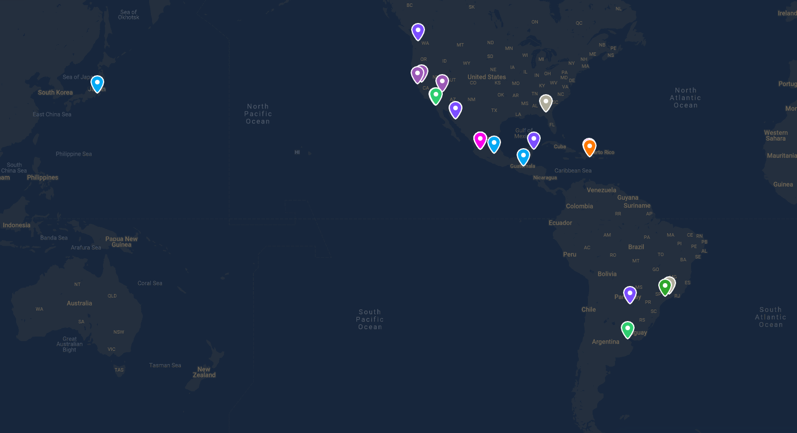

## Projects
### Home projects
With moving to a new places come a lot of projects to work on. Some of them are expected others are not so much. On top of having to unpack and organize everything in the new place, we had to assemble new furniture, install ceiling fans, decorate the house, setup garage cabinets and replace ceiling lights! This list excludes the projects that we paid people to do such us adding backsplash to the kitchen, painting the garage, epoxying the floor, sealing granite and tile and probably a few more that I am forgetting.

<Gallery photos={[
    hmove1,
    hmove2,
    hmove3,
    hmove4,
    hmove5,
    hmove6,
    hmove7,
    hmove8,
    hmove9,
]} />

### Outdoor projects
Once we were done with the inside of the home, we started working on things outside. Mainly fixing/cleaning up the backyard. We turned it from a deserted wasteland into a beautiful space to relax in (when the heat is not 100 degrees out). Some of those projects included cleaning up, flattening the ground, getting rocks for decorations, installing pavers, plant some greenery, install synthetic grass, install backyard lights/ decorations and set up a gazebo.

<Gallery photos={[
    outdoor1,
    outdoor2,
    outdoor3,
    outdoor4,
    outdoor5,
    outdoor6,
    outdoor7,
    outdoor8,
    outdoor9,
    outdoor10,
    outdoor11,
    outdoor12,
    outdoor13,
    outdoor14,
    outdoor15,
    outdoor16,
    outdoor17,
    outdoor18,
    outdoor19,
    outdoor20,
    outdoor21,
    outdoor22,
    outdoor23,
    outdoor24,
    outdoor25,
]} />

### Upgraded home network
By moving to a new bigger home that meant I needed to upgrade the WiFi network as well as how my home devices connect to the internet. I set up the new router and home network so everything at home is connected and communicating properly.

### Single sign on (SSO)
Although this was for CourseKey, I spent quite a bit of my time thinking about it and working on it. The actual project was not as challenging, the biggest issue was finding an identify provider to be able to test and verify things are working properly. This basically will allow us to authenticate users using any third party that supports the identity standards such as OAuth2.

### Security system
As soon as we installed the [Lorex smart doorbell](https://www.lorextechnology.com/hd-wifi-security-camera/2k-qhd-wired-video-doorbell-with-person-detection/B451AJD-E-1-p), we fell in love with it! It worked great and gave us ease of mind and the ability to answer the door from anywhere! That got me curious about installing a full security system. So I bought a LOREX security system from Costco that was a great deal for a six cameras. However, given that I don't have the tools to get the cables through the walls or a ladder tall enough to get into the attic, I hired an electrician. I helped him instead of bringing a crew and even with that and the discount it cost as much as the system itself to get it installed.

On the plus side, I own the system and I won't have to pay anything anymore. However, after the system was installed and things got connected, I realized there was an adapter missing. After many calls and months of working with customer service, I gave up and bought the adapter. Finally, I was able to complete the system install, upgrade it and power all the cameras.

<Gallery photos={[
    cam1,
    cam2,
]} />

### Tracking sheets upgrades
As part of working on my retirement/financial roadmap, I had to make sure I am collecting all the data I need and is easily accessible to analyze it. Most tools/accounts I use have great visualizations but end up removing the detailed transaction after certain amount of time. Additionally, since there are ton of different accounts and there isn't a tool that links everything. I decided to take things into my own hands.

**Shares/Stock market tracking sheet**
- Added support for multiple accounts: allow me to track all of my stocks across all the different exchanges without losing any data for analysis
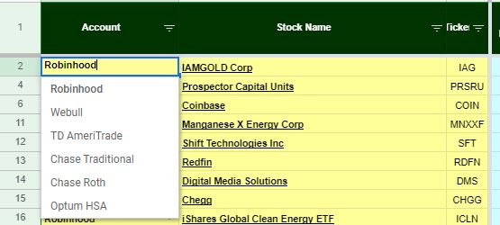
- Dividend and interest tracker: added enhancements to the transactions to be able to pull reports to get dividends and interests returns.
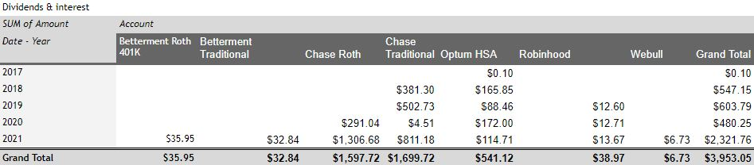
- Assets allocation per account/asset: Since all accounts are now part of the same sheet and all the data is there, I am able to get all the data and information needed to understand how diverse my portfolio is.
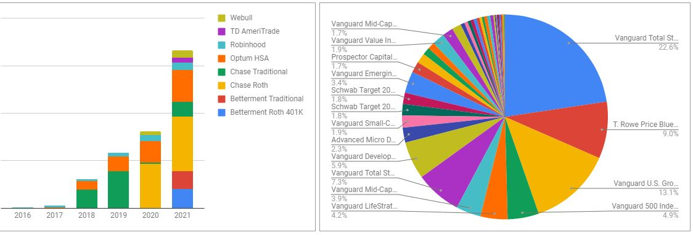
- Added charts within the cells: This was an awesome feature that I learned about which allows me to have a dynamic price chart embedded in each row for each stock. I also added a chart of how the current price relates to the 52 week high/low.
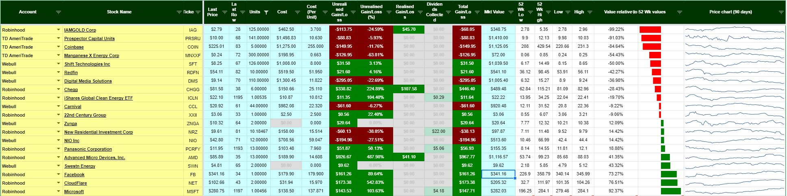

**Crypto tracking sheet**

I had to stop using [CoinTracking](https://cointracking.info/) due to the large amount of transactions that I have. Because of that I looked for alternatives and found this [sheet](https://mindup.medium.com/free-crypto-portfolio-tracker-based-on-google-sheets-ef76070ec325). I used it as the base and added a few enhancements that I wanted to analyze. Things like yearly contribution into my crypto portfolio as well as the cumulative return on investment year over year and value after taxes.

**Networth/ Finances sheet**

This is the master sheet that tracks everything! I gave it some major upgrades and enhancements.
- Added credit cards tracking: Although I never carry a balance on my cards, I still added this to keep track of the cards I have as well as all the perks/rewards associated with each one.
- Cleaned up sheets: Had a lot of reference information and data that did not need to live in this sheet so moved that elsewhere and created links to them
- Live updates from Stock market & crypto tracking sheets: before I used to go in every once in a while and enter the data in manually! Now the sheets are linked and data automagically update in relative real time.
- Stock market tracking clarity: Accounts data are grouped based on the type of account (retirement accounts, health savings account and brokerage account). This is used to calculate account value after taxes! Especially since each type has different taxes and laws associated with it.
- Jewelry live updates: Similar to the stock market and crypto, I updated the sheet to get the price of gold and silver and calculate the value of my jewelry in real time.
- New startups sheet: This sheet is designed to keep track of the funds and companies I am investing in as well as all the data rooms/deals information.
- New bonds sheet: To track my bonds purchases and returns
- Added real time average/wealthy networth calculator: this calculator calculates what a person's networth should be based on age and income.
- Networth forecasting: To help with figuring out the roadmap and getting a better understanding, I used a linear forecasting model to predict what my future network will look like. However, since I don't have enough data points the model is not great yet. With each year the predicting model should get better, especially as my networth gets tested against potential upcoming crashes.
- Automatic history recording: I used to record my networth a few times a year as I felt like it. That is fine to see the growth but not helpful in giving the full picture. I needed to keep records of everything and how it changes weekly. That is why I have set up automated jobs to record that for me so I can see the fluctuations across the different asset classes.

### Website Updates
Throughout the year, I made some tweaks and upgrades to my website as I was writing this year's recap. Some of those upgrades are under the hood, others are hidden and some are noticeable and accessible right now!
- Gallery image sizes: Basically wherever you see a group of images displayed together it is using my gallery component. This component works nicely except for the part where I have to enter every single image's dimensions, so it can generate the layout correctly. This year, I got too tired of doing that! I decided to use some more processing power to automatically get the dimensions from the images themselves and use them for the layout.
- Secret page enhancements: There is a page that I have created to reference things. This page has existed for a few years now, but it did not look pretty at all, and it was a bit buggy. So I made it more presentable and fixed the functionality to work very nicely the way that it was intended.
- Virtual business card: I ran out of business cards and I did not want to kill more trees. So, I decided to embrace the future and create a virtual business card! It is not the prettiest but it gets the job done.
[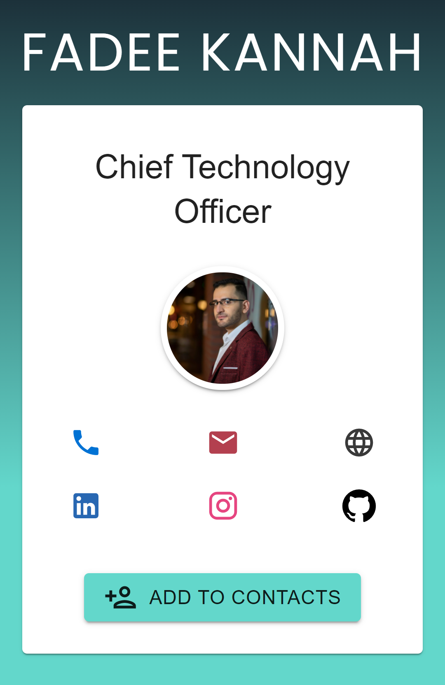](/card)

### Upgraded Smart TV
I upgraded our smart TV to be a Google TV! That gave me the ability to install android apps and do all sort of things!

- **[Ambient light](https://play.google.com/store/apps/details?id=com.sevson.androidambiapp)** I connected an LED strip with an Arduino to the Chromecast and used the ambient light to do magic! The app allows me to capture the screen and use the same color to control the LED strip creating a more immersive experience and a more enjoying movie experience.

- **[Fotoo](https://play.google.com/store/apps/details?id=com.bo.fotoo)** I used this app to play a slideshow of our family pictures! This app is pretty nice and easy to use. It is also able to connect to the network drive which means I don't have to worry about storage and get access to all of 16000+ pictures we have!

- **[VLC](https://play.google.com/store/apps/details?id=org.videolan.vlc)** Same as Fotoo but for videos!

### ClickUp Migration
After migrating from Jira to ClickUp for CourseKey issue tracking and management, ClickUp grew on me! I kept using it and the more I did, the more that I liked it! Although Trello is great, ClickUp wins when it comes to their editor as well as the extra features it has (mainly Docs for me). Because of those additional features and customizations, I migrated all of my Trello boards to ClickUp and got this creative email!

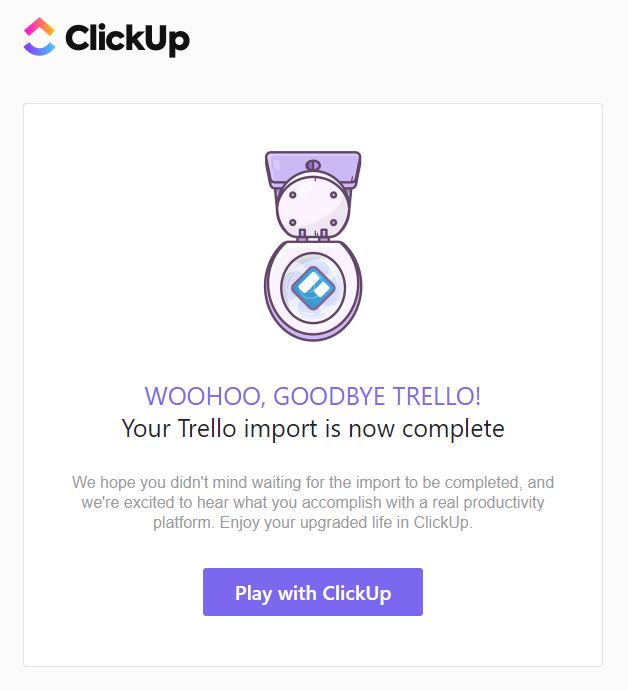

### Carbonation System
I got tired of buying carbonated water every few days/weeks. So I decided to look into what it takes to do it myself. I started small by buying a paintball tank and testing the system before investing into an actual 5lb gas tank. After assembling everything and being a successful test, I got the whole system set up and working on demand to carbonate any liquid!

<Instagram url="https://www.instagram.com/tv/CVl_LXilUls" />

### Soda Kegerator
Although the carbonation systems worked perfectly and I could make it whenever I wanted, it was still a hassle when people are over and it takes some time to carbonate. So I went back to researching and figured out how I can make it and store it in kegs, have those kegs in a kegerator cooled and ready to be consumed whenever! I got a kegerator that has two taps and three kegs. After cleaning and sanitizing everything, I set it up to have carbonated water on one tap and lime and strawberry flavored water on the other.

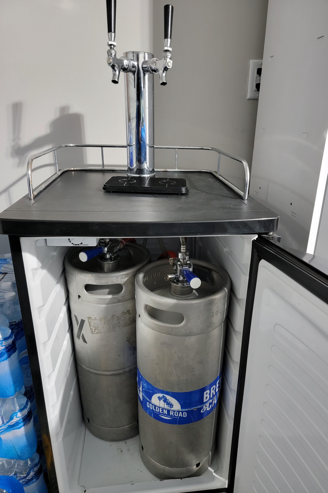

### Financial Planner
After researching and working on my financial roadmap, I realized how much there is out there that I don't know. Also, I found out that one of the best ways to make more money is to legally pay less taxes by structuring things differently and setting things up correctly. This is why I started looking for a financial planner (someone who does this as their job). I found [Cadenza Financial](https://cadenzafinancial.com/) who is a fee-only, fiduciary financial planning firm and local in Henderson. Resources used to find a financial advisor/planner:
- [Investopedia Financial Advisor Guide](https://www.investopedia.com/managing-wealth/when-should-you-hire-financial-advisor/#toc-how-to-choose-a-financial-advisor) Good guide that covers everything you need to know and how to find a good advisor/planner
- [Fee Only Network](https://www.feeonlynetwork.com/) Fee only advisors database
- [NAPFA](https://www.napfa.org/) Database for finding planners
- [CFP](https://www.cfp.net/) Certified Financial Planner Board website search people who are certified.
- [BrokerCheck FINRA](https://brokercheck.finra.org/) Check credentials/complaints
- [Investment Adviser Public Disclosure](https://adviserinfo.sec.gov/) Check credentials/complaints

## Reading Materials this year
This year I have been extremely bad at keeping track of my readings! This is due to the fact that most of my reading has been articles and newsletter online. I will be looking into a way to capture my reading material in a user friendly way.

## Podcasts
Since I have not commuted for work in a while, my podcast listening time has been reduced quite a bit. I have been trying to keep up with my favorites. Here is the complete list of podcasts I listen to (*favorite):

- [Soft-Skills Engineering*](https://castbox.fm/channel/Soft-Skills-Engineering-id231452?country=us) Softskills in software engineering
- [Naval*](https://castbox.fm/channel/Naval-id2030098?country=us) Intriguing insights life/entrepreneurship/ wealth creation
- [Darknet Diaries*](https://castbox.fm/channel/Darknet-Diaries-id1468651?country=us) Amazing secret stories related to technology (cybercrime)
- [Hackable?*](https://castbox.fm/channel/Hackable%3F-id970566) Stories of everything related to hacking (mainly how secure things really are)
- [Build For Tomorrow*](https://castbox.fm/channel/Pessimists-Archive-Podcast-id338179) Stories of people reactions to new things
- [Problem Solvers*](https://castbox.fm/channel/Problem-Solvers-id980712) Stories about entrepreneurs solving problems and how they handle them
- [Malicious Life*](https://castbox.fm/channel/Malicious-Life-id943414) Stories about hackers and how they got into hacking
- [Command Line Heros*](https://castbox.fm/channel/Command-Line-Heroes-id1105224) True stories about everything that shaped and revolutionized the technology world
- [Changelog Master Feed](https://castbox.fm/channel/Changelog-Master-Feed-id397660?country=us) Multiple software development podcasts in one, plus one Brain Science podcast
- [Under the Radar](https://castbox.fm/channel/Under-the-Radar-id2378?country=us) Independent iOS development
- [The Freelancers' Show](https://castbox.fm/channel/The-Freelancers'-Show-id325583?country=us) Freelance software development
- [Entreprogrammers](https://castbox.fm/channel/Entreprogrammers-Podcast-id38063?country=us) Programmers who are entrepreneurs
- [CodePen Radio](https://castbox.fm/channel/CodePen-Radio-id218322?country=us) Software development centered around CodePen
- [All JavaScript Podcasts by Devchat](https://castbox.fm/channel/All-JavaScript-Podcasts-by-Devchat.tv-id325284?country=us) Multiple podcasts that focus on JavaScript
- [Software Engineering Daily](https://castbox.fm/channel/Software-Engineering-Daily-id409522?country=us) Interviews with technical people about software
- [Syntax](https://castbox.fm/channel/Syntax-Tasty-Web-Development-Treats-id938004?country=us) Tips/tricks for web development
- [The Bike Shed](https://castbox.fm/channel/The-Bike-Shed-id491181?country=us) Software development
- [The Meb Faber Show](https://castbox.fm/channel/The-Meb-Faber-Show-id351652?country=us) Investment
- [The NewsWorthy](https://castbox.fm/channel/the-NewsWorthy-id1014399?country=us) Quick general news updates
- [On Call Nightmares](https://castbox.fm/channel/On-Call-Nightmares-Podcast-id1778442?country=us) Software development retrospectives
- [Techmeme Ride Home](https://castbox.fm/channel/2215699?country=us) Quick tech news updates
- [Election Ride Home](https://castbox.fm/channel/2181696?country=us) Quick election news updates
- [Today in Digital Marketing](https://castbox.fm/channel/Today-in-Digital-Marketing-id2372870?country=us) Quick marketing news updates
- [EconTalk](https://castbox.fm/channel/EconTalk-id2734) talk show about economics in daily life
- [My First Million](https://castbox.fm/channel/My-First-Million-id2180580)  Backstories & strategies behind millionaires' success
- [Gaming Ride Home](https://castbox.fm/channel/Gaming-Ride-Home-id2638311) Latest video game news
- [Mixergy](https://castbox.fm/channel/Mixergy---Recession-Startup-Stories-id349217) Startup stories
- [Akimbo](https://castbox.fm/channel/Akimbo%3A-A-Podcast-from-Seth-Godin-id2543209) talks about culture and about how we can change it. The only reason I dropped it is that I already have too many podcasts to listen to

## Places visited
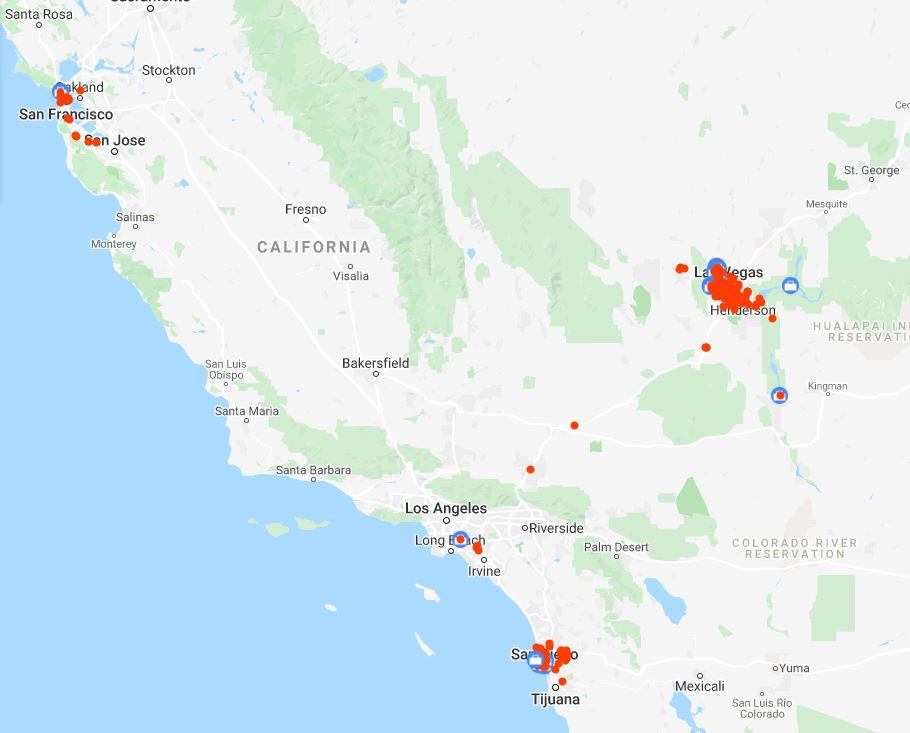
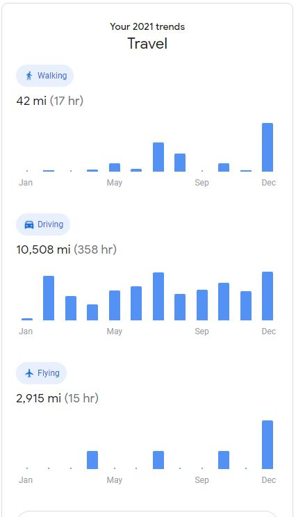

## Financial state
<Gallery photos={[Networth2021, AssetsBreakdown2021]} />

## Mood summary
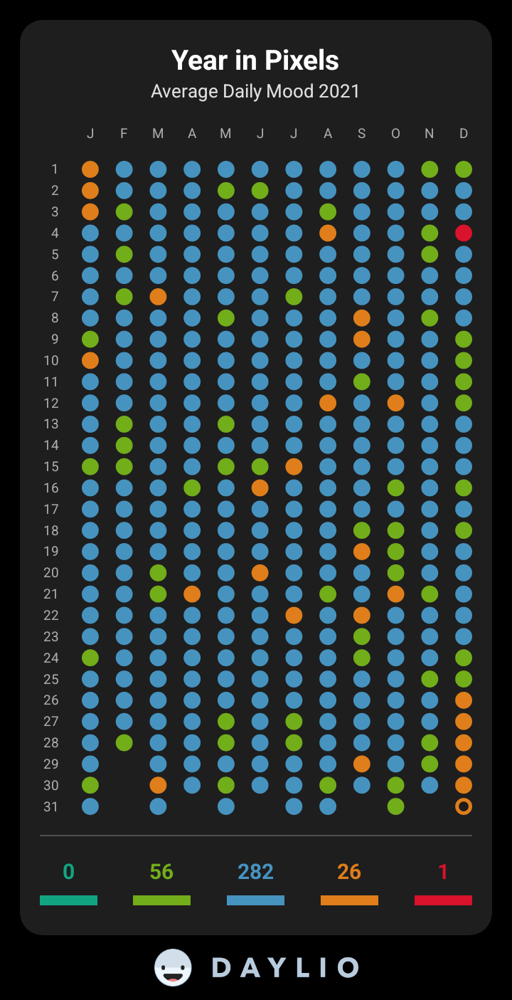

## Month by month highlights
### January
The year started with a bang! Literally right after midnight, I deployed a new update for CourseKey and things did not go as planned! The deployment took down part of the system which meant it was firefighting mode for a few hours to get everything up and running.

As the month progressed, my family and I started planning our move and preparing for it. We started selling the extra stuff we had, packing the things we didn't need and listed our home for renting.

Before the month ended, I joined San Diego Venture Partners which later got rebranded to be [Interlock Capital](https://interlock.capital/). This gives me the exposure and the opportunity to invest in other startups. As of June, I have not made any investments, since I have no extra cash. All of my money got tied up in the new home.

### February
This month was mostly focused on preparing for the move to Las Vegas. We rented our El Cajon home and had that all sorted out. Before leaving San Diego, I tried catching up with as many people as possible (while still in lockdown). I managed to see some friends and even get food together!

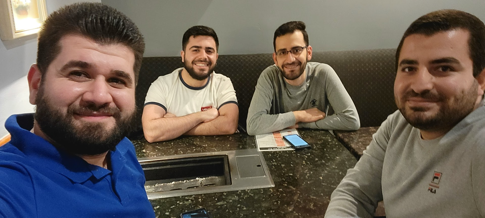

### March
The month where things finally started to fall into place! We finally were able to announce [our series B raise for CourseKey](https://techcrunch.com/2021/03/03/after-200-arr-growth-in-2020-coursekey-raises-9m-to-digitize-trade-schools/). The new home closed and we are able to move. It took an extra three months for the house to get completed due to all the COVID related delays. Once we moved in, the new home work and projects started and would last for another three months.

### April
A new quarter, which means it was time for our CourseKey quarterly meeting and kickoff. For the meeting, I attended in person in San Diego. It was a super quick visit! I was in San Diego for less than 48 hours. I got to see my coworkers, some familiar faces as well as new ones.

Being in a new city, means there is a lot exploration and places to go to and see. Along with exploring and visiting the places, we got to meet new people and make new friends.

I joined another venture capitalist fund called [305 ventures](https://www.305.ventures/). Additionally, I set up my investor account with [AngelList](https://angel.co/invest/start). I was not only growing my involvement in startups via investing but also by giving back. I did an industry panel for [Lambda school](https://lambdaschool.com/) as well trying to get in touch with [StartUpNV](https://startupnv.org/).

### May
The house projects somehow keep coming out of nowhere! While continuing to work on those projects, we still managed to enjoy the scenery of Las Vegas area before the heat hit.

Before the month ended, I planned a trip to San Diego. The main reason was to attend my cousin's event and meet the rest of wedding party gang! During my visit, I got to finally see some friends that I have not seen since pre-covid.

### June
This month was mostly for recovery and catching up on the things I kept pushing while working on the home projects. I finally applied and got the TSA pre✔. That will allow me to get through security much faster and avoid having to take off my belt and shoes.

Additionally, I took some time to find new doctors and scheduled appointments for all sorts of things. I also had a super minor cosmetic surgery to get rid of the weird zit on the side of my head.

### July
What a crazy month! I did not only have ton of work but also trips to San Diego! Not a single trip but actually two different trips! The first trip was for my cousin's [henna party](https://culturalglimpse.com/2014/10/21/the-blessings-of-a-henna-party/) and wedding!

<Gallery photos={[
    am1,
    am2,
    am3,
    am4,
    am5,
    am6,
    am7,
    am8,
    am9,
    am10,
    am11,
]} />

In between my San Diego trips, I got to invest in [MicroAcquire](https://microacquire.com/). The rest of my time was mostly spend working and trying to stay above water. It was totally worth it as my work trip was great! Although it was a quick trip it was packed of activities! Although most of it was meetings, we still had fun breakfasts/lunches/dinners, a cruise trip and even hit up a bar afterwards.

<Gallery photos={[
    ck1,
    ck2,
    ck3,
    ck4,
    ck5,
    ck6,
    ck7,
    ck8,
    ck9,
    ck10,
    ck11,
    ck12,
    ck13,
    ck14,
    ck15,
    ck16,
    ck17,
    ck18,
    ck19,
    ck20,
    ck21,
    ck22,
    ck23,
]} />

### August
I finally got to be able to get involved with the startup scene in Las Vegas! I attended a seminar at StartUpNV and got to network with a few entrepreneurs. Through networking, I found out about the [Tech Alley](https://www.techalley.org/) which had an event within ten days after I have found out about it. I attended it as well and it was another great event where I got to network with very interesting people. We ended up staying for an extra 3 hours after the event and geeking out about technology, businesses and entrepreneurship.

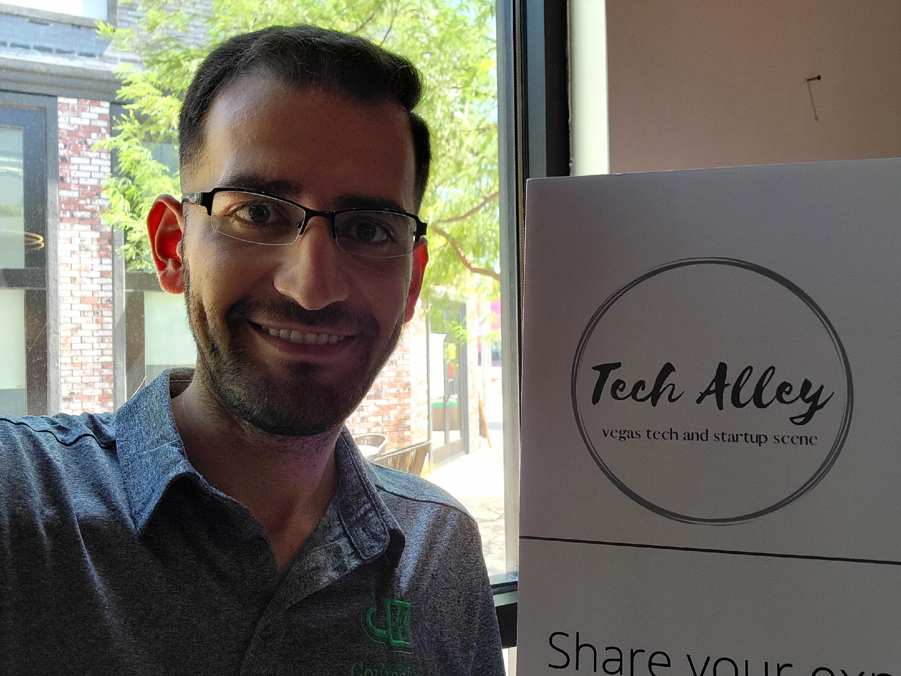

For as long as I have been driving, I have not gotten a single ticket or a citation! However, I got a parking citation from the city 😢 I somehow missed one of the parking signs that explains that the free parking turns into a Taxi zone at a certain time.

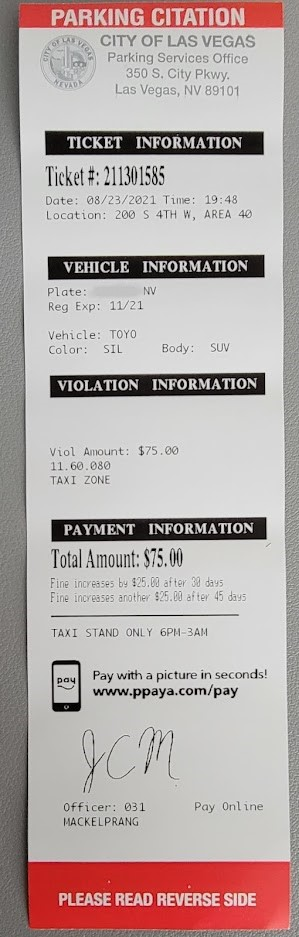

I also finally bought a Nintendo Switch along with [Ring Fit Adventure](https://ringfitadventure.nintendo.com/)! I have to admit, it was the best purchase I have made in a while! Since, I don't go to the gym and I don't exercise that much, this game has been a huge motivator and makes exercising extremely enjoyable!

### September
This month was heavily focused on my health. Started by getting Lasik surgery, which means no more glasses for me at least not until I am older. Got a new dentist, optometrist, primary care doctor and a Gastroenterology specialist. All of this to make sure I am good, and to get to the bottom of my yellowish skin tone.

When I was not dealing with doctors, I was working and networking! I got more involved with StartUpNV and the TechAlley. The rest of the time was spent exploring the city and the events around. That means I got to enjoy the Pacific Islander Festival, the Greek festival, different parks around the city as well as an Orchestra.

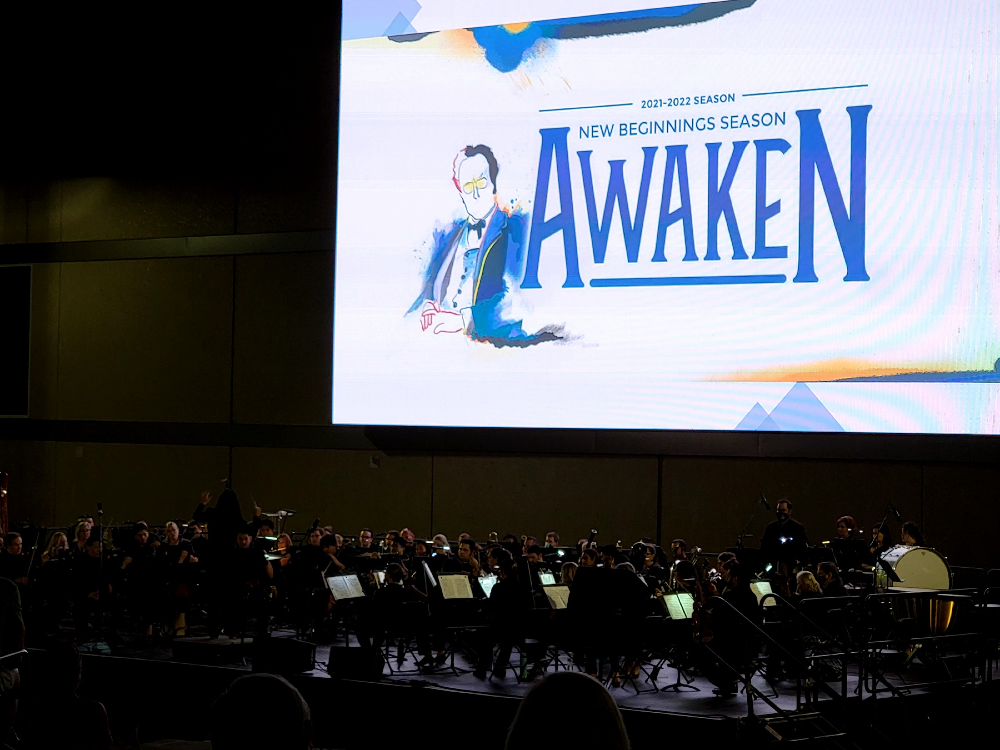

### October
The weather cooled off and the outdoor events started to come back! Along with that my aunt visited us and spent couple weeks with us. We attended all sorts of different festivals. As usual it is not all play and no work. However, it is always play when you enjoy work and get to go San Diego for work meeting. While in San Diego, I got to see and enjoy some company with friends.

<Instagram url="https://www.instagram.com/reel/CVemXaWDMWJ" />

Although, it was a quick business trip it was ton of fun. I am still in touch with people in San Diego, including doing the MESA Alumni Chat. As well as have friends visit from San Diego and enjoy things here in Las Vegas. That included watching the top rated magic show in Vegas!

### November
The month started great! I also got to enjoy dinner with Luke and his family at my home. Also continued to explore more of what Vegas has to offer. We found a great Moroccan restaurant, checked out different restaurants, museums, parks, butterfly exhibit, botanical gardens and chocolate factory!

<Gallery photos={[
    luke,
    choco,
]} />

Although the month was ton of fun, it was also ton of work! Most of the work was CourseKey, but also had fun working on some side projects. I also got more opportunities to invest in couple startups. I also started investing in savings bonds. Additionally, I started playing badminton and made some new friends.

### December
Started the month by enjoying a homemade Idly (south Indian food) and puran poli with friends. I followed that with a trip to San Francisco, where I got to explore the bay area. My San Francisco was half pleasure and half business since it was the time for our CourseKey executive meeting. As soon as the trip was over I traveled to Anaheim for a friend's holiday party.
<Gallery photos={[
    SF1,
    SF2,
    SF3,
    SF4,
    SF5,
    SF6,
    SF7,
    SF8,
    SF9,
    SF10,
    SF11,
    SF12,
    SF13,
    SF14,
]} />

The fun did not stop when I got back home! I got to explore some of what Vegas has to offer during Christmas that included the [Glittering Lights](https://glitteringlightslasvegas.com/) and [Enchant](https://enchantchristmas.com/las-vegas-nv/). Before the weekend could start, I was back in San Diego for a friendsmas party and a friend's wedding. I got to connect with some old friends and make some new friends. All of that before even Christmas arrived, so I decided to take a break and just relax with the family at home.

That did not last long though! Just like how the year started with a bang, it ended with one too! The family and I all got sick right after Christmas. We ended up getting COVID to end the year on a high note. Luckily, it was during the slowest week at work, so I was able to get the rest I needed.