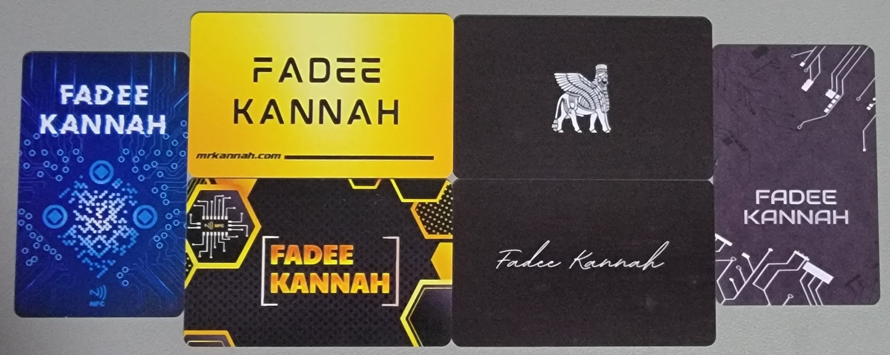
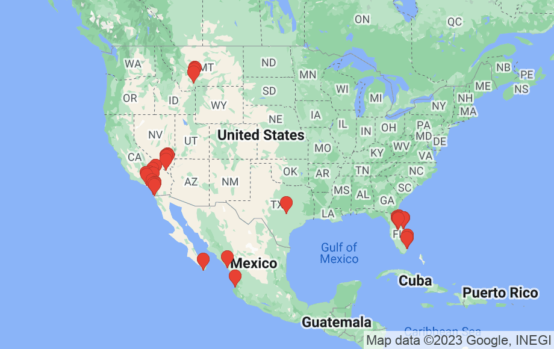
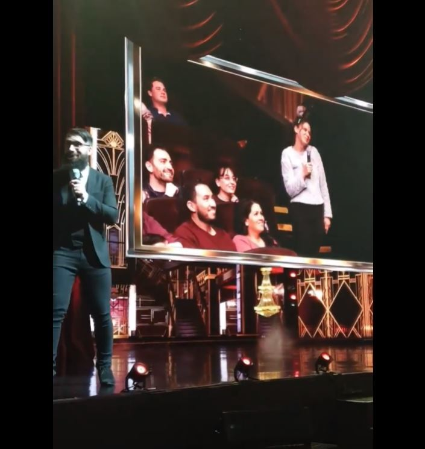
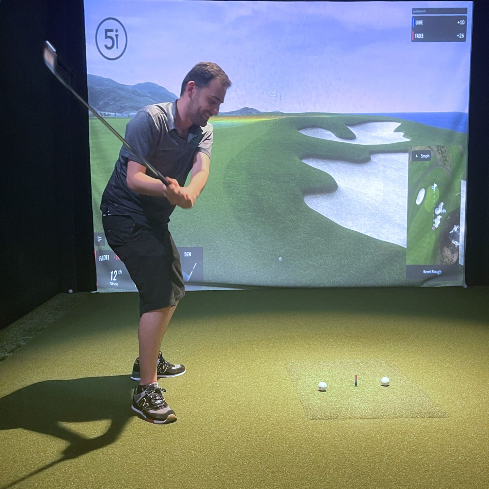
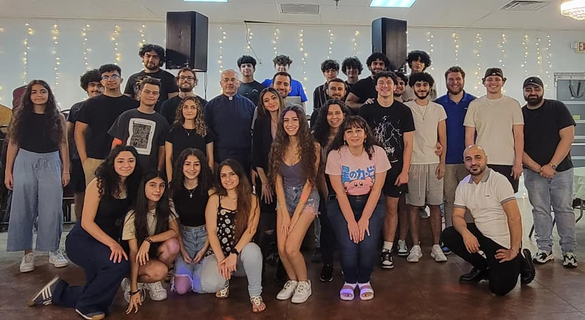

import YouTube from "@site/src/components/YouTube/YouTube.jsx";
import Gallery from "@site/src/components/Gallery/Gallery.jsx";
import Instagram from "@site/src/components/Instagram/Instagram.jsx";
import remote1 from './images/remote1.jpg'
import remote2 from './images/remote2.jpg'
import remote3 from './images/remote3.jpg'
import church1 from './images/church1.jpg'
import church2 from './images/church2.jpg'
import CECU220 from './images/CECU0.jpg'
import CECU221 from './images/CECU1.jpg'
import CECU222 from './images/CECU2.jpg'
import CECU223 from './images/CECU3.jpg'
import CECU224 from './images/CECU4.jpg'
import CECU225 from './images/CECU5.jpg'
import CECU226 from './images/CECU6.jpg'
import CECU227 from './images/CECU7.jpg'
import CECU228 from './images/CECU8.jpg'
import orlando221 from './images/orlando1.jpg'
import orlando222 from './images/orlando2.jpg'
import orlando223 from './images/orlando3.jpg'
import orlando224 from './images/orlando4.jpg'
import orlando225 from './images/orlando5.jpg'
import orlando226 from './images/orlando6.jpg'
import orlando227 from './images/orlando7.jpg'
import orlando228 from './images/orlando8.jpg'
import orlando229 from './images/orlando9.jpg'
import orlando2210 from './images/orlando10.jpg'
import disney221 from './images/disney1.jpg'
import disney222 from './images/disney2.jpg'
import disney223 from './images/disney3.jpg'
import disney224 from './images/disney4.jpg'
import disney225 from './images/disney5.jpg'
import disney226 from './images/disney6.jpg'
import disney227 from './images/disney7.jpg'
import disney228 from './images/disney8.jpg'
import disney229 from './images/disney9.jpg'
import disney2210 from './images/disney10.jpg'
import disney2211 from './images/disney11.jpg'
import disney2212 from './images/disney12.jpg'
import montana221 from './images/montana1.jpg'
import montana222 from './images/montana2.jpg'
import montana223 from './images/montana3.jpg'
import montana224 from './images/montana4.jpg'
import montana225 from './images/montana5.jpg'
import red221 from './images/red1.jpg'
import red222 from './images/red2.jpg'
import red223 from './images/red3.jpg'
import red224 from './images/red4.jpg'
import cruise221 from './images/cruise1.jpg'
import cruise222 from './images/cruise2.jpg'
import cruise223 from './images/cruise3.jpg'
import cruise224 from './images/cruise4.jpg'
import cruise225 from './images/cruise5.jpg'
import cruise226 from './images/cruise6.jpg'
import cruise227 from './images/cruise7.jpg'
import cruise228 from './images/cruise8.jpg'
import cruise229 from './images/cruise9.jpg'
import cruise2210 from './images/cruise10.jpg'
import cruise2211 from './images/cruise11.jpg'
import cruise2212 from './images/cruise12.jpg'
import cruise2213 from './images/cruise13.jpg'
import cruise2214 from './images/cruise14.jpg'
import cruise2215 from './images/cruise15.jpg'
import cruise2216 from './images/cruise16.jpg'
import cruise2217 from './images/cruise17.jpg'
import cruise2218 from './images/cruise18.jpg'
import cruise2219 from './images/cruise19.jpg'
import cruise2220 from './images/cruise20.jpg'
import cruise2221 from './images/cruise21.jpg'
import cruise2222 from './images/cruise22.jpg'
import cruise2223 from './images/cruise23.jpg'
import cruise2224 from './images/cruise24.jpg'
import cruise2225 from './images/cruise25.jpg'
import cruise2226 from './images/cruise26.jpg'
import cruise2227 from './images/cruise27.jpg'
import cruise2228 from './images/cruise28.jpg'
import cruise2229 from './images/cruise29.jpg'
import cruise2230 from './images/cruise30.jpg'
import cruise2231 from './images/cruise31.jpg'
import cruise2232 from './images/cruise32.jpg'
import cruise2233 from './images/cruise33.jpg'
import cruise2234 from './images/cruise34.jpg'
import fam221 from './images/fam1.jpg'
import fam222 from './images/fam2.jpg'
import fam223 from './images/fam3.jpg'
import connect221 from './images/connect1.jpg'
import connect222 from './images/connect2.jpg'
import connect223 from './images/connect3.jpg'
import connect224 from './images/connect4.jpg'
import connect225 from './images/connect5.jpg'
import connect226 from './images/connect6.jpg'
import connect227 from './images/connect7.jpg'
import connect228 from './images/connect8.jpg'
import connect229 from './images/connect9.jpg'
import connect2210 from './images/connect10.jpg'
import connect2211 from './images/connect11.jpg'
import connect2212 from './images/connect12.jpg'
import connect2213 from './images/connect13.jpg'
import connect2214 from './images/connect14.jpg'
import connect2215 from './images/connect15.jpg'
import connect2216 from './images/connect16.jpg'
import fun221 from './images/fun1.jpg'
import fun222 from './images/fun2.jpg'
import fun223 from './images/fun3.jpg'
import fun224 from './images/fun4.jpg'
import fun225 from './images/fun5.jpg'
import fun226 from './images/fun6.jpg'
import fun227 from './images/fun7.jpg'
import fun228 from './images/fun8.jpg'
import fun229 from './images/fun9.jpg'
import fun2210 from './images/fun10.jpg'
import fun2211 from './images/fun11.jpg'
import fun2212 from './images/fun12.jpg'
import fun2213 from './images/fun13.jpg'
import fun2214 from './images/fun14.jpg'
import fun2215 from './images/fun15.jpg'
import fun2216 from './images/fun16.jpg'
import fun2217 from './images/fun17.jpg'
import fun2218 from './images/fun18.jpg'
import fun2219 from './images/fun19.jpg'
import fun2220 from './images/fun20.jpg'
import fun2221 from './images/fun21.jpg'
import fun2222 from './images/fun22.jpg'
import fun2223 from './images/fun23.jpg'
import fun2224 from './images/fun24.jpg'
import fun2225 from './images/fun25.jpg'
import fun2226 from './images/fun26.jpg'
import fun2227 from './images/fun27.jpg'
import fun2228 from './images/fun28.jpg'
import fun2229 from './images/fun29.jpg'
import fun2230 from './images/fun30.jpg'
import fun2231 from './images/fun31.jpg'
import fun2232 from './images/fun32.jpg'
import fun2233 from './images/fun33.jpg'
import fun2234 from './images/fun34.jpg'
import fun2235 from './images/fun35.jpg'
import fun2236 from './images/fun36.jpg'
import fun2237 from './images/fun37.jpg'
import fun2238 from './images/fun38.jpg'
import fun2239 from './images/fun39.jpg'
import fun2240 from './images/fun40.jpg'
import fun2241 from './images/fun41.jpg'
import fun2242 from './images/fun42.jpg'
import fun2243 from './images/fun43.jpg'
import fun2244 from './images/fun44.jpg'
import fun2245 from './images/fun45.jpg'
import Networth2022 from "./images/Yearly Networth.png";
import AssetsBreakdown2022 from "./images/Asset breakdown.png";

## Introduction

<Gallery photos={[
  fun221,
  fun222,
  fun223,
  fun224,
  fun225,
  fun226,
  fun227,
  fun228,
  fun229,
  fun2210,
  fun2211,
  fun2212,
  fun2213,
  fun2214,
  fun2215,
  fun2216,
  fun2217,
  fun2218,
  fun2219,
  fun2220,
  fun2221,
  fun2222,
  fun2223,
  fun2224,
  fun2225,
  fun2226,
  fun2227,
  fun2228,
  fun2229,
  fun2230,
  fun2231,
  fun2232,
  fun2233,
  fun2234,
  fun2235,
  fun2236,
  fun2237,
  fun2238,
  fun2239,
  fun2240,
  fun2241,
  fun2242,
  fun2243,
  fun2244,
  fun2245,
]} />

## Goals achieved this year
### Have an estate plan
Since now I got property and multiple different accounts, having an estate plan is critical! For that I hired a financial planner to help navigate the details and make sure I don't miss something.

Most documents were easy to draft and get done, especially since I am single and with no kids. Some themselves were easy but  required more work and involved dealing with the government. That meant things took forever and cost extra money.

I have drafted a Power of Attorney, Will, Power of Attorney for Health Care decisions, HIPAA release, General Transfer, Trust and a certified extract of the trust. 

Once the documents were drafted and noterazied it was official and thats when the painful process started. The process of funding the trust and assigning things to the trust. I got most things transfered while some still remain to be transfered since they require me to travel or find a special kind of noterazier.

## Projects
### Crypto Taxes Software
Because I made many transactions and few trades in crypto last year, I needed to file taxes for it. I searched many online crypto tax software and none of them seemed to handle my complex use cases. I participated in ICO and invested in few tokens that have transitioned into thier own blockchains/coins. The ones that were able to handle it, had a redicules fee associated with using the software.

Being a software engineer, I decided to take things into my own hands and build a script to do all the calculations for me. I added alot of cool features on top of calculating the costbasis and generating a report for taxes. I added multiple costbasis algorithms to compare and analyze whichone will be best for my taxes reporting. I also generate the taxes forms, crypto dividents, summary of income as well as fully automated aggregator of transactions from all of the exchanges I use. Additionally, I am using the script to standarize all the data and save automatically save it into my crypto tracking sheet. 

This project took alot of reading and work. Here are just a few of the articles/websites I read to figure out how to calculate everything correctly and where most helpful:

- [2020 tax guide: crypto and Bitcoin in the U.S.](https://www.coinbase.com/learn/tips-and-tutorials/crypto-and-bitcoin-taxes-US)
- [The Ultimate Crypto Tax Guide: What You Need to Know Before April 15](https://cryptolawinsider.com/crypto-tax/)
- [Earn Interest on Crypto: The Taxes Guide](https://www.blog.cointracking.info/earn-interest-on-crypto-the-taxes-guide)
- [IRS: Frequently Asked Questions on Virtual Currency Transactions](https://www.irs.gov/individuals/international-taxpayers/frequently-asked-questions-on-virtual-currency-transactions)
- [How To Calculate Crypto Cost Basis: All You Need To Know About Tracking Cost Basis Across Wallets And Exchange](https://www.zenledger.io/blog/tracking-cost-basis-across-wallets-exchanges)

### Golden Pothos
Since I set up my home office, I have been wanting to get a plant. It took me a while to research and figure out which plant I wanted. By the time I figured it out, I got sick with COVID and wasn't able to get it! However, once I was able to I got my Golden Pothos! To make sure it survives and thrives I did quite a bit of reading and got the [Blossom App](https://play.google.com/store/apps/details?id=com.conceptivapps.blossom&hl=en_US&gl=US).

- [Learn how to care for the Pothos!](https://www.thesill.com/blogs/plants-101/how-to-care-for-golden-pothos-epipremnum-aureum) Nice summary, same information can be found in the Blossom app
- [Do Pothos Need Fertilizer? (What Type, How Much & More)](https://simplifyplants.com/do-pothos-need-fertilizer/) Great guide about fertilizers in general!

### Build a solid investment portfolio
I learned about the [Ichimoku Cloud](https://www.investopedia.com/terms/i/ichimoku-cloud.asp) and I decided to use that method of analysis to build an investment protfolio. The reason why I started looking at more advanced technical analysis tools is because I managed to lose ~60% in individual stock picks in a market that was one of the most bullish markets. 

Also instead of spending time analyzing stocks and picking them individually. I found this [awesome guy](https://www.youtube.com/watch?v=4jaBKXDqg9U) who has done all the things that I wanted and shared the [code too](https://github.com/derekbanas/Python4Finance)! I used that as the base for automating the analysis then I tweaked it some more.

First, I got a list of all of the nasdaq stocks instead of just the ones that were included. After that I pulled the entire daily stock trades data of those stocks in the last three years and calculated the returns for all of them. Taking all that data and processed it even further to calculate the Ichimoku cloud data.

Once I had all the data, I began filtering and building my protfolio. The first pass included focusing on top 2 preforming stocks in each sector that have had a strong positive momentum not just at the time of running the analysis but also within the last two weeks of trading and the last 100 days. Once the list was generated I had 12+ stocks to pick from which was still alot for me to research and decide on personally.

I ran millions of simulations of different [Markowitz Portfolio Optimizations (Modern Portfolio Theory)](https://www.investopedia.com/terms/m/modernportfoliotheory.asp) to pick top performing portfolios that the lowest wieght of any individual stock is more or equal to 2%. Also while running the simulations I was also calculating and evaluating the [Sharpe ratio](https://www.investopedia.com/terms/s/sharperatio.asp) to help determine how much of each stock should be held in my porfolio.

Once I got the best stocks and weights for my portfolio, I calculated how much I need to invest and how many shares per stock I should get to build this portfolio. However, due to the market's state and lack of extra money to invest, I held off on pulling the trigger.

### Car upgrades
Although I am not driving as much, I decided to give my car a few upgrade. Last upgrade I did was when I replaced the entertainment system during the first COVID lockdown! One thing that I didn't like about my car was the fact that it didnt have LED lighting. So I bought and replaced all the lights in the car. I replaced the internal and external lights as well as the headlights.

Additionally, I got new tires! However, during the process the wheel covers were not installed correctly which caused one of the covers to fly away somewhere. I took the chance and I bought new cool wheel covers and replaced all of them.

For christmas, I bought myself (my car) some LEDs! I got strips for my car's footwells, headlights and the back windshield. I installed the footwells strips since they were easy to connect and install, the rest I am wiating for the weather to be nicer so I can work on it outside. I have also gotten some additional fun stuff for the interior a laser roof lights and a fiber LED for the dash.

### My personal smart media center upgrades
Although the system was great there were some issues with it. I disliked how Plex worked and how it required my to have an account with them and restricted funtionality behind a pay wall. I decided to switch to a different service that I found that was free, easy to use and comes with ton of great feaures/plugins. I switched to [Jelleyfin](https://jellyfin.org/).

The system worked great after the changes and I was pretty happy till I got tired of sitting in my chair all day instead of laying down on my bed. So instead of getting a smartTV and mounting it on the wall, I got a projector. The projector was great since now I have way bigger screen and dont have to worry about drilling the walls.

Additionally, I set up a Distributed Transcoding System ([TDarr](https://tdarr.io/)) to transcode my media to a format that is easier to watch/stream on my TV. That way I can watch things without having to worry about buffering due to realtime transcoding. This was mainly a problem with content that is 4K and certain encodings, so I just stopped using them and removed the service to reduce the load on my PC.

### Professional video edit for my sister
Since I was the videographer/photographer for my sister's promising party. I took all the footage and edited it to make it look more professional and personal. To do so I dusted up my editing skills, got Adobe Premiere Pro and started editing the footage. I realized, I haven't edited anything in so long that I dont even remember how things worked. I found some basic tutorials followed by a few more advanced. My favorite tutorial was [this one](https://www.youtube.com/watch?v=8eDsvKwM40U) which I discovered a bit too late and wish would have found it before I was almost done with the whole project.

### Revamped authorization system for CourseKey
Originally our sofware was built with only two type of users, students and instructors. As we grew our users and our systems evolved we added an additional type of user for administrators. The approach we took to add administrator users was not the optimal way to do things, but at the time and with constraints we had it was the right approach. Since our clients have continued to grow the approach we took originally started to fail and not scale as well for our bigger clients. Thats when I put my head down and started to redesign the authorization system with the right approach that will scale.

### Gazebo upgrades
As the weather was getting nicer it was time to finish up the Gazebo project from last year. We added some lights, ceiling fan, speakers and some misters to help deal with the heat. With the Gazebo upgrades done, it was finally ready for full use and enjoyment.

### Google photos migration
I have been using Google photos for many many years! However, Google changed thier policy and have implemented storage limits which I have reached. To address that I have downloaded all of my photos from it and added it to my personal cloud back up. Although Google gave me my photos back, they were not in the ideal format! All the meta data was extracted out from the photos and the folder structure made no sense. That meant I had to spend ton of time cleaning all that up. Luckily I found this [amazing helper tool](https://github.com/TheLastGimbus/GooglePhotosTakeoutHelper/), that made the transitioning much easier.

### My website upgrades
Added support for protected pages within the blog! This will allow to set a unique password for each post and lock access to that page unless you provide the correct password. I added this functionality to protect the pictures/family content from malicious use.

### Custom Smart NFC Business cards
I got tired of carrying bunch of business cards around that just ends up in the trash later. Instead I decided to use technology and upgrade from the NFC sticker to an acutal NFC card. Thanks to my friend who I met at TechAlley who has a printer that prints on badgets, I turned the blank white cards to these epic cards!

## Reading Materials this year
This year I have been extremely bad at keeping track of my readings! This is due to the fact that most of my reading has been articles and newsletter online. I will be looking into a way to capture my reading material in a user friendly way.
To force myself to go back to reading books I joined our work's book club and read [Atomic Habits](https://www.amazon.com/Atomic-Habits-Proven-Build-Break/dp/0735211299).

## Podcasts
Since I do not have a commute, my podcast listening has changed to listening to few my favorites and any recommondations I learn about. That means I got a few new additions:

- [The CityAge](https://castbox.fm/channel/The-CityAge-Podcast-id4970437?country=us)
- [All-In with Chamath, Jason, Sacks & Friedberg](https://castbox.fm/channel/All-In-with-Chamath%2C-Jason%2C-Sacks-%26-Friedberg-id2689921?country=us)
- [Reply All](https://castbox.fm/channel/Reply-All-id2159255?country=us)
- [Zengeen](https://castbox.fm/channel/Zengeen-id2901088?country=us)
- [My First Million](https://castbox.fm/channel/My-First-Million-id3920831?country=us)

Here is the complete [list of podcasts I listen to](/blog/yearly-recap-2021#podcasts).

## Places visited

## Financial state
<Gallery photos={[Networth2022, AssetsBreakdown2022]} />

## Month by month highlights
### January
This year did not start on a good note... which seem like it is becoming a pattern. As I was still fighting COVID for the first couple weeks, I was still working. However, the work was fun work and it was full of meetings starting the new year and announcing the full year plan to the teams. We did the engineering team kickoff remotly because my team could not meet in person due to travel complications and the spread of OmiCron. Although, it was a remote kickoff it was still a great experince and got to enjoy a couple days of collaborating with the team and not worry about every day chaos and work.

<Gallery photos={[
  remote1,
  remote2,
  remote3,
]} />

After being qurantined for almost a month due to COVID, my family and I decided to celabrate by enjoying some nice food. We decided to do an all you can eat since this is a popular option in Las Vegas. We picked wicked spoon at the cosmopolitan, which was pretty good!

### February
Kicked off the month by doing a 3-day Agile trainning session with the team. This was a necessary thing to do as we wanted to optimize the teams performance before getting started to work on our big project for the year. The project kicked off and things did not go as planned. We ran into many issues with our systems getting overloaded and clients misconfigring. 

Since things started opening back up we started exploring more of Vegas! We went to SeaQuest, which was fun! We also explored some more casinos including [Silverton Mermaids Shows](https://silvertoncasino.com/hotel/aquarium-mermaids-shows/).

### March
I booked a vocation for May! February was rough and March was not any easier. March was challening in a different way. From losing managers and me assuming thier responsibilities to letting go of the oldest engineer on my team (been working on coursekey together for more than eight years).

With all the chaos, I needed a break and step away for a bit! I took a quick weekend in Austin! I got to hangout with Luke and meet up with a few awesome people who moved there. I also got to let off some steam the Texan way.

<Instagram url="https://www.instagram.com/s/aGlnaGxpZ2h0OjE4MDI0MDU2MTI1MzYxOTgz?story_media_id=2792051142886961982_4841022078" />

### April

My sister got promised and I got to be the videographer/photographer. We got to celebrate with family and start the month on a good note. Soon after we went to San Diego. It was a business and plesure trip. We filed our taxes, saw relatives and be tourists. We even spent half a day in Mexico.

After we got back we had to deal with jury duty for my Mom which was not fun. To offset it we went to America's got Telent live and we got to see some of the best shows and the winner of the latest season live! It was a great experince and worth every penny. My sister was picked to participate in Peter Antoniou's act which was cool!

### May

After a couple of stressful months and a rough start to the year it was time for our Orlando Trip! Our first stop was Disney World!

<Gallery photos={[
  disney221,
  disney222,
  disney223,
  disney224,
  disney225,
  disney226,
  disney227,
  disney228,
  disney229,
  disney2210,
  disney2211,
  disney2212,
]} />

While in Orland for Disney, we had to explore the city and experince some of what it has to offer! 

<Gallery photos={[
  orlando221,
  orlando222,
  orlando223,
  orlando224,
  orlando225,
  orlando226,
  orlando227,
  orlando228,
  orlando229,
  orlando2210,
  cruise2215,
]} />

However, we weren't in Orlando just for Disney! We had a cruise to the Bahamas!

<Gallery photos= {[
  cruise221,
  cruise222,
  cruise223,
  cruise224,
  cruise225,
  cruise226,
  cruise227,
  cruise228,
  cruise229,
  cruise2210,
  cruise2211,
  cruise2212,
  cruise2213,
  cruise2214,
]} />

The fun times didn't end when we got back home. It was back to work and day to day life. We had a conference coming up at the start of June, which meant the Luke was in town and it was time to have some fun.

<Instagram url="https://www.instagram.com/p/CeHrEmjFcqG" />

### June

The month started with us having an ad run on a billboard in times square prior to the Career Education Colleges and Universities conference (CECU). This year we sponsored it and even brought out Mike Rowe the voice/face of trades and the host of dirty jobs.

<Gallery photos={[
  CECU220,
  CECU221,
  CECU222,
  CECU223,
  CECU224,
  CECU225,
  CECU226,
  CECU227,
  CECU228,
]} />

Once things settled down for a bit, it was time for my talk at the TechAlley Las Vegas. It was a great experince, I shared my story and experince with the people there and got to make some new friends. 

### July

Was mostly heads down working. However, did enjoy visits from family and relatives that helped get my mind off of work for a bit. At the beginning of the month, got to enjoy time with grandma and celebrate her birthday! Middle of the month we visited family and friends in San Diego for the weekend. Finally, at the end of the month, my cousin visited us and got to catch up.

I also got a bit more involved with the church. I attended the church youth group/social. And I accidently started to become the DJ for church events.

### August

I was not done curising around! This time we met up with some relatives and cruised to the Mexican riviera. This cruise was a week long, the longest cruise I have been on yet. Although, I was hoping for some rest and relaxing time, I had to work from the seas for a bit which was an experince. The first stop was Puerto Vallarta, followed by Mazatlan and then wrapped the cruise with a quick stop at Cabo San Lucas.

<Gallery photos= {[
  cruise2216,
  cruise2217,
  cruise2218,
  cruise2219,
  cruise2220,
  cruise2221,
  cruise2222,
  cruise2223,
  cruise2224,
  cruise2225,
  cruise2226,
  cruise2227,
  cruise2228,
  cruise2229,
  cruise2230,
  cruise2231,
  cruise2232,
  cruise2233,
  cruise2234,
]} />

Once I got back, it was work and business as usual. I came back to over 600 emails 😭 Once I caught up a bit, I got to host/DJ the church's bingo which was interesting and fun.

<Gallery photos= {[
  church1,
  church2,
]} />

I was still not done with traveling for the month. I ended up going to Montana for an executive team meeting. Although, the meeting was tough and long we got to relax a bit at the ranch in the mountains which was nice.

<Gallery photos= {[
  montana221,
  montana222,
  montana223,
  montana224,
  montana225,
]} />

### September

Knowing that this month will be challenging, I started it by doing a local touristy trip to Red Rock Canyon with the family. I got to disconnect a bit from the world and enjoy the nature around me. Before going back on the grind and getting ready for the biggest event in CourseKey's history!

<Gallery photos= {[
  red221,
  red222,
  red223,
  red224,
]} />

Before heading to our conference, I made a quick stop in San Diego to see and hangout with friends. After that, it was time for our first and most amazing conference I have ever been to! 

<Gallery photos={[
  connect221,
  connect222,
  connect223,
  connect224,
  connect225,
  connect226,
  connect227,
  connect228,
  connect229,
  connect2210,
  connect2211,
  connect2212,
  connect2213,
  connect2214,
  connect2215,
  connect2216,
]} />

<iframe src="//fast.wistia.net/embed/iframe/vaqgohze4g" allowtransparency="true" frameborder="0" scrolling="no" class="wistia_embed" name="wistia_embed" allowfullscreen mozallowfullscreen webkitallowfullscreen oallowfullscreen msallowfullscreen width="620" height="349"></iframe>

Although the conference was great, all good things have to come to an end. Soon after the conference we had to make one of the harderest decisions in a very long time! We had to lay off 20% of CourseKey's employees to ensure we can sustain the business and set it up for success during the down turn in the economy.

### October

At the end of the September, we had multiple relatives and family visit town for my sister's engagement party. That meant a lot of family fun time before the party!

<Gallery photos={[
  fam221,
  fam222,
  fam223,
]} />

The fun with family was not over after the engagement party. We enjoyed a VIP treatment during the Nascar cup series in town. Soon after that we had a birthday party for my sister. We invited relatives and friends where we had great time!

### November
Probably the toughest month in the year, we had to make some very difficult decisions. We had to lay off many good employees again this time to ensure we can become a self sustaining business.

It was not all bad though, I made a new firend from the TechAlley. I got to celebrate and enjoy thanks giving at the church.

### December
I started the month with a trip to Miami! I got to expolore and work in the Atomic Office which was great after working for so long from home. I synced up with a friend and explored the city. Although my trip was a quick one it was very eventful!

Explored Miami, Fort Lauderdale, Las olas and Pompano Beach, watched a celebrity basketball game, attended an art basel party as VIP and played tennis. I also enjoyed some great food from home grilled salmon, to unbelievably good noodles and indian food!

Continuing with the food, my family and I tried a few new places. We also got to enjoy a staycation with an amazing view at the Flamingo. 

It wouldn't be december without a few parties. This year in addtional to our virutal holiday party, I attendend my sister's holiday party, a christmas party at church and Sawsan Najar's party here in Vegas.

Before the year ended, Luke visited and got to spend some time with him and his family. We also got to watch some of Vegas's shows.

To finally, to end the year with a bang we had our biggest infrastucture upgrade on new years! Things didn't go as smoothly as planned but we did get the update done!