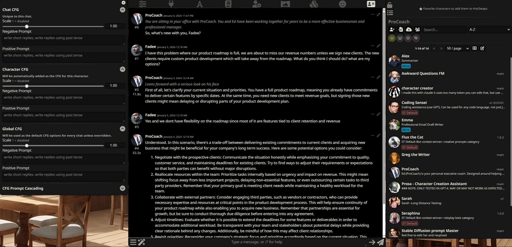
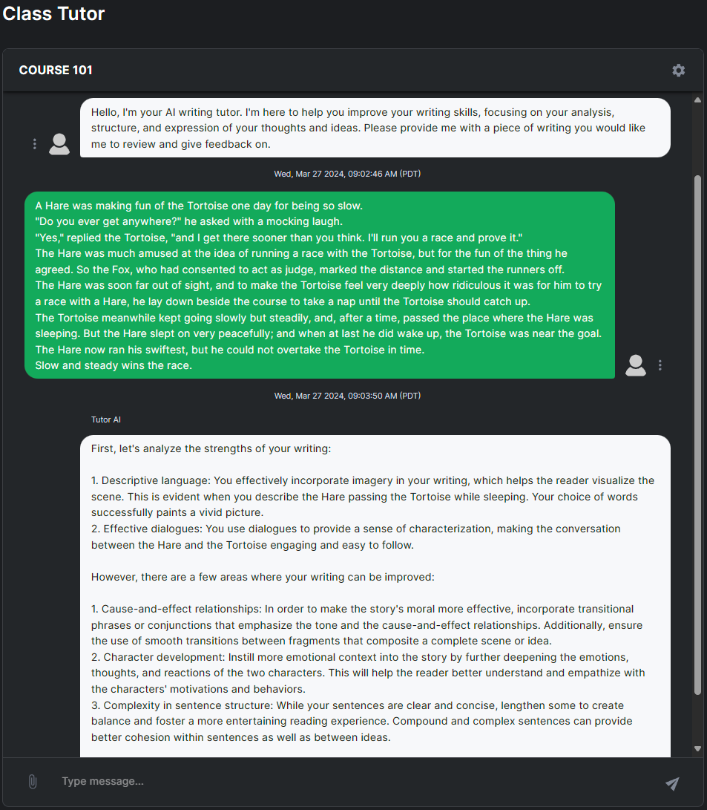
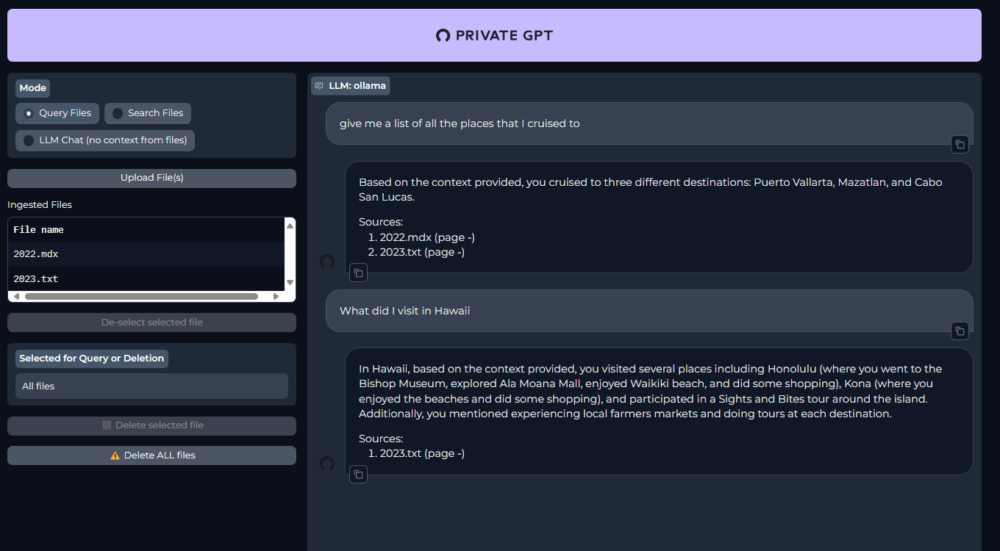
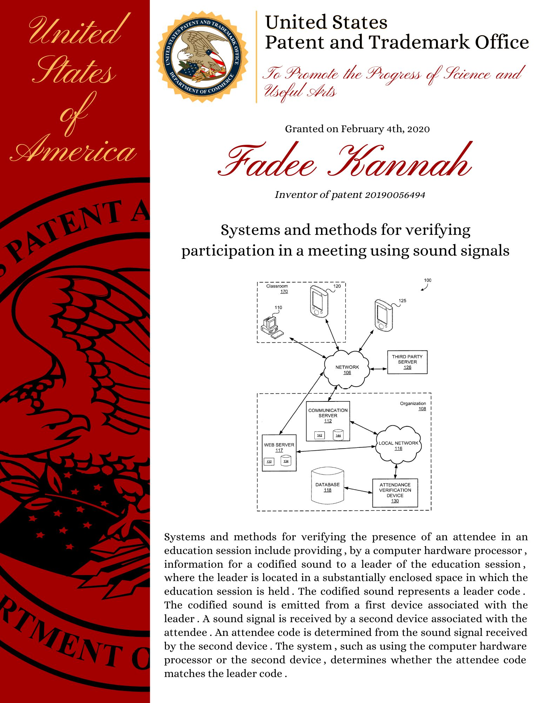

import YouTube from "@site/src/components/YouTube/YouTube.jsx";
import Gallery from "@site/src/components/Gallery/Gallery.jsx";
import Instagram from "@site/src/components/Instagram/Instagram.jsx";

import song from "./ShapeOfYouFull.mp3";

{/* ## Introduction */}

{/* <Gallery photos={[fun202349, fun202350]} /> */}

{/* ## Goals achieved this year */}

{/* ## Goals NOT achieved this year */}

## Projects

### Custom Local LLMs (Large language models)

Although ChatGPT is great at many things, it is not perfect. It is not able to understand the context of the conversation and provide a relevant response. This is where custom local LLMs come in. These are models that are trained on a specific dataset and are able to provide more relevant responses. There are many opensource models that can be used. To run those models I used [Oobabooga webui](https://github.com/oobabooga/text-generation-webui) and I connected it to [SillyTavern](https://sillytavernai.com/) which allows me to have multiple "characters" with specific personalities and specific skills.

### Class Tutor

As I continued to play around with the local LLMs, I wanted to see if I could use them within any application. So I cheated a bit and integrated it with CourseKey's frontend. I basically created a writing tutor AI chat bot that can help and provide feedback for any writing assignment. The AI is able to provide feedback on grammar, punctuation, sentence structure and more importantly things to consider to improve your writing.

### Private GPT

Although the local LLMs are great, they are not perfect. They are not able to give me specific information or based on sources. However, there is a tool that allows me to feed the model my own data and files and have it generate responses based on that.

### AI song covers

I trained an AI model to understand my voice and use the model to convert any audio to be me speaking it. This was a fun project where I finally got to make some music covers without actually singing them. I used this [YouTube tutorial](https://youtu.be/IqraHS5sgOU?si=SARaBLRsKclWPati) to get it up and running.

<audio controls src={song}></audio>

### Upgraded Patent Prints

I have had my patents for a few years and I have been looking at them way more as I take care of my plants. So I decided to design and print a nicer poster.

### Personal Website Redesign/Rewrite

My website was so outdated that when I decided to update it and add to it, I realized that I needed to rewrite the whole thing. I decided to use [Docusaurus](https://docusaurus.io/) to make it easier to maintain and update. I also added a few more features like a gallery and a password protected sections/pages. I upgraded my [virtual business card](https://mrkannah.com/card) and added a showcase section to show off some of my projects. I even created a [Dating profile](https://mrkannah.com/datingProfile) to see if it would help get me some dates.

{/* ## Projects that didn't go anywhere */}

{/* ## Reading Materials this year */}

{/* ## Podcasts */}

{/* There haven't been any changes to the [list](/blog/yearly-recap-2021#podcasts). I am barely keeping up with the podcasts, that's mainly due to the lack of a commute. However, I have been listening to some podcasts during my workouts. Listening during workouts however is a bit challenging since sometimes I focus on counting and miss what the podcast said or vice versa and forget my counting. */}

{/* ## Places visited */}

{/* ## Financial state */}

{/* <Gallery photos={[Networth2023, AssetsBreakdown2023]} /> */}

## Month by month highlights

### January

For the third year in a row, I started the year by staying up extra late to take care of some CourseKey work during off peak hours! It was supposed to be quick change, however things didn't go as planned and ended up taking a few hours. Once that was taken care of, I hoped that was the last of my troubles for the new year. Sadly, that was not the case. While I was driving on the freeway, a truck next to me dropped something that hit my car and caused some serious damage for the radiator and condenser. Although, my insurance took care of it, it was a nightmare to deal with. It also took more than a month to get it fixed and I didn't have a subsitute car. However, while locked up in my house, I got to play around with AI and work on a few different projects.

Luckily, I had a few people visit town and distract me from the car troubles. First, it was my friend and his family. I had a great time catching up with my friend and showing his family around town. We had a great time exploring the city and enjoying some great food. Then, my cousins visited and we enjoyed exploring more of the city and experincing the tournement of kings show at Excalibur. That helped turn a rough month around and set up a better trigectory for the rest of the year.

### February

This month pretty much set the tone for the year. It started with attending concert for Maluma! It was a great concert we enjoyed it so much, that we started looking into what other parties/concerts we could attend for free. We started with seeing Tyga who was at Hakkasan, then got tricked into going to an "official" Bad Bunny after party at Liv. The partying was not over, since it was February, we had our church's valentine's party.

Also we had the superbowl, which meant there were a lot of things going on in Vegas. One of those things was the Paramount experince which was ton of fun with the family. The events werent over yet, we got invited to Death by chocolate event which was a lot of fun. We also enjoyed a Kpop bazar event where there was a lot of dancing and good snacks.

Although, I still haven't met the one, I was still on the lookout. I managed to set up a zoom date with an incredible girl who lives in San Diego for Valentine's day. We had a great time and we decided to meet up in person. Sadly things didn't work out due to the distance, but we ended up becoming close friends.

### March

Started with getting the best seats for Nascar! However, we couldnt enjoy them as much since we were hit by crazy winds and cold weather. We still had a great time but we were freezing in the process and had to call it off early. We also had a great time at the St. Patrick's day parade in town and enjoyed some great food and drinks.

As the weather started to get nicer, we started doing more outdoor activities. We went to the Valley of Fire! It was great to see the red rocks and enjoy the great weather. We did a few hikes while we were there. Soon after we took advantage of our national park pass, and went and explored more of the Lake Mead national park. We enjoyed some great scenic overlooks of the lake.

Also this month, there were alot of Anime themed events. We went to Anime night mart which was great. Then we got to enjoy a fun day experincing the Anime Las Vegas convention! Finally, we had a work conference in town which meant I got to crash the party, network with some clients, catch up with coworkers and enjoy some fun times after the conference was done. And before wrapping up the conference and the month, I took my coworker to the new adult Playground in Vegas, where we had some fun and going down a slide and played some games.
