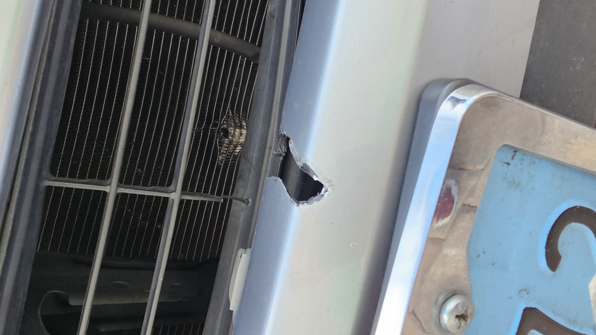
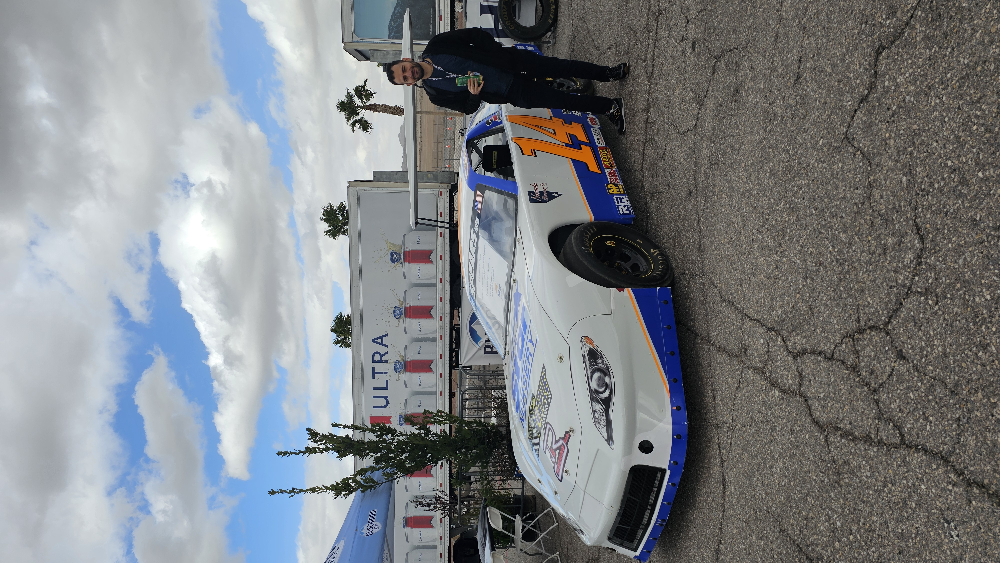

import Gallery from "@site/src/components/Gallery/Gallery.jsx";
import Instagram from "@site/src/components/Instagram/Instagram.jsx";
import song from "./ShapeOfYouFull.mp3";
import visit1 from "./images/visit1.JPG";
import visit2 from "./images/visit2.jpg";
import maluma from "./images/maluma.jpg";
import bunny from "./images/bunny.jpg";
import para1 from "./images/para1.jpg";
import para2 from "./images/para2.jpg";
import para3 from "./images/para3.jpg";
import youth1 from "./images/youth1.jpg";
import youth2 from "./images/youth2.jpg";
import fire1 from "./images/fire1.jpg";
import fire2 from "./images/fire2.jpg";
import fire3 from "./images/fire3.jpg";
import fire4 from "./images/fire4.jpg";
import anime1 from "./images/anime1.jpg";
import anime2 from "./images/anime2.jpg";
import april1 from "./images/april1.jpg";
import april2 from "./images/april2.jpg";
import april3 from "./images/april3.jpg";
import april4 from "./images/april4.jpg";
import april5 from "./images/april5.jpg";
import may1 from "./images/may1.jpg";
import may2 from "./images/may2.jpg";
import may3 from "./images/may3.jpeg";
import may4 from "./images/may4.jpg";
import may5 from "./images/may5.jpeg";
import june1 from "./images/june1.jpg";
import june2 from "./images/june2.jpg";
import june3 from "./images/june3.jpg";
import june4 from "./images/june4.jpg";
import june5 from "./images/june5.jpg";
import june6 from "./images/june6.jpg";
import june7 from "./images/june7.jpg";
import june8 from "./images/june8.jpg";
import june9 from "./images/june9.jpg";
import july1 from "./images/july1.jpg";
import july2 from "./images/july2.jpg";
import july3 from "./images/july3.jpg";
import july4 from "./images/july4.jpg";
import july5 from "./images/july5.jpg";
import july6 from "./images/july6.jpg";
import july7 from "./images/july7.jpg";
import retreat1 from "./images/retreat1.jpg";
import retreat2 from "./images/retreat2.jpg";
import retreat3 from "./images/retreat3.JPG";
import retreat4 from "./images/retreat4.jpg";
import retreat5 from "./images/retreat5.JPG";
import retreat6 from "./images/retreat6.JPG";
import retreat7 from "./images/retreat7.jpg";
import retreat8 from "./images/retreat8.jpg";
import retreat9 from "./images/retreat9.jpg";
import retreat10 from "./images/retreat10.jpg";
import retreat11 from "./images/retreat11.jpg";
import arizona1 from "./images/arizona1.jpg";
import arizona2 from "./images/arizona2.jpg";
import arizona3 from "./images/arizona3.jpg";
import arizona4 from "./images/arizona4.jpg";
import arizona5 from "./images/arizona5.jpg";

{/* ## Introduction */}

{/* <Gallery photos={[fun202349, fun202350]} /> */}

{/* ## Goals achieved this year */}

{/* ## Goals NOT achieved this year */}

## Projects

### Custom Local LLMs (Large language models)

Although ChatGPT is great at many things, it is not perfect. It is not able to understand the context of the conversation and provide a relevant response. This is where custom local LLMs come in. These are models that are trained on a specific dataset and are able to provide more relevant responses. There are many opensource models that can be used. To run those models I used [Oobabooga webui](https://github.com/oobabooga/text-generation-webui) and I connected it to [SillyTavern](https://sillytavernai.com/) which allows me to have multiple "characters" with specific personalities and specific skills.

### Class Tutor

As I continued to play around with the local LLMs, I wanted to see if I could use them within any application. So I cheated a bit and integrated it with CourseKey's frontend. I basically created a writing tutor AI chat bot that can help and provide feedback for any writing assignment. The AI is able to provide feedback on grammar, punctuation, sentence structure and more importantly things to consider to improve your writing.

### Private GPT

Although the local LLMs are great, they are not perfect. They are not able to give me specific information or based on sources. However, there is a tool that allows me to feed the model my own data and files and have it generate responses based on that.

### AI song covers

I trained an AI model to understand my voice and use the model to convert any audio to be me speaking it. This was a fun project where I finally got to make some music covers without actually singing them. I used this [YouTube tutorial](https://youtu.be/IqraHS5sgOU?si=SARaBLRsKclWPati) to get it up and running.

<audio controls src={song}></audio>

### Upgraded Patent Prints

I have had my patents for a few years and I have been looking at them way more as I take care of my plants. So I decided to design and print a nicer poster.

### Personal Website Redesign/Rewrite

My website was so outdated that when I decided to update it and add to it, I realized that I needed to rewrite the whole thing. I decided to use [Docusaurus](https://docusaurus.io/) to make it easier to maintain and update. I also added a few more features like a gallery and a password protected sections/pages. I upgraded my [virtual business card](https://mrkannah.com/card) and added a showcase section to show off some of my projects. I even created a [Dating profile](https://mrkannah.com/datingProfile) to see if it would help get me some dates.

### [PureFrame](https://pureframe.app/)

My friend asked me for help him with his project. I wanted to try something new, different and chellenging. So I took on the project and build a desktop application that runs AI locally.

It uses multiple technologies and languages. I used Vue for the frontend, Python, Node and Electron for the backend. You can view the app and what it does [here](https://pureframe.app/).

### Cloud Services (WIP)

Rebuild my cloud services to be better and available from anywhere. Additionally, I have added a few new services but have not managed to finish setting them up. I did set up intrusion detection and intrusion prevention systems. I also experinmented with running my own password manager vault, a few monitoring tools and a remote desktop service.

Sadly, I havent been able to finish setting up the services and migrate my old cloud to the new system. I did however have to rush building and making an invoicing/billing service work so I could bill people for consoulting work I did.

### [MeetingHero.ai](https://meetinghero.ai/)

I have been working on a project that helps with meetings. Since, I was no longer on CourseKey, this is my next venture. It is a tool that helps making meeting preperation much easier for you. It is still in the early stages but I have been working on it and improving it each day. By the new year, I hope to have it ready for beta testing.

## Projects that didn't go anywhere

### [Dating Profile](/datingProfile)

I created a dating profile to see if it would help me get more dates. I have been using it for a few months and I have not had any luck. I have been getting a lot of matches but none of them have been leading to any thing serious.

{/* ## Reading Materials this year */}

{/* ## Podcasts */}

{/* There haven't been any changes to the [list](/blog/yearly-recap-2021#podcasts). I am barely keeping up with the podcasts, that's mainly due to the lack of a commute. However, I have been listening to some podcasts during my workouts. Listening during workouts however is a bit challenging since sometimes I focus on counting and miss what the podcast said or vice versa and forget my counting. */}

{/* ## Places visited */}

{/* ## Financial state */}

{/* <Gallery photos={[Networth2023, AssetsBreakdown2023]} /> */}

## Month by month highlights

### January

For the third year in a row, I started the year by staying up extra late to take care of some CourseKey work during off peak hours! It was supposed to be quick change, however things didn't go as planned and ended up taking a few hours. Once that was taken care of, I hoped that was the last of my troubles for the new year. Sadly, that was not the case. While I was driving on the freeway, a truck next to me dropped something that hit my car and caused some serious damage for the radiator and condenser. Although, my insurance took care of it, it was a nightmare to deal with. It also took more than a month to get it fixed and I didn't have a subsitute car. However, while locked up in my house, I got to play around with AI and work on a few different projects.

Luckily, I had a few people visit town and distract me from the car troubles. First, it was my friend and his family. I had a great time catching up with my friend and showing his family around town. We had a great time exploring the city and enjoying some great food. Then, my cousins visited and we enjoyed exploring more of the city and experincing the tournement of kings show at Excalibur. That helped turn a rough month around and set up a better trigectory for the rest of the year.

<Gallery photos={[visit1, visit2]} />

### February

This month pretty much set the tone for the year. It started with attending concert for Maluma! It was a great concert we enjoyed it so much, that we started looking into what other parties/concerts we could attend for free. We started with seeing Tyga who was at Hakkasan, then got tricked into going to an "official" Bad Bunny after party at Liv. The partying was not over, since it was February, we had our church's valentine's party.

<Gallery photos={[maluma, bunny]} />

Also we had the superbowl, which meant there were a lot of things going on in Vegas. One of those things was the Paramount experince which was ton of fun with the family. The events werent over yet, we got invited to Death by chocolate event which was a lot of fun. We also enjoyed a Kpop bazar event where there was a lot of dancing and good snacks.

<Gallery photos={[para1, para2, para3]} />

Although, I still haven't met the one, I was still on the lookout. I managed to set up a zoom date with an incredible girl who lives in San Diego for Valentine's day. We had a great time and we decided to meet up in person. Sadly things didn't work out due to the distance, but we ended up becoming close friends. I also got to present for the youth group at church and share my story and how I have been able to stay positive and keep my faith through all the challenges I have faced.

<Gallery photos={[youth1, youth2]} />

### March

Started with getting the best seats for Nascar! However, we couldnt enjoy them as much since we were hit by crazy winds and cold weather. We still had a great time but we were freezing in the process and had to call it off early. We also had a great time at the St. Patrick's day parade in town and enjoyed some great food and drinks.

As the weather started to get nicer, we started doing more outdoor activities. We went to the Valley of Fire! It was great to see the red rocks and enjoy the great weather. We did a few hikes while we were there. Soon after we took advantage of our national park pass, and went and explored more of the Lake Mead national park. We enjoyed some great scenic overlooks of the lake.

<Gallery photos={[fire1, fire2, fire3, fire4]} />

Also this month, there were alot of Anime themed events. We went to Anime night mart which was great. Then we got to enjoy a fun day experincing the Anime Las Vegas convention! Finally, we had a work conference in town which meant I got to crash the party, network with some clients, catch up with coworkers and enjoy some fun times after the conference was done. And before wrapping up the conference and the month, I took my coworker to the new adult Playground in Vegas, where we had some fun and going down a slide and played some games.

<Gallery photos={[anime1, anime2]} />

### April

Started this month and ended with a trip to San Diego. The first trip was with the family to do our taxes. It was a quick trip and spent majority of it with relatives. The second trip was just me to hangout and catch up with friends while also taking care of some stuff.

In between the San Diego trips I had a few friends visit town and I got to do a staycation and be a tourist in my own city. We had a lot of fun, including going shooting in a range here locally and my faviroate arcade.

I also started doing Acupuncture at the recommendation of a friend. I was skeptical at first but I have been enjoying it and it has been helping me relax, sleep better and just reduce some of the pain I got by injuring myself.

My last trip of the month to San Diego was very eventful, got to catch up with a lot of highschool friends, meet up with my coworkers! Celebrate my friend's birthday and my cousin's son's birthday. Also, this trip included a date at San Diego State University, and another in Los Angeles area. Although, neither dates worked out, I still had a great time and made some great memories.

Before the month ended, I DJed and partied at a friend's son's and daughter's communion party. It was a great time and I got to DJ next to a singer/band for the first time!

<Gallery photos={[april1, april2, april3, april4, april5]} />

### May

Was an interesting month, since it was start of the summer and I was living in Vegas, I decided to checkout some of the beach clubs and night clubs in town. I got to listen to Tiesto Live and enjoy Trey Songs and Jeremih which brought back bunch of memories from when I was in highschool!

It wasn't just partying, I attended UNLV innovation day, the Tech Alley and a white labeling expo. Also got to party up at a locals club with a friend and made some new friends. Finally wrapped up the month with a SAW escape room experience which was a lot of fun and a great way to end the month.

<Gallery photos={[may1, may2, may3, may4, may5]} />

### June

This month was ton of fun! Started by checking out the new Particle Ink experince. Then had a friend's wedding in San Diego which meant another trip. This time it was abit longer which meant I could spend more time with friends one on one vs rushing and meeting everyone at once.

Then it was my birthday which I got to celebrate it twice! The first time was just enjoying my day by going to my faviroate arcade and followed it up with my faviroate burger place. The second time was going to a Japanese Wagyu BBQ placy with the family and enjoyed an amazing meal!

Since it was summer and getting pretty hot, we went to the water park to cool off and enjoy some water slides. And wrapped up the month with a few friends birthdays doing karaoke and some drinking.

<Gallery
  photos={[june1, june2, june3, june4, june5, june6, june7, june8, june9]}
/>

### July

Started with celebrating my sister's birthday! Which involved lots of food and fun. We went to the new Play at Luxor and did a road trip to Mesquite. We enjoyed a few resturants and explored the Donkey History Museum.

I had a friend and his family visit town and we had a great time. I took them to my faviroate spots and we toured the strip which was ton of fun.

<Gallery photos={[july1, july2, july3, july4, july5, july6, july7]} />

### August

Was an eventful month to say the least. It started with the St. Peter Eparchy Youth Convention at Palomar Christian Conference Center. It was a great time and I got to disconnect for a bit which was nice and I got to reflect on my 10 years journey at CourseKey. I made the decision that it was time for me to step away and take the leap and try something different.

<Gallery
  photos={[
    retreat1,
    retreat2,
    retreat3,
    retreat4,
    retreat5,
    retreat6,
    retreat7,
    retreat8,
    retreat9,
    retreat10,
    retreat11,
  ]}
/>

<Instagram url="https://www.instagram.com/p/C-TpUZpyBED" />

I spent the rest of the month wrapping up my projects and making sure everything was in order before I left. My goal was to have everything handed over before my second trip of the month to Arizona. I went to Arizona and got to catch up with a few friends and have great food and time. I also explored some of the museums and the zoo in the area.

<Gallery photos={[arizona1, arizona2, arizona3, arizona4, arizona5]} />
