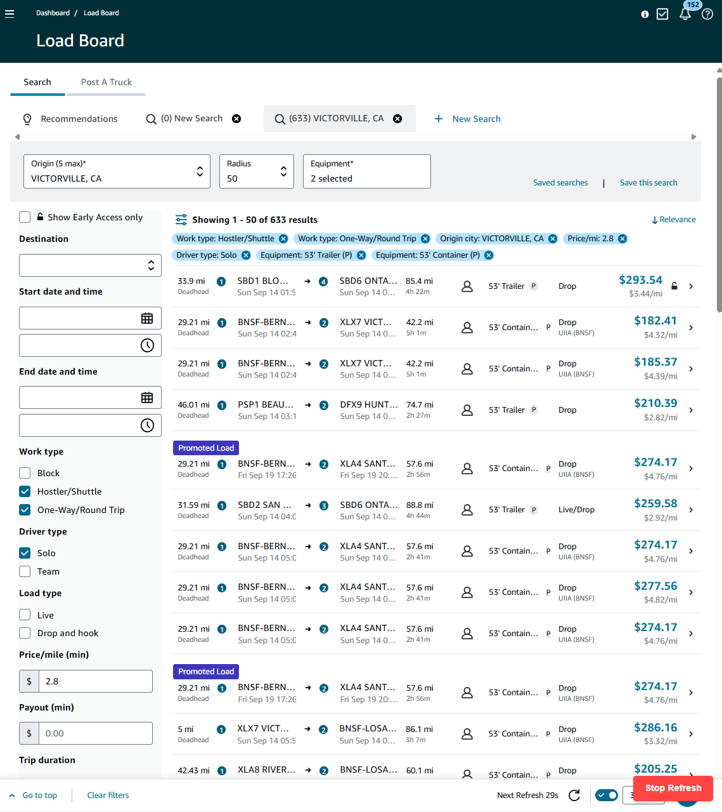

import Gallery from "@site/src/components/Gallery/Gallery.jsx";
import Instagram from "@site/src/components/Instagram/Instagram.jsx";
import YouTube from "@site/src/components/YouTube/YouTube.jsx";
import fun1 from "./images/fun1.jpg";
import fun2 from "./images/fun2.jpg";
import fun3 from "./images/fun3.jpg";
import fun4 from "./images/fun4.jpg";
import fun5 from "./images/fun5.jpg";
import fun6 from "./images/fun6.jpg";
import fun7 from "./images/fun7.jpg";
import fun8 from "./images/fun8.jpg";
import fun9 from "./images/fun9.jpg";
import fun10 from "./images/fun10.jpg";
import fun11 from "./images/fun11.jpeg";
import fun12 from "./images/fun12.jpg";
import fun13 from "./images/fun13.jpg";
import fun14 from "./images/fun14.jpg";
import fun15 from "./images/fun15.jpg";
import fun16 from "./images/fun16.mp4";
import fun17 from "./images/fun17.jpg";
import fun18 from "./images/fun18.jpg";
import fun19 from "./images/fun19.jpg";
import fun20 from "./images/fun20.jpg";
import fun21 from "./images/fun21.jpg";
import fun22 from "./images/fun22.jpg";
import fun23 from "./images/fun23.jpg";
import fun24 from "./images/fun24.jpg";
import fun25 from "./images/fun25.jpg";
// import fun25 from "./images/fun25.jpg";
// import fun26 from "./images/fun26.jpg";
// import fun27 from "./images/fun27.jpg";
// import fun28 from "./images/fun28.jpg";
// import fun29 from "./images/fun29.jpg";
// import fun30 from "./images/fun30.jpg";
import car1 from "./images/car1.jpg";
import car2 from "./images/car2.mp4";
import jan1 from "./images/jan1.jpg";
import jan2 from "./images/jan2.mp4";
import jan3 from "./images/jan3.mp4";
import jan4 from "./images/jan4.jpg";
import jan5 from "./images/jan5.mp4";
import jan6 from "./images/jan6.mp4";
import jan7 from "./images/jan7.mp4";
import feb1 from "./images/feb1.jpg";
import feb2 from "./images/feb2.jpg";
import feb3 from "./images/feb3.mp4";
import feb4 from "./images/feb4.jpg";
import feb5 from "./images/feb5.mp4";
import feb6 from "./images/feb6.mp4";
import mar1 from "./images/mar1.jpg";
import mar2 from "./images/mar2.jpg";
import mar3 from "./images/mar3.jpg";
import mar4 from "./images/mar4.mp4";
import mar5 from "./images/mar5.mp4";
import mar6 from "./images/mar6.mp4";
import mar7 from "./images/mar7.jpg";
import mar8 from "./images/mar8.mp4";
import mar9 from "./images/mar9.mp4";
import mar10 from "./images/mar10.jpg";
import mar11 from "./images/mar11.jpg";
import apr1 from "./images/apr1.jpg";
import apr2 from "./images/apr2.jpg";
import apr3 from "./images/apr3.jpg";
import apr4 from "./images/apr4.jpg";
import apr5 from "./images/apr5.jpg";
import apr6 from "./images/apr6.jpg";
import apr7 from "./images/apr7.mp4";
import apr8 from "./images/apr8.jpg";
import apr9 from "./images/apr9.jpg";
import apr10 from "./images/apr10.jpg";
import apr11 from "./images/apr11.jpg";
import apr12 from "./images/apr12.jpg";
import apr13 from "./images/apr13.mp4";
import apr14 from "./images/apr14.jpg";
import apr15 from "./images/apr15.jpg";
import apr16 from "./images/apr16.mp4";
import apr17 from "./images/apr17.jpg";
import apr18 from "./images/apr18.jpg";
import apr19 from "./images/apr19.jpg";
import may1 from "./images/may1.jpg";
import may2 from "./images/may2.jpg";
import may3 from "./images/may3.jpg";
import may4 from "./images/may4.jpg";
import may5 from "./images/may5.jpg";
import may6 from "./images/may6.jpg";
import may7 from "./images/may7.jpg";
import may8 from "./images/may8.jpg";
import may9 from "./images/may9.jpg";
import may10 from "./images/may10.JPEG";
import may11 from "./images/may11.jpg";
import jun1 from "./images/jun1.mp4";
import jun2 from "./images/jun2.jpg";
import jun3 from "./images/jun3.jpg";
import jun4 from "./images/jun4.jpg";
import jun5 from "./images/jun5.jpg";
import jun6 from "./images/jun6.jpg";
import jun7 from "./images/jun7.jpg";
import jun8 from "./images/jun8.jpg";
import jun9 from "./images/jun9.jpg";
import jun10 from "./images/jun10.jpg";
import jun11 from "./images/jun11.jpg";
import jun12 from "./images/jun12.jpg";
import jun13 from "./images/jun13.jpg";
import jun14 from "./images/jun14.jpg";
import jun15 from "./images/jun15.mp4";

## Introduction

<Gallery
  photos={[
    fun1,
    fun2,
    fun3,
    fun4,
    fun5,
    fun6,
    fun7,
    fun8,
    fun9,
    fun10,
    fun11,
    fun12,
  ]}
/>

<Gallery
  photos={[
    fun13,
    fun14,
    fun15,
    fun16,
    fun17,
    fun18,
    fun19,
    fun20,
    fun21,
    fun22,
    fun23,
    fun24,
    fun25,
  ]}
/>

## Big goals achieved this year

None 😅

## Goals NOT achieved this year

### Sell CourseKey

### Find a life partner

## Goals with some progress

### Travel to the six continents (excluding Antarctica 🥶)

This year I have added Australia to the list. I have technically been to Europe and Asia (Middle east) but I wont count those sicne I didn't really get to explore them properly. As of North America, I have explored parts of the US and Mexico. The rest of the continents are still on my list to visit.

## Projects

### [MeetingHero.ai](https://meetinghero.ai/)

I launched it this year after creating and polishing the beta then rewriting the frontend to be more user friendly and intuitive. I also added a few new features and improved the overall user experience. I tried my best and even did a relaunch campaign and marketing to get more users. However, in the end it didn't really take off and I had to sunset it.

I presented it at TechAlley demo, that got me a single user that ended up becoming a paying customer for a few months. I created multiple videos, some blog posts, redesigned the whole website, offered free tools and trial. That didnt really get me any more users. In the end, after months of trying to aquire users, I only had 3 users that were paying and didnt churn plus Luke who has been my tester since day one.

Eventually, it didnt workout but I learned alot and I got to play around with AI and got a taste of what it takes to try to force a product market fit. The fun part is I got to document the process and the journey.

#### Alpha demo

<YouTube videoId="UltVhgPyuao" />

#### Beta demo

<YouTube videoId="lPE1S_ZBy68" />

#### Launch demo

<YouTube videoId="Oz72TtdGw-w" />

#### Relaunch demo

<YouTube videoId="6ZWbnt96Who" />

I even built a nice product updates page to keep track of all the changes and improvements I made (after the first launch in March). You can view it [here](https://app.meetinghero.ai/updates).

### Sister's engagement and wedding preparation!

Another sister got engaged and we started preparing for the wedding. It was a lot of work and I was glad to be part of it. Dress shopping, venue prep, booking singers, dj and so on... And this time I got to paint thier bedroom!

TODO: Add picutres

### Duolingo

Since I had a trip coming up to dominican republic, I decided to start using Duolingo to learn and referesh my spanish. I have been makings some good progress. I will probably keep going with it and see how far/good I get with it.

TODO: add picture of streak

### Habibi Match

After exhausting my network of people I know. I decided to give Habibi Match a try. I got matched in June with someone who seemed great on the first date, we ended up extending and having dinner that same day! However, the next date/day things took a turn and we didnt end up working out.

TODO: add more details about the match and the experience.

### DMV chaos

My parents and I swapped cars because of my dad's back condition got worse and he can no longer drive the sport car. With that I had to do a few DMV updates and fixes including paying off the car, transfering title and requesting new placards for my Dad.

### Car enhancements

Since I got my dad's car, I decided to upgrade it a bit. I added interior lights and led strips. I also added, a wireless chargers and installed a usb c port as an auxulariy port so there are no cables hanging all over the place. Finally, I installed a custom Andorid device that connects to the car's infotainment system and allows me to do wireless Android eventhough that my car doesn't support it.

TODO: get picutres

<Gallery photos={[car1, car2]} />

### Cellphone's shinanigans!

First, I had to change my plan since I was on CourseKey's plan. The transition was rough because once I was off the plan Verizon wouldn't help me! My phone kept showing errors and I couldnt use visualmail (see voicemails in app) because it is a different network and the phone was locked to Verizon.

Eventually, I flashed my phone (reset everything and use a clean firmware not linked to any specific company) and had to set everything up again. Restoring things went smoothly for the most part, since I had everything backed up before flashing my phone. However, as I was restoring everything, I realized the whatsup messages didnt backup and everything I had in whatsapp was lost.

The phone also gave a bit of scare, when I gave it a nice dip in the ocean in the Dominican republic. The phone is water proof however since it is saltwater, the usb port got cloged with salt and I couldnt charge my phone anymore! The following day I had to take my flight back and I couldn't find a wireless charger 😅 So me and my friend gave my phone a nice water bath and brushed its port then dried it up and let it sit overnight. Thankfully it worked and I was able to charge my phone again in the morning before my flight!

Finally, my mom's phone took a swim in the pool and the screen was damaged. I was busy with ton of things and my mom needed her phone as soon as possible. So I bought a new phone and gave her my old phone. With the new phone, I had to redo the data migration and transfer everything again but this time I made sure to transfer whatsapp messages properly!

### Parents's Health and Doctors

A big chunck of this year was spent on my parents' health and doctors. That meant finding new doctors, getting them appointments, and making sure they are getting the care they need. Especially since my dad was diagnosed with early onset Alzheimer's disease.

### Fleeter

A fun small project for my friend who is a truck driver. He needed a better way to find loads from Amazon Relay platform, so I built him a custom script that increases the frequency of checking for loads and it automatically notifies him when a new load is available by playing a sound. This allows him to multitask and let the script do its thing and just look at when he hears the notification sound!

### Travel Trips planning!

#### Punta Cana (Dominican Republic)

This trip was the easiest to plan! I only had to coordinate and plan the Miami trip after it and book flights/hotel. Originally, I wanted to do Mexico andSouth America as well but since MeetingHero.ai wasn't working out as expected. I decided to save up the money and just do Punta Cana and Miami. The Miami part, I didnt need to plan or do anything for it since Luke and Mallory took care of everything for me and hosted me at thier place! The trip was a blast and I got to relax and recharge!

#### [Europe trip](https://wanderlog.com/view/cjxoehlkhi/trip-to-london/shared)

The craziest trip I have planned so far! I spent months planning this trip and it was a blast! This trip was originally not planned, since it was supposed to be my sister's honeymoon trip. However, my sister and her husdband decided to include me and my parents in the trip! Making me thier tour guide and planner! We decided on a 12 days European cruise and an extra day in London. I was in charge of figuring out transportation, hotels and ensuring we do everything my sister and her husband wanted to do and not missing the ship! We ended up visiting London (UK), Edinburgh (Scotland), Invergordon & Dunrobin (Scotland), Portree (Scotland), Dublin (Ireland), and Belfast (Northern Ireland), Zaanse Schans & Amsterdam (Netherlands), Brugge (Belgium) and finally Paris (France).

## Podcasts

I added The Diary Of A CEO based on a friend's recommendation and I have been in love with it. It has a huge amount of varaity of topics and they are always interesting.
Other than that there hasn't been any changes to the [list](/blog/yearly-recap-2021#podcasts).

## Cities visited

<iframe
  src="https://www.google.com/maps/d/u/0/embed?mid=1b3XWpy63OrbzkIFaITT339yAcxFAk-4&ehbc=2E312F&noprof=1"
  width="100%"
  height="480"
></iframe>

## Workouts

{/* <Gallery photos={[workout1, workout2, workout3, workout4]} /> */}

## Financial state

This year was a bit of a setback on my financial state. Since I stepped away from CourseKey, I lost my options/shares which impacted my networth. Knowing that I was transitioning, I increased my emergency fund savings to ensure I have enough saved to not stress about things. I made sure I have enough saved to find something new and not rush into something isnt for me. Also I spend alot on a big family trip.

{/* <Gallery photos={[networth, assets]} /> */}

## Month by month highlights

### January

The year was off to a good start this time! My friend was in town and we both had tickets for CES. We got to see some fun and crazy innovations in the tech world. I also got be a toursit in vegas and enjoyed the city. I even got to see Delta's keynote and a mini Lenny Kravitz concert for free at the Sphere! Then wrapped up CES with seeing Kaskade at Zouk.

<Gallery photos={[jan1, jan2, jan3, jan4, jan5, jan6, jan7]} />

And before the month ended, I made a few new friends and I joined the circus! Just kidding, I didn't join the circus, but I did go to the circus gym and started learning how to jump on the trampoline.

### February

Started the month by doing a fmaily paintball which was ton of fun. Also, celebrated a friend's birthday and partied abit. I squized in a developer conference with a friend that I havent seen in a while. Got back and attended a Love and Laughter concert. The rest of the month was busy with family planning and preparing for my sister's engagement and wedding.

<Gallery photos={[feb1, feb2, feb3, feb4, feb5, feb6]} />

### March

Was an interesting month! It was a busy month with family chaos and preparations. I did my sister's photoshoot in Valley of Fire before the engagement. Then we had the engagement party and helped with the love story photoshoot. After that, I had the ASD Market Week convention which was a lot of fun and I found my new favorite perfume! As soon as the convention was over, I had another party this time it was a baptism party. Followed by more errands and family chores (moving things, fixing stuff and painting my sister's future bedroom). Finally, celebrated my other sister's baby shower and found out the gender of the baby!

<Gallery
  photos={[mar1, mar2, mar3, mar4, mar5, mar6, mar7, mar8, mar9, mar10, mar11]}
/>

### April

The craziness continues! First had to go to San Diego to do my taxes and some shopping with the family. The trip was quick and fun. Got to catch up with the family and a few friends. Once I got back, I got to celebrate my friends getting married! Attended a football game with the family then did the big game show and an escape room. I officially launched MeetingHero.ai!

<Gallery photos={[apr1, apr2, apr3, apr4, apr5, apr6, apr7, apr8, apr9]} />

I also got to participate in the last supper mass and I had my feet washed by the priest! The rest of the month was still very busy I had the Sign Expo and family visit us and celebrate easter with a party.

<Gallery
  photos={[
    apr10,
    apr11,
    apr12,
    apr13,
    apr14,
    apr15,
    apr16,
    apr17,
    apr18,
    apr19,
  ]}
/>

### May

Was a heads down month! Between working on and updating MeetingHero and sister's wedding preparations and my upcoming trip to Punta Cana, I was busy! I did more photoshoots for my sister and her "propsal" photoshoot. I also had a friend visit and spend some time together and saw carrot top. Before heading to Punta Cana, I stopped by San Diego since my last visit was super quick and didnt get to see/spend time with friends. I also squeezed in a dental visit south the border in Mexico. I then picked up my friend from San Diego and got back to Las Vegas to head to Punta Cana!

<Gallery
  photos={[may1, may2, may3, may4, may5, may6, may7, may8, may9, may10, may11]}
/>

### June

I continued to enjoy my time in Punta Cana and had a great time! However, my trip was not just all fun, I had some work stuff to take care of for MeetingHero. As soon as, my trip was over, I went to Miami to see Luke and Mallory and had a great time! I got to work from Atomic and meet his fiance and her family which was great! After that it was back to Las Vegas and back wedding preparations and work! We had my sister's bachelorette party. Then my highschool friend visited town and we spend some time together! Also, my great aunt visted as well all the way from Iraq, so spent some time showing her around and celebrated my birthday with her! Then I wrapped up the month by attending Shakira's concert!

<Gallery
  photos={[
    jun1,
    jun2,
    jun3,
    jun4,
    jun5,
    jun6,
    jun7,
    jun8,
    jun9,
    jun10,
    jun11,
    jun12,
    jun13,
    jun14,
    jun15,
  ]}
/>
