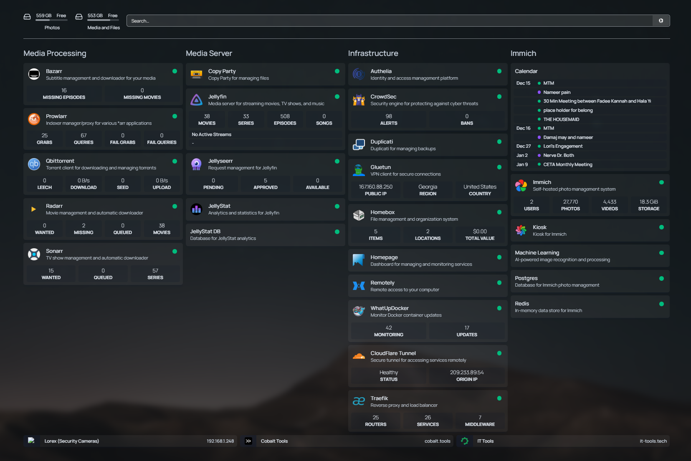

import Gallery from "@site/src/components/Gallery/Gallery.jsx";
import Instagram from "@site/src/components/Instagram/Instagram.jsx";
import YouTube from "@site/src/components/YouTube/YouTube.jsx";
import fun1 from "./images/fun1.jpg";
import fun2 from "./images/fun2.jpg";
import fun3 from "./images/fun3.jpg";
import fun4 from "./images/fun4.jpg";
import fun5 from "./images/fun5.jpg";
import fun6 from "./images/fun6.jpg";
import fun7 from "./images/fun7.jpg";
import fun8 from "./images/fun8.jpg";
import fun9 from "./images/fun9.jpg";
import fun10 from "./images/fun10.jpg";
import fun11 from "./images/fun11.jpeg";
import fun12 from "./images/fun12.jpg";
import fun13 from "./images/fun13.jpg";
import fun14 from "./images/fun14.jpg";
import fun15 from "./images/fun15.jpg";
import fun16 from "./images/fun16.mp4";
import fun17 from "./images/fun17.jpg";
import fun18 from "./images/fun18.jpg";
import fun19 from "./images/fun19.jpg";
import fun20 from "./images/fun20.jpg";
import fun21 from "./images/fun21.jpg";
import fun22 from "./images/fun22.jpg";
import fun23 from "./images/fun23.jpg";
import fun24 from "./images/fun24.jpg";
import fun25 from "./images/fun25.jpg";
import fun26 from "./images/fun26.jpg";
import fun27 from "./images/fun27.jpg";
import fun28 from "./images/fun28.jpg";
import fun29 from "./images/fun29.jpg";
import fun30 from "./images/fun30.jpg";
import fun31 from "./images/fun31.jpg";
import fun32 from "./images/fun32.jpg";
import fun33 from "./images/fun33.jpg";
import fun34 from "./images/fun34.jpg";
import fun35 from "./images/fun35.jpg";
import fun36 from "./images/fun36.jpg";
import fun37 from "./images/fun37.jpg";
import fun38 from "./images/fun38.jpg";
import fun39 from "./images/fun39.jpg";
import fun40 from "./images/fun40.jpg";
import fun41 from "./images/fun41.jpg";
import fun42 from "./images/fun42.jpg";
import fun43 from "./images/fun43.mp4";
import fun44 from "./images/fun44.jpg";
import fun45 from "./images/fun45.jpg";
import fun46 from "./images/fun46.jpg";
import car1 from "./images/car1.jpg";
import car2 from "./images/car2.mp4";
import jan1 from "./images/jan1.jpg";
import jan2 from "./images/jan2.mp4";
import jan3 from "./images/jan3.mp4";
import jan4 from "./images/jan4.jpg";
import jan5 from "./images/jan5.mp4";
import jan6 from "./images/jan6.mp4";
import jan7 from "./images/jan7.mp4";
import feb1 from "./images/feb1.jpg";
import feb2 from "./images/feb2.jpg";
import feb3 from "./images/feb3.mp4";
import feb4 from "./images/feb4.jpg";
import feb5 from "./images/feb5.mp4";
import feb6 from "./images/feb6.mp4";
import mar1 from "./images/mar1.jpg";
import mar2 from "./images/mar2.jpg";
import mar3 from "./images/mar3.jpg";
import mar4 from "./images/mar4.mp4";
import mar5 from "./images/mar5.mp4";
import mar6 from "./images/mar6.mp4";
import mar7 from "./images/mar7.jpg";
import mar8 from "./images/mar8.mp4";
import mar9 from "./images/mar9.mp4";
import mar10 from "./images/mar10.jpg";
import mar11 from "./images/mar11.jpg";
import apr1 from "./images/apr1.jpg";
import apr2 from "./images/apr2.jpg";
import apr3 from "./images/apr3.jpg";
import apr4 from "./images/apr4.jpg";
import apr5 from "./images/apr5.jpg";
import apr6 from "./images/apr6.jpg";
import apr7 from "./images/apr7.mp4";
import apr8 from "./images/apr8.jpg";
import apr9 from "./images/apr9.jpg";
import apr10 from "./images/apr10.jpg";
import apr11 from "./images/apr11.jpg";
import apr12 from "./images/apr12.jpg";
import apr13 from "./images/apr13.mp4";
import apr14 from "./images/apr14.jpg";
import apr15 from "./images/apr15.jpg";
import apr16 from "./images/apr16.mp4";
import apr17 from "./images/apr17.jpg";
import apr18 from "./images/apr18.jpg";
import apr19 from "./images/apr19.jpg";
import may1 from "./images/may1.jpg";
import may2 from "./images/may2.jpg";
import may3 from "./images/may3.jpg";
import may4 from "./images/may4.jpg";
import may5 from "./images/may5.jpg";
import may6 from "./images/may6.jpg";
import may7 from "./images/may7.jpg";
import may8 from "./images/may8.jpg";
import may9 from "./images/may9.jpg";
import may10 from "./images/may10.JPEG";
import may11 from "./images/may11.jpg";
import jun1 from "./images/jun1.mp4";
import jun2 from "./images/jun2.jpg";
import jun3 from "./images/jun3.jpg";
import jun4 from "./images/jun4.jpg";
import jun5 from "./images/jun5.jpg";
import jun6 from "./images/jun6.jpg";
import jun7 from "./images/jun7.jpg";
import jun8 from "./images/jun8.jpg";
import jun9 from "./images/jun9.jpg";
import jun10 from "./images/jun10.jpg";
import jun11 from "./images/jun11.jpg";
import jun12 from "./images/jun12.jpg";
import jun13 from "./images/jun13.jpg";
import jun14 from "./images/jun14.jpg";
import jun15 from "./images/jun15.mp4";
import july1 from "./images/july1.jpg";
import july2 from "./images/july2.jpg";
import july3 from "./images/july3.jpg";
import july4 from "./images/july4.jpg";
import july5 from "./images/july5.jpg";
import july6 from "./images/july6.jpg";
import july7 from "./images/july7.jpg";
import july8 from "./images/july8.jpg";
import euro1 from "./images/euro1.jpg";
import euro2 from "./images/euro2.jpg";
import euro3 from "./images/euro3.jpg";
import euro4 from "./images/euro4.jpg";
import euro5 from "./images/euro5.jpg";
import euro6 from "./images/euro6.jpeg";
import euro7 from "./images/euro7.jpg";
import euro8 from "./images/euro8.jpg";
import euro9 from "./images/euro9.jpg";
import euro10 from "./images/euro10.jpg";
import euro11 from "./images/euro11.jpg";
import euro12 from "./images/euro12.jpg";
import euro13 from "./images/euro13.jpg";
import euro14 from "./images/euro14.jpg";
import euro15 from "./images/euro15.jpg";
import euro16 from "./images/euro16.jpg";
import aug1 from "./images/aug1.mp4";
import aug2 from "./images/aug2.jpg";
import aug3 from "./images/aug3.mp4";
import aug4 from "./images/aug4.jpg";
import aug5 from "./images/aug5.jpg";
import aug6 from "./images/aug6.jpg";
import oct1 from "./images/oct1.mp4";
import oct2 from "./images/oct2.jpg";
import oct3 from "./images/oct3.jpeg";
import oct4 from "./images/oct4.jpg";
import oct5 from "./images/oct5.jpg";
import oct6 from "./images/oct6.mp4";
import oct7 from "./images/oct7.jpg";
import oct8 from "./images/oct8.jpg";
import oct9 from "./images/oct9.jpeg";
import oct10 from "./images/oct10.mp4";
import oct11 from "./images/oct11.mp4";
import nov1 from "./images/nov1.jpg";
import nov2 from "./images/nov2.jpg";
import nov3 from "./images/nov3.jpg";
import nov4 from "./images/nov4.jpg";
import nov5 from "./images/nov5.jpg";
import nov6 from "./images/nov6.jpg";
import nov7 from "./images/nov7.jpg";
import nov8 from "./images/nov8.jpg";
import nov9 from "./images/nov9.jpg";
import dj1 from "./images/dj1.png";
import dj2 from "./images/dj2.png";
import dj3 from "./images/dj3.png";
import labs1 from "./images/labs1.png";
import labs2 from "./images/labs2.png";
import you1 from './images/you1.png';
import you2 from './images/you2.png';
import you3 from "./images/you3.png";
import you4 from "./images/you4.png";

## Introduction

<Gallery
  photos={[
    fun1,
    fun2,
    fun3,
    fun4,
    fun5,
    fun6,
    fun7,
    fun8,
    fun9,
    fun10,
    fun11,
    fun12,
  ]}
/>

<Gallery
  photos={[
    fun13,
    fun14,
    fun15,
    fun16,
    fun17,
    fun18,
    fun19,
    fun20,
    fun21,
    fun22,
    fun23,
    fun24,
    fun25,
    fun26,
    fun27,
    fun28,
    fun29,
    fun30,
  ]}
/>

<Gallery
  photos={[
    fun31,
    fun32,
    fun46,
    fun33,
    fun34,
    fun35,
    fun36,
    fun37,
    fun38,
    fun39,
    fun40,
    fun41,
    fun42,
    fun43,
    fun44,
    fun45,
  ]}
/>

## Big goals achieved this year

None 😅 This year was more of a transitonal year! Taking care of family and recharging was the main goal.

## Goals NOT achieved this year

### Find a wife

Given the lack of prospects in my area and after exhausting my network of people I know, I decided to give Habibi Match (a Chaldean focused matching service) a try. I got matched in June with someone who seemed great on the first date, we ended up extending it and having dinner that same day! However, the next date/day she changed 180 degrees and she had a list of demands that she wouldn't share till after getting engaged. Given the situation, I knew things wouldnt work out so I ended it.

The second/last match was great on the first date however on the second date things didnt go as planned.I was exhausted due to travel and other things going on that I wasn't fully present during the date. So when I reached out to plan the third date, I got friendzoned.

My friend introduced me to a girl on instagram, I reached out to her and things went really well. We talked on the phone and I was planning our date when she ended things because I was not Chaldean Catholic. She even introduced me to another girl that I reached out to and got ignored.

I have reached the point where, the door is open if I meet someone, but I am done chasing after our people and their expectations.

## Goals with some progress

### Travel to the six continents (excluding Antarctica 🥶)

This year I have officially added Europe to the list. With an honnorary mention to the Carribean (Dominican Republic).

## Projects

### [MeetingHero.ai](https://meetinghero.ai/)

I launched it this year after creating and polishing the beta then rewriting the frontend to be more user friendly and intuitive. I also added a few new features and improved the overall user experience. I tried my best and even did a relaunch campaign and marketing to get more users. However, in the end it didn't really take off and I had to sunset it.

I presented it at TechAlley demo, that got me a single user that ended up becoming a paying customer for a few months. I created multiple videos, some blog posts, redesigned the whole website, offered free tools and trial. That didnt really get me any more users. In the end, after months of trying to aquire users, I only had 3 users that were paying and didnt churn plus Luke who has been my tester since day one.

Eventually, it didnt workout but I learned alot and I got to play around with AI and got a taste of what it takes to try to force a product market fit. The fun part is I got to document the process and the journey.

#### Alpha demo

<YouTube videoId="UltVhgPyuao" />

#### Beta demo

<YouTube videoId="lPE1S_ZBy68" />

#### Launch demo

<YouTube videoId="Oz72TtdGw-w" />

#### Relaunch demo

<YouTube videoId="6ZWbnt96Who" />

I even built a nice product updates page to keep track of all the changes and improvements I made (after the first launch in March). You can view it [here](https://meetinghero.ai/changelog).

### Sister's engagement and wedding preparation!

Another sister got engaged and we started preparing for the wedding. It was a lot of work and I was glad to be part of it. Dress shopping, venue prep, booking singers, dj and so on... And this time I got to paint thier bedroom!

TODO: Add picutres, move july photo

### Family side quests

The family had quite a few things for me to do. From me and my parents moving to an apartment. To helping my sister with her car shopping and buying one. To becoming the family handyman, mounting TVs to the wall, hiding wires inside the walls, Setting up my niece's room and furniture. Working as delivery, picking up packages, delivering them. Setting up Christmas trees and many more things that I dont even remember.

### Duolingo

Since I had a trip coming up to dominican republic, I decided to start using Duolingo to learn and referesh my spanish. I have been makings some good progress. I will probably keep going with it and see how far/good I get with it.

TODO: add picture of streak

### Car chaos

My parents and I swapped cars because of my dad's back condition got worse and he can no longer drive the sport car. With that I had to do a few DMV updates and fixes including paying off the car, transfering title and requesting new placards for my Dad.

Also, while my parents were parked a nighboer backed into our car breaking the side mirror and denting the door. I had to deal with the insurance, getting a rental and getting it fixed.

### Car enhancements

Since I got my dad's car, I decided to upgrade it a bit. I added interior lights and led strips. I also added, a wireless chargers and installed a usb c port as an auxulariy port so there are no cables hanging all over the place. Finally, I installed a custom Andorid device that connects to the car's infotainment system and allows me to do wireless Android eventhough that my car doesn't support it.

TODO: get picutres

<Gallery photos={[car1, car2]} />

### Cellphone's shinanigans!

First, I had to change my plan since I was on CourseKey's plan. The transition was rough because once I was off the plan Verizon wouldn't help me! My phone kept showing errors and I couldnt use visualmail (see voicemails in app) because it is a different network and the phone was locked to Verizon.

Eventually, I flashed my phone (reset everything and use a clean firmware not linked to any specific company) and had to set everything up again. Restoring things went smoothly for the most part, since I had everything backed up before flashing my phone. However, as I was restoring everything, I realized the whatsup messages didnt backup and everything I had in whatsapp was lost.

The phone also gave a bit of scare, when I gave it a nice dip in the ocean in the Dominican republic. The phone is water proof however since it is saltwater, the usb port got cloged with salt and I couldnt charge my phone anymore! The following day I had to take my flight back and I couldn't find a wireless charger 😅 So me and my friend gave my phone a nice water bath and brushed its port then dried it up and let it sit overnight. Thankfully it worked and I was able to charge my phone again in the morning before my flight!

Finally, my mom's phone took a swim in the pool and the screen was damaged. I was busy with ton of things and my mom needed her phone as soon as possible. So I bought a new phone and gave her my old phone. With the new phone, I had to redo the data migration and transfer everything again but this time I made sure to transfer whatsapp messages properly!

### Parents's Health and Doctors

A big chunck of this year was spent on my parents' health and doctors. That meant finding new doctors, getting them appointments, and making sure they are getting the care they need. Especially since my dad was diagnosed with early onset Alzheimer's disease.

### Fleeter

A fun small project for my friend who is a truck driver. He needed a better way to find loads from Amazon Relay platform, so I built him a custom script that increases the frequency of checking for loads and it automatically notifies him when a new load is available by playing a sound. This allows him to multitask and let the script do its thing and just look at when he hears the notification sound!

### My homeserver services

This was a fun rabbit hole that I went down. It started because my photo server stopped working. So I decided to rebuild it using Immich. Once I got the photo server up and running I realized I could improve the system a lot more. So I started revamping and upgrading things. Starting with the media server where I recreated the entire stack and added additional services and monitoring and features.As well as recreated my home page and added a lot more fun features to it. It is still work in progress as I'm not fully done with it. I also added the ability to access it from anywhere in the world and share it with family and friends. This is how it looks like now.

### Renting my house

After we moved to the apartment I prepared the house to rent it in September. I had some tenants reach out and schedule showings. By August 26th, I had the lease signed and me being nice, I handed the keys over before even the month started. I did so because they initiated the payment through the bank and everything looked legit.

However, that's when the craziness started. Their security deposit and rent failed thier bank didn't have enough funds.I spent ten days trying to work with them and get them to pay me. After failing to do so through the system I tried to get it in cash.That's when the tenant went completely quiet. So I ended up leaving a note and threatening them getting evicted. That's when they changed their number and apologized and reinitiated the payment.

As expected the payment didn't go through. And they stopped responding. So I started the eviction process. Sadly my notice didn't count, so I had to serve them a legal note through the constable and start the timer. After the intial notice, they agreed to leave. So I gave them the time and continued with the second notice just in case. And on the final day of the notice, before the eviction is filed and is on their record permanently, I went there to get the keys. I was surprised by somebody else answering the door and giving me a very legal message stating they have the right to stay additional two days before they leave and they will not hand any keys.

The eviction was granted October 8th. However, they appealed the eviction which delayed it by another week. Of course the appeal got denied, and they were going to get evicted the next day. The next day came and the deputy was heading to kick them out. However, as we were on the way, he got a call and had to stop the eviction.Because they appealed it with the district court. The district court case took about a month to resolve, including a hearing that they did not show up to.

Luckily my neighbor kept an eye on the house and he had informed me that they left and nobody was home. So I went to the house and called in for a cop and we both entered the house. The house was in a trash state. Trash and broken furniture and diapers everywhere. Toilets full of urine and feces not flushed. Fridge had meat and milk that have been spoiled since they disconnected electricity. And of course the whole house smelled of weed and smoke.

This whole eviction cost me about five thousand dollars. That's excluding missed rent payments, my time and effort cleaning, fixing and reparing things. It could have easily cost another five just in labor and handyman's expenses as well as legal fees. I took care of patching the walls, fixing the holes they left, painting them, repairing the broken irrigation system, and cleaning the house.

### Job hunting

Looking for a job this year was not easy! The whole job market is in a crisis. All the layoffs caused by AI, be it directly or the companies using it as an excuse to lay off people. caused a huge increase in supply with dwindling demand for software engineers as companies slowly started to adapt to AI and automation. And whatever demand that was left, it was getting drowned by AI applications.

Luckily for me I have good network and I was able to reach out to a few friends and people I know. I got to understand how things were going. Since there aren't that many jobs in the market because of the economy slowing down and companies worried about the future the froze hiring. So whatever position that's available within few hours they receive hundreds if not thousands of applications from desperate people trying to get the job or people abusing AI and mass applying.

That makes getting past the initial screening a nightmare and very unlikely without having somebody as a referral. I revamp my website and took on some side projects that helped me polish my resume a little bit. With that I man managed to pass a couple of technical interviews. However the company froze hiring and couple weeks later I found out they fired more people. Luckily through my network I managed to get some contract work and that has been helping pay the bills. While I continue to interview and look for something more consistent.

### DJing

Since I was on the hunt for jobs and ways to make money. One of those ways was me DJing. I borrowed DJ equipment and DJed for a couple of parties. I didn't make think from DJing, but it did help. And in the process I decided to create an app that makes my life easier during live events. Basically it's a real time app that allows people to search a song on YouTube and request it from within the app. As soon as the song is requested, it gets downloaded onto my machine and I'll be able to play it within less than a minute.

<Gallery photos={[dj1, dj2, dj3]} />

### Liquor store

Since I was unemployed and I was leaving up my savings, I considered investing in an existing business.My friend found a liquid store that looked good, so we started negotiating and digging into it. He has experience and he knew how to run the liquor store. He would handle the details and I'll take care of running the business backend and helping here and there. It would have been a nice business.

However, one once I dug into it and looked at the business financials and numbers. The owner was selling it for a ridiculous price that was not worth it. And the whole market slowing down since a lot of people are feeling the inflation. We made them an offer that was fair market value, but they didn't accept it. Since that store did not work out, we looked at another one which was way outside of our price range. So eventually ended up canceling the whole idea.

### My Health

Since I have no health insurance, taking care of my health was a little bit more challenging. I have to come up with some creative strategies to save up on money and still take care of my health and make sure everything's okay. I found a dentist in Tijuana, Mexico that has been great and is reasonably priced. They speak full English and have great customer service better than most than this I've been to here in the US.

However, the biggest challenge was doing blood work and laps. My lab order cost twenty five hundred here at Quest Diagnostics. And Lab Corp did not even give me an estimate, they just told me it will be very expensive. I looked at doing the labs at a hospital in Mexico. But even that was expensive. I found a smaller lab here that has reasonable prices if paid cash. I ended up going with clinical pathology laboratories. And the primary care doctor Copay with no insurance is not too ridiculous.

Now since my lab results are in multiple different labs, It is difficult to find out how I'm actually doing without opening up three or four different tabs and looking at the results. So I did what I do best and created an app that shows me all my lab results and graphs them for me. No matter where they came from So I can have the full picture.

<Gallery photos={[labs1, labs2]} />

### Travel Trips planning!

#### Punta Cana (Dominican Republic)

This trip was the easiest to plan! I only had to coordinate and plan the Miami trip after it and book flights/hotel. Originally, I wanted to do Mexico andSouth America as well but since MeetingHero.ai wasn't working out as expected. I decided to save up the money and just do Punta Cana and Miami. The Miami part, I didnt need to plan or do anything for it since Luke and Mallory took care of everything for me and hosted me at thier place! The trip was a blast and I got to relax and recharge!

TODO add pictures here

#### [Europe trip](https://wanderlog.com/view/cjxoehlkhi/trip-to-london/shared)

The craziest trip I have planned so far! I spent months planning this trip and it was a blast! This trip was originally not planned, since it was supposed to be my sister's honeymoon trip. However, my sister and her husdband decided to include me and my parents in the trip! Making me thier tour guide and planner! We decided on a 12 days European cruise and an extra day in London. I was in charge of figuring out transportation, hotels and ensuring we do everything my sister and her husband wanted to do and not missing the ship! We ended up visiting London (UK), Edinburgh (Scotland), Invergordon & Dunrobin (Scotland), Portree (Scotland), Dublin (Ireland), and Belfast (Northern Ireland), Zaanse Schans & Amsterdam (Netherlands), Brugge (Belgium) and finally Paris (France).

TODO move eruo photos here 

## Podcasts

TODO: create a tracker page or remove the section

## Cities visited

<iframe src="https://www.google.com/maps/d/u/0/embed?mid=1ATTl0BHyLdeWJwYhsi0zaWrGp8dxg8k&ehbc=2E312F" width="100%" height="480"></iframe>

## Youtube recap
<Gallery photos={[you1, you2, you3, you4]} />
## Workouts

TODO: add workout tracker

{/* <Gallery photos={[workout1, workout2, workout3, workout4]} /> */}

## Financial state

TODO: add financial tracker

{/* <Gallery photos={[networth, assets]} /> */}

## Month by month highlights

### January

The year was off to a good start this time! My friend was in town and we both had tickets for CES. We got to see some fun and crazy innovations in the tech world. I also got be a toursit in vegas and enjoyed the city. I even got to see Delta's keynote and a mini Lenny Kravitz concert for free at the Sphere! Then wrapped up CES with seeing Kaskade at Zouk.

<Gallery photos={[jan1, jan2, jan3, jan4, jan5, jan6, jan7]} />

And before the month ended, I made a few new friends and I joined the circus! Just kidding, I didn't join the circus, but I did go to the circus gym and started learning how to jump on the trampoline.

### February

Started the month by doing a fmaily paintball which was ton of fun. Also, celebrated a friend's birthday and partied abit. I squized in a developer conference with a friend that I havent seen in a while. Got back and attended a Love and Laughter concert. The rest of the month was busy with family planning and preparing for my sister's engagement and wedding.

<Gallery photos={[feb1, feb2, feb3, feb4, feb5, feb6]} />

### March

Was an interesting month! It was a busy month with family chaos and preparations. I did my sister's photoshoot in Valley of Fire before the engagement. Then we had the engagement party and helped with the love story photoshoot. After that, I had the ASD Market Week convention which was a lot of fun and I found my new favorite perfume! As soon as the convention was over, I had another party this time it was a baptism party. Followed by more errands and family chores (moving things, fixing stuff and painting my sister's future bedroom). Finally, celebrated my other sister's baby shower and found out the gender of the baby!

<Gallery
  photos={[mar1, mar2, mar3, mar4, mar5, mar6, mar7, mar8, mar9, mar10, mar11]}
/>

### April

The craziness continues! First had to go to San Diego to do my taxes and some shopping with the family. The trip was quick and fun. Got to catch up with the family and a few friends. Once I got back, I got to celebrate my friends getting married! Attended a football game with the family then did the big game show and an escape room. I officially launched MeetingHero.ai!

<Gallery photos={[apr1, apr2, apr3, apr4, apr5, apr6, apr7, apr8, apr9]} />

I also got to participate in the last supper mass and I had my feet washed by the priest! The rest of the month was still very busy I had the Sign Expo and family visit us and celebrate easter with a party.

<Gallery
  photos={[
    apr10,
    apr11,
    apr12,
    apr13,
    apr14,
    apr15,
    apr16,
    apr17,
    apr18,
    apr19,
  ]}
/>

### May

Was a heads down month! Between working on and updating MeetingHero and sister's wedding preparations and my upcoming trip to Punta Cana, I was busy! I did more photoshoots for my sister and her "propsal" photoshoot. I also had a friend visit and spend some time together and saw carrot top. Before heading to Punta Cana, I stopped by San Diego since my last visit was super quick and didnt get to see/spend time with friends. I also squeezed in a dental visit south the border in Mexico. I then picked up my friend from San Diego and got back to Las Vegas to head to Punta Cana!

<Gallery
  photos={[may1, may2, may3, may4, may5, may6, may7, may8, may9, may10, may11]}
/>

### June

I continued to enjoy my time in Punta Cana and had a great time! However, my trip was not just all fun, I had some work stuff to take care of for MeetingHero. As soon as, my trip was over, I went to Miami to see Luke and Mallory and had a great time! I got to work from Atomic and meet his fiance and her family which was great! After that it was back to Las Vegas and back wedding preparations and work! We had my sister's bachelorette party. Then my highschool friend visited town and we spend some time together! Also, my great aunt visted as well all the way from Iraq, so spent some time showing her around and celebrated my birthday with her! Then I wrapped up the month by attending Shakira's concert!

<Gallery
  photos={[
    jun1,
    jun2,
    jun3,
    jun4,
    jun5,
    jun6,
    jun7,
    jun8,
    jun9,
    jun10,
    jun11,
    jun12,
    jun13,
    jun14,
    jun15,
  ]}
/>

### July

This month was mostly focused on my sister. It started with her henna party and followed up by more  preparations for her wedding. Lots of family time since everybody was visiting for the wedding. Then the actual wedding. And wrapped up the month with her honeymoon trip to Europe.

<Gallery
  photos={[july1, july2, july3, july4, july5, july6, july7, july8]}
/>

Since I'm [the family's tour guide](#travel-trips-planning), I ended up joining my sister for her honeymoon to Europe. We stayed a couple of days in London, then took a cruise ship around Western Europe. Our first stop was in Edinburgh. Then we stop at Invorgordon and Portreee in Scotland. After that we went to Belfast and Dublin in Ireland. Then we went to a Mesterdam Netherlands. Followed by Bruges in Belgium.And Our final destination was Paris, France. Before heading back to London and ending the trip.

<Gallery photos={[
  euro1,
  euro2,
  euro3,
  euro4,
  euro5,
  euro6,
  euro7,
  euro8,
  euro9,
  euro10,
  euro11,
  euro12,
  euro13,
  euro14,
  euro15,
  euro16,
]} />

### August

August was a crazy month. I was not only dealing with moving, But also catching up and recovering from the last month. The month started with the ASD Market convention which is where I do some of my shopping. I bought some perfumes and Karak tea. Once the convention was over, I had the church youth convention. Which was a fun weekend and I got to DJ for the youth. By the end of the month, became an uncle and got to celebrate my niece's birth.

<Gallery
  photos={[
    aug1,
    aug2,
    aug3,
    aug4,
    aug5,
    aug6,
  ]}
/>

### September

The must chaotic month to sum it up. All the spending and the travel bills caught up, with me still unemployed, I rushed into renting my home. And I ended up with a tenant from hell! And ha had to deal with that and starting the eviction process. While also applying for a bunch of jobs and trying to  land some work. I did manage to get some thanks to Luke which helped alot with the bills.

### October

Continuing with the theme of the year with all the craziness. This month started with some festivals in town because the weather was nice. We went to a Filipino Fiesta and the Lebanese festival. And since I needed money, I was taking on any job I could find. And that included DJing for a party. After that it was my friend's wedding in San Diego. So I doubled up the trip and did some networking in the hopes of finding a job. I reconnected with multiple friends and even saw my old professor.I also got to enjoy some good food, hanging out, and even jet skiing in the ocean. After I got back to the license, so damn that guy's me and my sister and their husbands did the Squid Game Experience.I also enjoyed a live wrestling match. And to wrap up the month I finally managed to get access back to the house. And assess the damage.

<Gallery
  photos={[
    oct1,
    oct2,
    oct3,
    oct4,
    oct5,
    oct6,
    oct7,
    oct8,
    oct9,
    oct10,
    oct11,
  ]}
/>

### November

Another eventful month. Sadly this month had to do two trips to San Diego.The first one was to check on my dad's uncle since his health wasn't so good. The first visit was quick since I had to come back for the eviction court hearing. Then we got to celebrate my niece's baptism. Sadly we had to go back to San Diego for my dad's uncle's funeral. Once I was back, I got to reunite with the CourseKey crew and have some fun around Vegas.

<Gallery
  photos={[
    nov1,
    nov2,
    nov3,
    nov4,
    nov5,
    nov6,
    nov7,
    nov8,
    nov9,
  ]}
/>

### December

This month was focused on trying to settle everything down. I had few interviews including second interviews so hopefully by the end of this year I will have a job. Also I finished repairing and fixing the mess that the evicted tenants left.